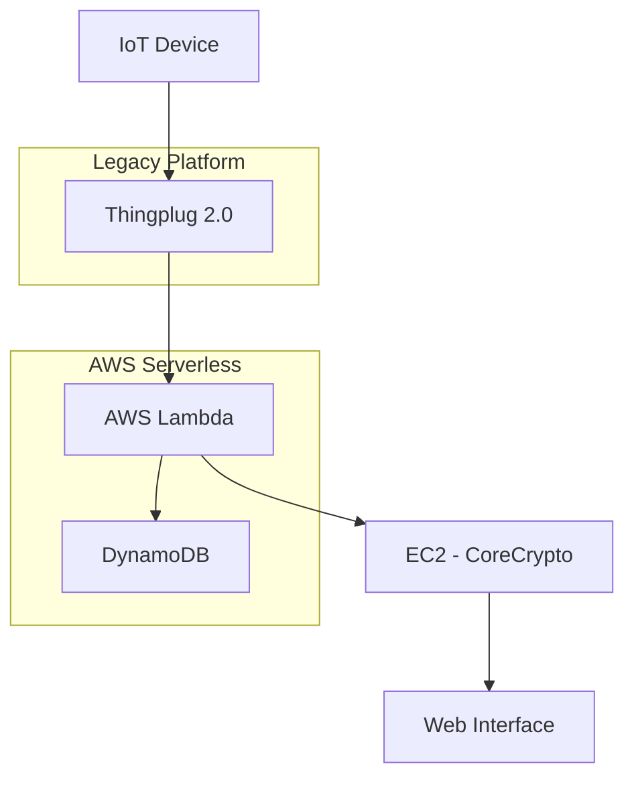

# Hardware-Based Key Management and Access Control System Design Using Thingplug

## 🎯 Summary

**Core Design Points of Thingplug 2.0-based IoT Security System**

```yaml
# System Architecture Overview
Platform: Thingplug 2.0
Cloud: AWS (Lambda, DynamoDB, EC2)
Security: CoreCrypto Library
Architecture: Serverless + Hybrid

# Core Components
1. Database: DynamoDB (Key Management)
2. API Integration: AWS Lambda Functions
3. Encryption: CoreCrypto (C Library)
4. Computing: EC2 (CoreCrypto Dedicated)
5. Interface: Web Service
```

**Immediately Applicable Design Patterns:**

```javascript
// Thingplug API Integration Lambda Function Structure
const thingplugConnector = {
  endpoint: 'https://thingplugapi.sktiot.com',
  authentication: 'Bearer token',
  keyManagement: 'DynamoDB integration',
  security: 'CoreCrypto encryption'
};

// Development Priorities (2-month schedule)
const developmentPhases = [
  '1. DynamoDB Schema Design',
  '2. Thingplug API Integration',
  '3. CoreCrypto Library Implementation',
  '4. Lambda Function Development',
  '5. Web Interface Construction'
];
```

---

## 📚 Detailed Description

### Background and Requirements

Hardware-based key management and access control are essential for security in Internet of Things (IoT) environments. While AWS IoT was initially considered, Thingplug 2.0 was selected according to project requirements. Although it's a platform that has reached end-of-support, it was a realistic choice considering compatibility with existing systems and project constraints.

### System Architecture Design

#### 1. Platform Selection and Constraints

**Thingplug 2.0 Features:**
- IoT platform developed by SKT
- Based on oneM2M standards
- Currently end-of-support
- Existing APIs and documentation available

**Design Constraints:**
- CoreCrypto Library: C-based, OS/bit constraints
- Cost optimization: Considering demonstration service
- Development schedule: Completion within 2 months

#### 2. Cloud Architecture Configuration



**Core Components:**

1. **DynamoDB**: Key management database
   - NoSQL-based scalability
   - Serverless architecture compliance
   - Cost-effective

2. **AWS Lambda**: API integration layer
   - Thingplug API call handling
   - Event-driven scalability
   - Easy development and maintenance

3. **EC2 Instance**: CoreCrypto dedicated
   - C library execution environment
   - OS dependency resolution
   - Security computation processing

### Technical Details

#### Phase 1: Database Design (DynamoDB)

```javascript
// DynamoDB Table Schema Example
const keyManagementSchema = {
  TableName: 'IoTKeyManagement',
  KeySchema: [
    {
      AttributeName: 'deviceId',
      KeyType: 'HASH'  // Partition key
    },
    {
      AttributeName: 'keyVersion',
      KeyType: 'RANGE'  // Sort key
    }
  ],
  AttributeDefinitions: [
    {
      AttributeName: 'deviceId',
      AttributeType: 'S'
    },
    {
      AttributeName: 'keyVersion',
      AttributeType: 'N'
    }
  ],
  GlobalSecondaryIndexes: [
    {
      IndexName: 'KeyStatusIndex',
      KeySchema: [
        {
          AttributeName: 'keyStatus',
          KeyType: 'HASH'
        }
      ]
    }
  ]
};
```

#### Phase 2: Thingplug API Integration

```javascript
// Lambda Function - Thingplug API Integration
const AWS = require('aws-sdk');
const axios = require('axios');

exports.handler = async (event) => {
  const thingplugConfig = {
    baseURL: 'https://thingplugapi.sktiot.com',
    headers: {
      'Accept': 'application/json',
      'X-M2M-RI': generateRequestId(),
      'X-M2M-Origin': process.env.THINGPLUG_ORIGIN
    }
  };

  try {
    // Thingplug API call
    const response = await axios.post(
      `${thingplugConfig.baseURL}/oneM2M/v1/CSEBase`,
      event.body,
      { headers: thingplugConfig.headers }
    );

    // Save result to DynamoDB
    const dynamodb = new AWS.DynamoDB.DocumentClient();
    await dynamodb.put({
      TableName: 'IoTKeyManagement',
      Item: {
        deviceId: event.deviceId,
        keyVersion: Date.now(),
        encryptedKey: response.data.encryptedKey,
        timestamp: new Date().toISOString()
      }
    }).promise();

    return {
      statusCode: 200,
      body: JSON.stringify({
        success: true,
        data: response.data
      })
    };
  } catch (error) {
    console.error('Thingplug API integration error:', error);
    return {
      statusCode: 500,
      body: JSON.stringify({
        success: false,
        error: error.message
      })
    };
  }
};
```

#### Phase 3-4: CoreCrypto Library Integration

```c
// CoreCrypto Library Interface Example
#include "corecrypto/cc_priv.h"
#include <stdio.h>

// Key generation function
int generate_device_key(const char* device_id, char* output_key) {
    // Key generation logic using CoreCrypto
    cc_unit key_buffer[CC_SHA256_DIGEST_LENGTH];
    
    // Device ID-based key generation
    if (cc_sha256(strlen(device_id), device_id, key_buffer) != 0) {
        return -1;
    }
    
    // Base64 encoding and return
    base64_encode(key_buffer, CC_SHA256_DIGEST_LENGTH, output_key);
    return 0;
}

// HTTP endpoint callable from Lambda
int main() {
    // HTTP server setup
    start_http_server(8080);
    return 0;
}
```

#### Phase 5: Web Interface Implementation

```javascript
// React-based Management Interface
import React, { useState, useEffect } from 'react';
import axios from 'axios';

const IoTKeyManagement = () => {
  const [devices, setDevices] = useState([]);
  const [selectedDevice, setSelectedDevice] = useState(null);

  // Fetch device list
  useEffect(() => {
    const fetchDevices = async () => {
      try {
        const response = await axios.get('/api/devices');
        setDevices(response.data);
      } catch (error) {
        console.error('Device fetch failed:', error);
      }
    };

    fetchDevices();
  }, []);

  // Key regeneration request
  const regenerateKey = async (deviceId) => {
    try {
      await axios.post(`/api/devices/${deviceId}/regenerate-key`);
      alert('Key regenerated successfully.');
    } catch (error) {
      alert('Key regeneration failed.');
    }
  };

  return (
    <div className="key-management-dashboard">
      <h2>IoT Key Management System</h2>
      <div className="device-list">
        {devices.map(device => (
          <div key={device.id} className="device-card">
            <h3>{device.name}</h3>
            <p>Status: {device.status}</p>
            <p>Last Key Update: {device.lastKeyUpdate}</p>
            <button onClick={() => regenerateKey(device.id)}>
              Regenerate Key
            </button>
          </div>
        ))}
      </div>
    </div>
  );
};

export default IoTKeyManagement;
```

### Practical Use Cases

#### Security Considerations

1. **Encryption Key Lifecycle Management**
   - Regular key rotation
   - Key disposal and archive policies
   - Access permission logging

2. **Network Security**
   - TLS/SSL encrypted communication
   - API authentication token management
   - VPC and security group configuration

#### Error Handling and Monitoring

```javascript
// CloudWatch Logging and Notification Setup
const cloudwatch = new AWS.CloudWatch();

const logMetric = async (metricName, value, unit = 'Count') => {
  const params = {
    Namespace: 'IoTKeyManagement',
    MetricData: [
      {
        MetricName: metricName,
        Value: value,
        Unit: unit,
        Timestamp: new Date()
      }
    ]
  };

  try {
    await cloudwatch.putMetricData(params).promise();
  } catch (error) {
    console.error('CloudWatch metric transmission failed:', error);
  }
};

// Usage example
await logMetric('KeyRegenerationSuccess', 1);
await logMetric('ThingplugAPIError', 1);
```

#### Cost Optimization Strategy

1. **Serverless First**: Lambda functions for usage-based billing
2. **DynamoDB On-Demand**: Addressing unpredictable traffic
3. **EC2 Spot Instance**: Cost reduction for CoreCrypto processing

## Conclusion

The key to designing a Thingplug 2.0-based IoT security system lies in **effectively combining legacy platforms with modern cloud architecture**. Despite the constraint of having to use an end-of-support platform, we successfully achieved both scalability and cost efficiency by actively utilizing AWS Serverless services.

**Key Insights:**
- **Hybrid Architecture**: Harmony between legacy systems and cloud-native services
- **Phased Development**: Systematic approach through 5 phases for complexity management
- **Security First**: Hardware-based encryption using CoreCrypto

**Next Steps:**
Following the 2-month development schedule, we will proceed sequentially from Phase 1 (database design), aiming to build a stable system through testing and validation at each phase. Particularly for the CoreCrypto library integration, we plan to secure sufficient testing time to meet security requirements.
