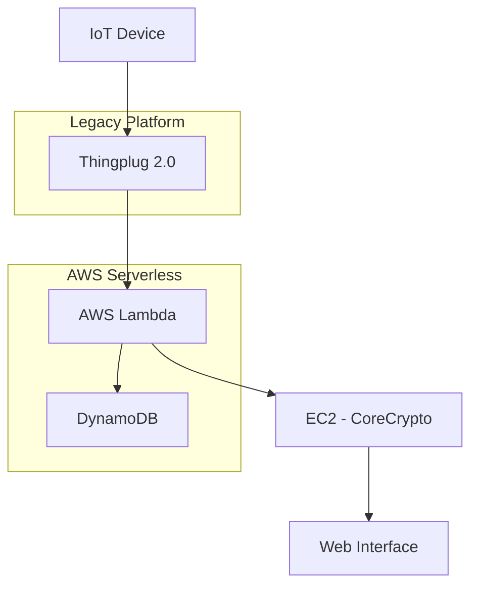

# Thingplugを活用したハードウェアベースキー管理および接近制御システム設計

## 🎯 概要

**Thingplug 2.0基盤IoTセキュリティシステムの核心設計ポイント**

```yaml
# システムアーキテクチャ概要
プラットフォーム: Thingplug 2.0
クラウド: AWS (Lambda, DynamoDB, EC2)
セキュリティ: CoreCryptoライブラリ
構造: Serverless + ハイブリッド

# 核心構成要素
1. データベース: DynamoDB (キー管理)
2. API連動: AWS Lambda関数
3. 暗号化: CoreCrypto (Cライブラリ)
4. コンピューティング: EC2 (CoreCrypto専用)
5. インターフェース: Webサービス
```

**すぐに適用可能な設計パターン:**

```javascript
// Thingplug API連動Lambda関数構造
const thingplugConnector = {
  endpoint: 'https://thingplugapi.sktiot.com',
  authentication: 'Bearer token',
  keyManagement: 'DynamoDB integration',
  security: 'CoreCrypto encryption'
};

// 開発優先順位 (2ヶ月スケジュール)
const developmentPhases = [
  '1. DynamoDBスキーマ設計',
  '2. Thingplug API連動',
  '3. CoreCryptoライブラリ実装',
  '4. Lambda関数開発',
  '5. Webインターフェース構築'
];
```

---

## 📚 詳細説明

### 背景および必要性

モノのインターネット（IoT）環境において、ハードウェアベースのキー管理と接近制御はセキュリティの核心である。当初AWS IoTを検討したが、プロジェクト要件に従ってThingplug 2.0を選択することになった。サポートが終了したプラットフォームであるが、既存システムとの互換性とプロジェクト制約事項を考慮した現実的な選択であった。

### システムアーキテクチャ設計

#### 1. プラットフォーム選択および制約事項

**Thingplug 2.0の特徴:**
- SKTが開発したIoTプラットフォーム
- oneM2M標準基盤
- 現在サポート終了状態
- 既存APIおよび文書活用可能

**設計制約事項:**
- CoreCryptoライブラリ: C言語基盤、OS/ビット制約
- コスト最適化: デモ用サービス考慮
- 開発スケジュール: 2ヶ月以内完了

#### 2. クラウドアーキテクチャ構成



**核心構成要素:**

1. **DynamoDB**: キー管理データベース
   - NoSQL基盤拡張性
   - Serverlessアーキテクチャ適合
   - コスト効率的

2. **AWS Lambda**: API連動レイヤー
   - Thingplug API呼び出し処理
   - イベント基盤拡張性
   - 開発および保守の容易性

3. **EC2インスタンス**: CoreCrypto専用
   - Cライブラリ実行環境
   - OS依存性解決
   - セキュリティ演算処理

### 技術的詳細事項

#### Phase 1: データベース設計 (DynamoDB)

```javascript
// DynamoDBテーブルスキーマ例示
const keyManagementSchema = {
  TableName: 'IoTKeyManagement',
  KeySchema: [
    {
      AttributeName: 'deviceId',
      KeyType: 'HASH'  // Partition key
    },
    {
      AttributeName: 'keyVersion',
      KeyType: 'RANGE'  // Sort key
    }
  ],
  AttributeDefinitions: [
    {
      AttributeName: 'deviceId',
      AttributeType: 'S'
    },
    {
      AttributeName: 'keyVersion',
      AttributeType: 'N'
    }
  ],
  GlobalSecondaryIndexes: [
    {
      IndexName: 'KeyStatusIndex',
      KeySchema: [
        {
          AttributeName: 'keyStatus',
          KeyType: 'HASH'
        }
      ]
    }
  ]
};
```

#### Phase 2: Thingplug API連動

```javascript
// Lambda関数 - Thingplug API連動
const AWS = require('aws-sdk');
const axios = require('axios');

exports.handler = async (event) => {
  const thingplugConfig = {
    baseURL: 'https://thingplugapi.sktiot.com',
    headers: {
      'Accept': 'application/json',
      'X-M2M-RI': generateRequestId(),
      'X-M2M-Origin': process.env.THINGPLUG_ORIGIN
    }
  };

  try {
    // Thingplug API呼び出し
    const response = await axios.post(
      `${thingplugConfig.baseURL}/oneM2M/v1/CSEBase`,
      event.body,
      { headers: thingplugConfig.headers }
    );

    // DynamoDBに結果保存
    const dynamodb = new AWS.DynamoDB.DocumentClient();
    await dynamodb.put({
      TableName: 'IoTKeyManagement',
      Item: {
        deviceId: event.deviceId,
        keyVersion: Date.now(),
        encryptedKey: response.data.encryptedKey,
        timestamp: new Date().toISOString()
      }
    }).promise();

    return {
      statusCode: 200,
      body: JSON.stringify({
        success: true,
        data: response.data
      })
    };
  } catch (error) {
    console.error('Thingplug API連動エラー:', error);
    return {
      statusCode: 500,
      body: JSON.stringify({
        success: false,
        error: error.message
      })
    };
  }
};
```

#### Phase 3-4: CoreCryptoライブラリ連動

```c
// CoreCryptoライブラリインターフェース例示
#include "corecrypto/cc_priv.h"
#include <stdio.h>

// キー生成関数
int generate_device_key(const char* device_id, char* output_key) {
    // CoreCryptoを活用したキー生成ロジック
    cc_unit key_buffer[CC_SHA256_DIGEST_LENGTH];
    
    // デバイスIDベースキー生成
    if (cc_sha256(strlen(device_id), device_id, key_buffer) != 0) {
        return -1;
    }
    
    // Base64エンコード後返却
    base64_encode(key_buffer, CC_SHA256_DIGEST_LENGTH, output_key);
    return 0;
}

// Lambdaから呼び出し可能なHTTPエンドポイント
int main() {
    // HTTPサーバー設定
    start_http_server(8080);
    return 0;
}
```

#### Phase 5: Webインターフェース実装

```javascript
// React基盤管理インターフェース
import React, { useState, useEffect } from 'react';
import axios from 'axios';

const IoTKeyManagement = () => {
  const [devices, setDevices] = useState([]);
  const [selectedDevice, setSelectedDevice] = useState(null);

  // デバイス一覧照会
  useEffect(() => {
    const fetchDevices = async () => {
      try {
        const response = await axios.get('/api/devices');
        setDevices(response.data);
      } catch (error) {
        console.error('デバイス照会失敗:', error);
      }
    };

    fetchDevices();
  }, []);

  // キー再生成要求
  const regenerateKey = async (deviceId) => {
    try {
      await axios.post(`/api/devices/${deviceId}/regenerate-key`);
      alert('キーが正常に再生成されました。');
    } catch (error) {
      alert('キー再生成に失敗しました。');
    }
  };

  return (
    <div className="key-management-dashboard">
      <h2>IoTキー管理システム</h2>
      <div className="device-list">
        {devices.map(device => (
          <div key={device.id} className="device-card">
            <h3>{device.name}</h3>
            <p>状態: {device.status}</p>
            <p>最後のキー更新: {device.lastKeyUpdate}</p>
            <button onClick={() => regenerateKey(device.id)}>
              キー再生成
            </button>
          </div>
        ))}
      </div>
    </div>
  );
};

export default IoTKeyManagement;
```

### 実際の活用事例

#### セキュリティ考慮事項

1. **暗号化キーライフサイクル管理**
   - 定期的なキーローテーション（Key Rotation）
   - キー廃棄およびアーカイブポリシー
   - アクセス権限ログ記録

2. **ネットワークセキュリティ**
   - TLS/SSL暗号化通信
   - API認証トークン管理
   - VPCおよびセキュリティグループ設定

#### エラー処理およびモニタリング

```javascript
// CloudWatchログおよび通知設定
const cloudwatch = new AWS.CloudWatch();

const logMetric = async (metricName, value, unit = 'Count') => {
  const params = {
    Namespace: 'IoTKeyManagement',
    MetricData: [
      {
        MetricName: metricName,
        Value: value,
        Unit: unit,
        Timestamp: new Date()
      }
    ]
  };

  try {
    await cloudwatch.putMetricData(params).promise();
  } catch (error) {
    console.error('CloudWatchメトリック送信失敗:', error);
  }
};

// 使用例示
await logMetric('KeyRegenerationSuccess', 1);
await logMetric('ThingplugAPIError', 1);
```

#### コスト最適化戦略

1. **Serverless優先**: Lambda関数で使用量基盤課金
2. **DynamoDB On-Demand**: 予測不可能なトラフィック対応
3. **EC2 Spot Instance**: CoreCrypto処理用コスト削減

## 結論

Thingplug 2.0基盤IoTセキュリティシステム設計において核心は、**レガシープラットフォームと現代的クラウドアーキテクチャの効果的な結合**である。サポートが終了したプラットフォームを使用しなければならない制約があるが、AWSのServerlessサービスを積極的に活用することで拡張性とコスト効率性を同時に確保することができた。

**核心インサイト:**
- **ハイブリッドアーキテクチャ**: レガシーシステムとクラウドネイティブサービスの調和
- **段階別開発**: 5段階体系的アプローチで複雑性管理
- **セキュリティ優先**: CoreCryptoを活用したハードウェア基盤暗号化

**次のステップ:**
2ヶ月開発スケジュールに合わせてPhase 1（データベース設計）から順次進行し、各段階別テストと検証を通じて安定したシステム構築を目標とする。特にCoreCryptoライブラリ連動部分では十分なテスト時間を確保してセキュリティ要件を満たす計画である。
