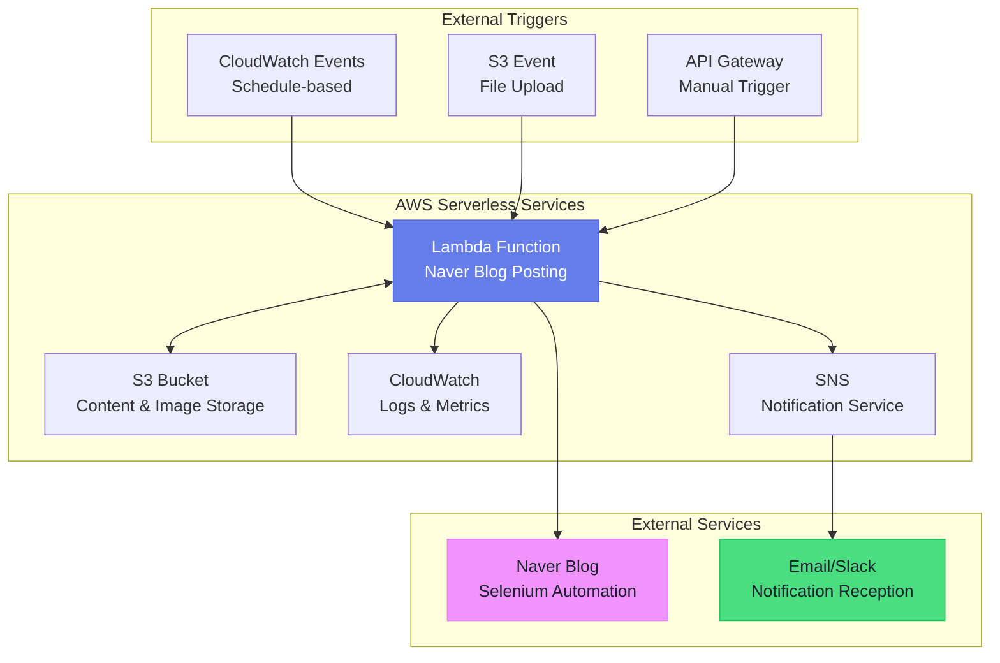
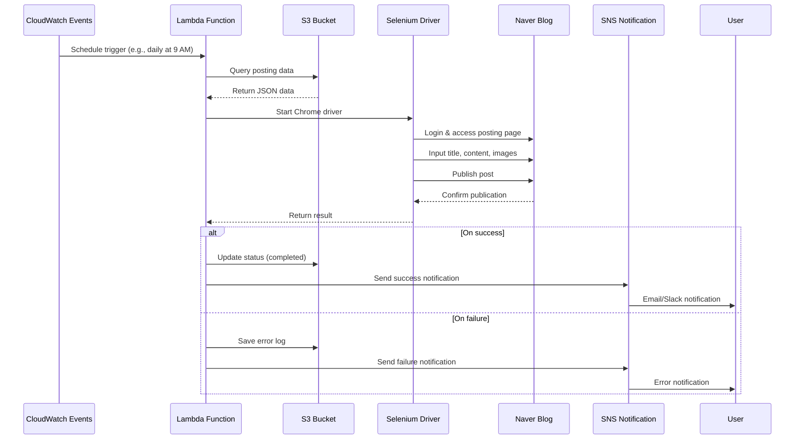

# Building an Automated Naver Blog Posting System with AWS Lambda + S3 + CloudWatch + SNS

## 🎯 Summary

A complete solution for automating Naver blog posting using AWS serverless architecture. This guide presents how to solve the complexity and errors of existing on-premise servers and transition to a scalable microservice-based approach.

### Core Architecture Components
```
S3 (Content Storage) → Lambda (Processing Logic) → CloudWatch (Monitoring) → SNS (Notifications)
```

### Ready-to-Use Lambda Function Example
```python
import json
import boto3
import requests
from selenium import webdriver
from selenium.webdriver.chrome.options import Options
import logging

def lambda_handler(event, context):
    """
    Naver blog posting automation Lambda function
    """
    
    # Get posting data from S3
    s3_client = boto3.client('s3')
    sns_client = boto3.client('sns')
    
    try:
        # Read posting content from S3
        bucket_name = event['bucket_name']
        object_key = event['object_key']
        
        response = s3_client.get_object(Bucket=bucket_name, Key=object_key)
        post_data = json.loads(response['Body'].read())
        
        # Execute Naver blog posting
        result = post_to_naver_blog(post_data)
        
        # Send success notification
        send_notification(sns_client, "Posting Success", result)
        
        return {
            'statusCode': 200,
            'body': json.dumps('Posting completed')
        }
        
    except Exception as e:
        # Send error notification
        send_notification(sns_client, "Posting Failed", str(e))
        raise e

def post_to_naver_blog(post_data):
    """
    Naver blog posting using Selenium
    (Alternative due to lack of API)
    """
    chrome_options = Options()
    chrome_options.add_argument('--headless')
    chrome_options.add_argument('--no-sandbox')
    
    driver = webdriver.Chrome(options=chrome_options)
    
    try:
        # Naver login and posting logic
        driver.get('https://blog.naver.com')
        # ... Implement posting logic
        return "Posting successful"
    finally:
        driver.quit()

def send_notification(sns_client, subject, message):
    """
    Send notification via SNS
    """
    topic_arn = 'arn:aws:sns:ap-northeast-2:123456789:blog-posting-alerts'
    sns_client.publish(
        TopicArn=topic_arn,
        Subject=subject,
        Message=message
    )
```

### CloudWatch Monitoring Setup
```python
# Create CloudWatch log group
aws logs create-log-group --log-group-name /aws/lambda/naver-blog-posting

# Set up metric filter (error detection)
aws logs put-metric-filter \
    --log-group-name /aws/lambda/naver-blog-posting \
    --filter-name ErrorFilter \
    --filter-pattern "ERROR" \
    --metric-transformations \
        metricName=BlogPostingErrors,metricNamespace=CustomMetrics,metricValue=1
```

---

## 📚 Detailed Description

### Background and Requirements

Transitioning to AWS serverless architecture was necessary to solve the problems of existing on-premise servers.

**Problems with Existing System**
- Difficult maintenance due to complex monolithic structure
- Difficulty in identifying causes when errors occur
- Lack of scalability and resource waste
- Single Point of Failure (SPOF)

**Advantages of Serverless Transition**
- Clear separation of responsibilities based on microservices
- Auto-scaling and cost optimization
- Powerful monitoring and logging capabilities
- Guaranteed high availability

### Detailed Architecture Design

#### Complete AWS Serverless Architecture Structure



#### Posting Process Flow



#### 1. S3-based Content Management
```json
{
  "Posting Data Structure": {
    "title": "Post Title",
    "content": "Post Content",
    "tags": ["tag1", "tag2"],
    "category": "Category",
    "images": [
      {
        "url": "s3://bucket/images/image1.jpg",
        "caption": "Image description"
      }
    ],
    "schedule": "2024-04-10T10:00:00Z",
    "status": "pending"
  }
}
```

#### 2. Detailed Lambda Function Implementation
```python
import boto3
import json
from datetime import datetime
import logging

# Logging setup
logger = logging.getLogger()
logger.setLevel(logging.INFO)

class NaverBlogPoster:
    def __init__(self):
        self.s3_client = boto3.client('s3')
        self.sns_client = boto3.client('sns')
        self.cloudwatch = boto3.client('cloudwatch')
    
    def process_posting_request(self, event):
        """
        Main logic for processing posting request
        """
        try:
            # 1. Query posting data from S3
            post_data = self.get_post_data_from_s3(event)
            
            # 2. Execute Naver blog posting
            posting_result = self.execute_blog_posting(post_data)
            
            # 3. Save result and update status
            self.update_posting_status(event, 'completed', posting_result)
            
            # 4. Send success metric
            self.send_custom_metric('PostingSuccess', 1)
            
            # 5. Send success notification
            self.send_notification('Posting Success', f"Title: {post_data['title']}")
            
            return {
                'statusCode': 200,
                'body': json.dumps({
                    'message': 'Posting completed',
                    'post_id': posting_result.get('post_id')
                })
            }
            
        except Exception as e:
            logger.error(f"Posting failed: {str(e)}")
            self.handle_error(event, e)
            raise
    
    def get_post_data_from_s3(self, event):
        """Query posting data from S3"""
        bucket = event['Records'][0]['s3']['bucket']['name']
        key = event['Records'][0]['s3']['object']['key']
        
        response = self.s3_client.get_object(Bucket=bucket, Key=key)
        return json.loads(response['Body'].read().decode('utf-8'))
    
    def execute_blog_posting(self, post_data):
        """
        Execute Naver blog posting
        Using Selenium due to lack of API
        """
        # Implement Naver blog posting logic
        # (Use Selenium WebDriver in actual implementation)
        pass
    
    def send_custom_metric(self, metric_name, value):
        """Send CloudWatch custom metric"""
        self.cloudwatch.put_metric_data(
            Namespace='BlogPosting',
            MetricData=[
                {
                    'MetricName': metric_name,
                    'Value': value,
                    'Timestamp': datetime.utcnow()
                }
            ]
        )
    
    def handle_error(self, event, error):
        """Error handling and notification"""
        self.update_posting_status(event, 'failed', str(error))
        self.send_custom_metric('PostingError', 1)
        self.send_notification('Posting Failed', f"Error: {str(error)}")

def lambda_handler(event, context):
    poster = NaverBlogPoster()
    return poster.process_posting_request(event)
```

#### 3. CloudWatch Monitoring Setup
```python
# Configuration for creating CloudWatch dashboard
dashboard_config = {
    "widgets": [
        {
            "type": "metric",
            "properties": {
                "metrics": [
                    ["BlogPosting", "PostingSuccess"],
                    ["BlogPosting", "PostingError"]
                ],
                "period": 300,
                "stat": "Sum",
                "region": "ap-northeast-2",
                "title": "Blog Posting Status"
            }
        },
        {
            "type": "log",
            "properties": {
                "query": "SOURCE '/aws/lambda/naver-blog-posting' | fields @timestamp, @message | filter @message like /ERROR/ | sort @timestamp desc | limit 20",
                "region": "ap-northeast-2",
                "title": "Recent Error Logs"
            }
        }
    ]
}
```

#### 4. SNS Notification System
```python
class NotificationManager:
    def __init__(self):
        self.sns_client = boto3.client('sns')
        self.topic_arn = 'arn:aws:sns:ap-northeast-2:account:blog-alerts'
    
    def send_posting_success(self, post_data):
        """Posting success notification"""
        message = f"""
        ✅ Blog posting successful
        
        Title: {post_data['title']}
        Time: {datetime.now().strftime('%Y-%m-%d %H:%M:%S')}
        Tags: {', '.join(post_data.get('tags', []))}
        """
        
        self.sns_client.publish(
            TopicArn=self.topic_arn,
            Subject='[Success] Naver Blog Posting',
            Message=message
        )
    
    def send_error_alert(self, error_details):
        """Error occurrence notification"""
        message = f"""
        ❌ Blog posting failed
        
        Error: {error_details['error']}
        Time: {error_details['timestamp']}
        Function: {error_details['function_name']}
        
        Immediate attention required.
        """
        
        self.sns_client.publish(
            TopicArn=self.topic_arn,
            Subject='[Critical] Naver Blog Posting Failed',
            Message=message
        )
```

### Real-world Use Cases

#### Deployment and Configuration Automation
```bash
#!/bin/bash
# deploy.sh - Automated deployment script

# 1. Package Lambda function
zip -r naver-blog-poster.zip lambda_function.py requirements.txt

# 2. Update Lambda function
aws lambda update-function-code \
    --function-name naver-blog-posting \
    --zip-file fileb://naver-blog-poster.zip

# 3. Set environment variables
aws lambda update-function-configuration \
    --function-name naver-blog-posting \
    --environment Variables="{
        S3_BUCKET=blog-content-bucket,
        SNS_TOPIC_ARN=arn:aws:sns:ap-northeast-2:account:blog-alerts,
        NAVER_ID=$NAVER_ID,
        NAVER_PW=$NAVER_PW
    }"

# 4. Configure S3 trigger
aws s3api put-bucket-notification-configuration \
    --bucket blog-content-bucket \
    --notification-configuration file://s3-trigger-config.json
```

#### Error Handling and Recovery Strategy
```python
class ErrorRecoveryManager:
    def __init__(self):
        self.max_retries = 3
        self.retry_delay = 60  # seconds
    
    def execute_with_retry(self, func, *args, **kwargs):
        """Execution with retry logic"""
        for attempt in range(self.max_retries):
            try:
                return func(*args, **kwargs)
            except Exception as e:
                if attempt == self.max_retries - 1:
                    # Send to DLQ on final failure
                    self.send_to_dlq(args, kwargs, str(e))
                    raise
                else:
                    logger.warning(f"Attempt {attempt + 1} failed, retrying in {self.retry_delay} seconds")
                    time.sleep(self.retry_delay)
    
    def send_to_dlq(self, args, kwargs, error):
        """Send failed task to Dead Letter Queue"""
        sqs = boto3.client('sqs')
        queue_url = 'https://sqs.ap-northeast-2.amazonaws.com/account/blog-posting-dlq'
        
        message = {
            'args': args,
            'kwargs': kwargs,
            'error': error,
            'timestamp': datetime.utcnow().isoformat(),
            'retry_count': self.max_retries
        }
        
        sqs.send_message(
            QueueUrl=queue_url,
            MessageBody=json.dumps(message)
        )
```

### Solutions for Naver API Limitations

Alternative approaches in the absence of official Naver blog API:

#### 1. Selenium-based Automation (Recommended)
```python
from selenium import webdriver
from selenium.webdriver.common.by import By
from selenium.webdriver.support.ui import WebDriverWait
from selenium.webdriver.support import expected_conditions as EC

class NaverBlogAutomation:
    def __init__(self):
        chrome_options = Options()
        chrome_options.add_argument('--headless')
        chrome_options.add_argument('--no-sandbox')
        chrome_options.add_argument('--disable-dev-shm-usage')
        self.driver = webdriver.Chrome(options=chrome_options)
    
    def login_and_post(self, credentials, post_data):
        """Naver login and posting"""
        try:
            # Naver login
            self.driver.get('https://nid.naver.com/nidlogin.login')
            
            # Fill login form
            id_input = self.driver.find_element(By.ID, 'id')
            pw_input = self.driver.find_element(By.ID, 'pw')
            
            id_input.send_keys(credentials['id'])
            pw_input.send_keys(credentials['pw'])
            
            # Click login button
            login_btn = self.driver.find_element(By.ID, 'log.login')
            login_btn.click()
            
            # Navigate to blog writing page
            self.driver.get('https://blog.naver.com/PostWriteForm.naver')
            
            # Write post content
            self.write_post_content(post_data)
            
            # Publish
            self.publish_post()
            
            return {'status': 'success', 'post_url': self.get_post_url()}
            
        finally:
            self.driver.quit()
```

#### 2. RSS/Atom Feed Integration
```python
def create_rss_feed(posts):
    """Create RSS feed for indirect integration"""
    rss_content = f"""<?xml version="1.0" encoding="UTF-8"?>
    <rss version="2.0">
        <channel>
            <title>Automated Posting Feed</title>
            <description>AWS Lambda-based Automated Posting</description>
            <link>https://your-domain.com</link>
    """
    
    for post in posts:
        rss_content += f"""
            <item>
                <title>{post['title']}</title>
                <description><![CDATA[{post['content']}]]></description>
                <pubDate>{post['pub_date']}</pubDate>
                <guid>{post['id']}</guid>
            </item>
        """
    
    rss_content += """
        </channel>
    </rss>
    """
    
    return rss_content
```

## Conclusion

The automated Naver blog posting system using AWS serverless architecture is an effective solution to solve the complexity and errors of existing on-premise environments.

**Key Achievements**
- Improved maintainability through clear separation of responsibilities based on microservices
- Easy error tracking through real-time monitoring with CloudWatch
- Immediate response capability through SNS-based notification system
- Cost optimization achieved through auto-scaling

**Next Steps Suggestions**
1. **Expansion Plan**: Add support for other blog platforms (Tistory, Brunch, etc.)
2. **AI Integration**: Introduce automatic content generation features by integrating ChatGPT API
3. **Enhanced Analytics**: Build data pipeline for posting performance analysis
4. **Security Enhancement**: Apply credential encryption using AWS KMS

Despite Naver API limitations, a stable and scalable automated posting system can be built by combining Selenium and AWS serverless technologies.
