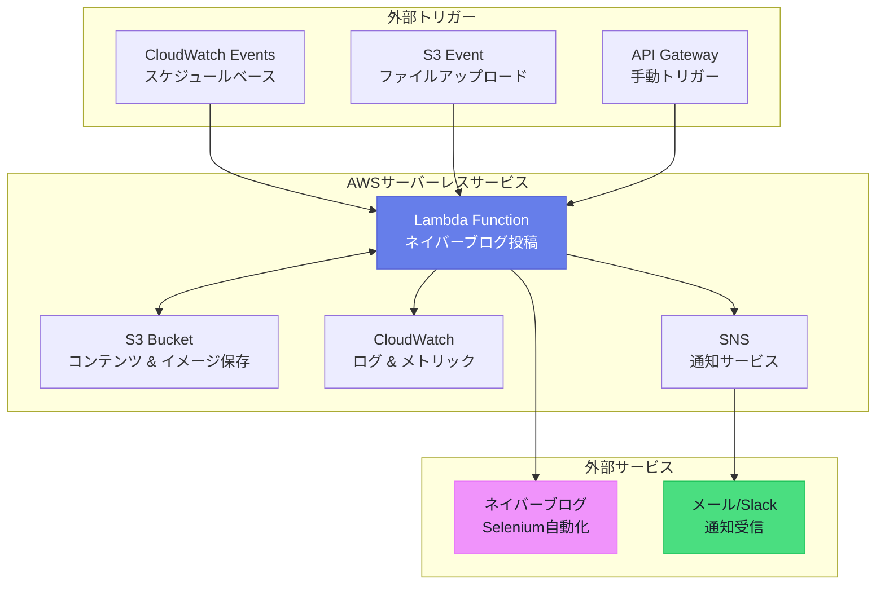
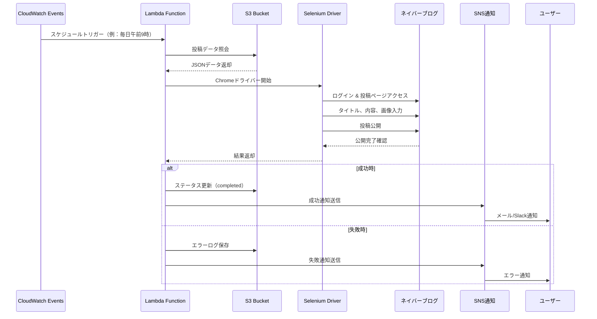

# AWS Lambda + S3 + CloudWatch + SNSを活用したネイバーブログ自動投稿システム構築

## 🎯 概要

ネイバーブログ投稿をAWSサーバーレスアーキテクチャで自動化する完全なソリューションです。既存のオンプレミスサーバーの複雑性とエラーを解決し、拡張可能なマイクロサービス基盤への移行方法を提示します。

### コアアーキテクチャ構成要素
```
S3（コンテンツ保存）→ Lambda（処理ロジック）→ CloudWatch（監視）→ SNS（通知）
```

### すぐに使用可能なLambda関数例
```python
import json
import boto3
import requests
from selenium import webdriver
from selenium.webdriver.chrome.options import Options
import logging

def lambda_handler(event, context):
    """
    ネイバーブログ投稿自動化Lambda関数
    """
    
    # S3から投稿データを取得
    s3_client = boto3.client('s3')
    sns_client = boto3.client('sns')
    
    try:
        # S3から投稿コンテンツを読み取り
        bucket_name = event['bucket_name']
        object_key = event['object_key']
        
        response = s3_client.get_object(Bucket=bucket_name, Key=object_key)
        post_data = json.loads(response['Body'].read())
        
        # ネイバーブログ投稿実行
        result = post_to_naver_blog(post_data)
        
        # 成功通知
        send_notification(sns_client, "投稿成功", result)
        
        return {
            'statusCode': 200,
            'body': json.dumps('投稿完了')
        }
        
    except Exception as e:
        # エラー通知
        send_notification(sns_client, "投稿失敗", str(e))
        raise e

def post_to_naver_blog(post_data):
    """
    Seleniumを使用したネイバーブログ投稿
    （API未提供による代替手段）
    """
    chrome_options = Options()
    chrome_options.add_argument('--headless')
    chrome_options.add_argument('--no-sandbox')
    
    driver = webdriver.Chrome(options=chrome_options)
    
    try:
        # ネイバーログイン及び投稿ロジック
        driver.get('https://blog.naver.com')
        # ... 投稿ロジック実装
        return "投稿成功"
    finally:
        driver.quit()

def send_notification(sns_client, subject, message):
    """
    SNSを通じた通知送信
    """
    topic_arn = 'arn:aws:sns:ap-northeast-2:123456789:blog-posting-alerts'
    sns_client.publish(
        TopicArn=topic_arn,
        Subject=subject,
        Message=message
    )
```

### CloudWatch監視設定
```python
# CloudWatchログ グループ作成
aws logs create-log-group --log-group-name /aws/lambda/naver-blog-posting

# メトリックフィルター設定（エラー検出）
aws logs put-metric-filter \
    --log-group-name /aws/lambda/naver-blog-posting \
    --filter-name ErrorFilter \
    --filter-pattern "ERROR" \
    --metric-transformations \
        metricName=BlogPostingErrors,metricNamespace=CustomMetrics,metricValue=1
```

---

## 📚 詳細説明

### 背景と必要性

既存のオンプレミスサーバーの問題点を解決するため、AWSサーバーレスアーキテクチャへの移行が必要でした。

**既存システムの問題点**
- 複雑なモノリシック構造による保守の困難さ
- エラー発生時の原因究明の困難さ
- 拡張性不足とリソース浪費
- 単一障害点（SPOF）の存在

**サーバーレス移行の利点**
- マイクロサービス基盤の明確な責任分離
- 自動スケーリングとコスト最適化
- 強力な監視とログ機能
- 高可用性の保証

### アーキテクチャ詳細設計

#### AWSサーバーレスアーキテクチャ全体構造



#### 投稿プロセスフロー



#### 1. S3基盤コンテンツ管理
```json
{
  "投稿データ構造": {
    "title": "投稿タイトル",
    "content": "投稿内容",
    "tags": ["タグ1", "タグ2"],
    "category": "カテゴリ",
    "images": [
      {
        "url": "s3://bucket/images/image1.jpg",
        "caption": "画像説明"
      }
    ],
    "schedule": "2024-04-10T10:00:00Z",
    "status": "pending"
  }
}
```

#### 2. Lambda関数詳細実装
```python
import boto3
import json
from datetime import datetime
import logging

# ログ設定
logger = logging.getLogger()
logger.setLevel(logging.INFO)

class NaverBlogPoster:
    def __init__(self):
        self.s3_client = boto3.client('s3')
        self.sns_client = boto3.client('sns')
        self.cloudwatch = boto3.client('cloudwatch')
    
    def process_posting_request(self, event):
        """
        投稿リクエスト処理メインロジック
        """
        try:
            # 1. S3から投稿データ照会
            post_data = self.get_post_data_from_s3(event)
            
            # 2. ネイバーブログ投稿実行
            posting_result = self.execute_blog_posting(post_data)
            
            # 3. 結果保存とステータス更新
            self.update_posting_status(event, 'completed', posting_result)
            
            # 4. 成功メトリック送信
            self.send_custom_metric('PostingSuccess', 1)
            
            # 5. 成功通知
            self.send_notification('投稿成功', f"タイトル: {post_data['title']}")
            
            return {
                'statusCode': 200,
                'body': json.dumps({
                    'message': '投稿完了',
                    'post_id': posting_result.get('post_id')
                })
            }
            
        except Exception as e:
            logger.error(f"投稿失敗: {str(e)}")
            self.handle_error(event, e)
            raise
    
    def get_post_data_from_s3(self, event):
        """S3から投稿データ照会"""
        bucket = event['Records'][0]['s3']['bucket']['name']
        key = event['Records'][0]['s3']['object']['key']
        
        response = self.s3_client.get_object(Bucket=bucket, Key=key)
        return json.loads(response['Body'].read().decode('utf-8'))
    
    def execute_blog_posting(self, post_data):
        """
        ネイバーブログ投稿実行
        API未提供によるSelenium活用
        """
        # ネイバーブログ投稿ロジック実装
        # （実際の実装ではSelenium WebDriverを使用）
        pass
    
    def send_custom_metric(self, metric_name, value):
        """CloudWatchカスタムメトリック送信"""
        self.cloudwatch.put_metric_data(
            Namespace='BlogPosting',
            MetricData=[
                {
                    'MetricName': metric_name,
                    'Value': value,
                    'Timestamp': datetime.utcnow()
                }
            ]
        )
    
    def handle_error(self, event, error):
        """エラー処理と通知"""
        self.update_posting_status(event, 'failed', str(error))
        self.send_custom_metric('PostingError', 1)
        self.send_notification('投稿失敗', f"エラー: {str(error)}")

def lambda_handler(event, context):
    poster = NaverBlogPoster()
    return poster.process_posting_request(event)
```

#### 3. CloudWatch監視設定
```python
# CloudWatchダッシュボード作成のための設定
dashboard_config = {
    "widgets": [
        {
            "type": "metric",
            "properties": {
                "metrics": [
                    ["BlogPosting", "PostingSuccess"],
                    ["BlogPosting", "PostingError"]
                ],
                "period": 300,
                "stat": "Sum",
                "region": "ap-northeast-2",
                "title": "ブログ投稿状況"
            }
        },
        {
            "type": "log",
            "properties": {
                "query": "SOURCE '/aws/lambda/naver-blog-posting' | fields @timestamp, @message | filter @message like /ERROR/ | sort @timestamp desc | limit 20",
                "region": "ap-northeast-2",
                "title": "最近のエラーログ"
            }
        }
    ]
}
```

#### 4. SNS通知システム
```python
class NotificationManager:
    def __init__(self):
        self.sns_client = boto3.client('sns')
        self.topic_arn = 'arn:aws:sns:ap-northeast-2:account:blog-alerts'
    
    def send_posting_success(self, post_data):
        """投稿成功通知"""
        message = f"""
        ✅ ブログ投稿成功
        
        タイトル: {post_data['title']}
        時間: {datetime.now().strftime('%Y-%m-%d %H:%M:%S')}
        タグ: {', '.join(post_data.get('tags', []))}
        """
        
        self.sns_client.publish(
            TopicArn=self.topic_arn,
            Subject='[成功] ネイバーブログ投稿',
            Message=message
        )
    
    def send_error_alert(self, error_details):
        """エラー発生通知"""
        message = f"""
        ❌ ブログ投稿失敗
        
        エラー: {error_details['error']}
        時間: {error_details['timestamp']}
        関数: {error_details['function_name']}
        
        即座に確認が必要です。
        """
        
        self.sns_client.publish(
            TopicArn=self.topic_arn,
            Subject='[緊急] ネイバーブログ投稿失敗',
            Message=message
        )
```

### 実際の活用事例

#### デプロイと設定自動化
```bash
#!/bin/bash
# deploy.sh - 自動デプロイスクリプト

# 1. Lambda関数パッケージング
zip -r naver-blog-poster.zip lambda_function.py requirements.txt

# 2. Lambda関数更新
aws lambda update-function-code \
    --function-name naver-blog-posting \
    --zip-file fileb://naver-blog-poster.zip

# 3. 環境変数設定
aws lambda update-function-configuration \
    --function-name naver-blog-posting \
    --environment Variables="{
        S3_BUCKET=blog-content-bucket,
        SNS_TOPIC_ARN=arn:aws:sns:ap-northeast-2:account:blog-alerts,
        NAVER_ID=$NAVER_ID,
        NAVER_PW=$NAVER_PW
    }"

# 4. S3トリガー設定
aws s3api put-bucket-notification-configuration \
    --bucket blog-content-bucket \
    --notification-configuration file://s3-trigger-config.json
```

#### エラー処理と復旧戦略
```python
class ErrorRecoveryManager:
    def __init__(self):
        self.max_retries = 3
        self.retry_delay = 60  # seconds
    
    def execute_with_retry(self, func, *args, **kwargs):
        """リトライロジックが含まれた実行"""
        for attempt in range(self.max_retries):
            try:
                return func(*args, **kwargs)
            except Exception as e:
                if attempt == self.max_retries - 1:
                    # 最終失敗時DLQに移動
                    self.send_to_dlq(args, kwargs, str(e))
                    raise
                else:
                    logger.warning(f"試行 {attempt + 1} 失敗、{self.retry_delay}秒後にリトライ")
                    time.sleep(self.retry_delay)
    
    def send_to_dlq(self, args, kwargs, error):
        """Dead Letter Queueに失敗したタスクを送信"""
        sqs = boto3.client('sqs')
        queue_url = 'https://sqs.ap-northeast-2.amazonaws.com/account/blog-posting-dlq'
        
        message = {
            'args': args,
            'kwargs': kwargs,
            'error': error,
            'timestamp': datetime.utcnow().isoformat(),
            'retry_count': self.max_retries
        }
        
        sqs.send_message(
            QueueUrl=queue_url,
            MessageBody=json.dumps(message)
        )
```

### ネイバーAPI制限事項解決方案

ネイバーブログ公式APIが提供されない状況での代替的アプローチ方法：

#### 1. Seleniumを活用した自動化（推奨）
```python
from selenium import webdriver
from selenium.webdriver.common.by import By
from selenium.webdriver.support.ui import WebDriverWait
from selenium.webdriver.support import expected_conditions as EC

class NaverBlogAutomation:
    def __init__(self):
        chrome_options = Options()
        chrome_options.add_argument('--headless')
        chrome_options.add_argument('--no-sandbox')
        chrome_options.add_argument('--disable-dev-shm-usage')
        self.driver = webdriver.Chrome(options=chrome_options)
    
    def login_and_post(self, credentials, post_data):
        """ネイバーログインと投稿"""
        try:
            # ネイバーログイン
            self.driver.get('https://nid.naver.com/nidlogin.login')
            
            # ログインフォーム作成
            id_input = self.driver.find_element(By.ID, 'id')
            pw_input = self.driver.find_element(By.ID, 'pw')
            
            id_input.send_keys(credentials['id'])
            pw_input.send_keys(credentials['pw'])
            
            # ログインボタンクリック
            login_btn = self.driver.find_element(By.ID, 'log.login')
            login_btn.click()
            
            # ブログ作成ページ移動
            self.driver.get('https://blog.naver.com/PostWriteForm.naver')
            
            # 投稿内容作成
            self.write_post_content(post_data)
            
            # 公開
            self.publish_post()
            
            return {'status': 'success', 'post_url': self.get_post_url()}
            
        finally:
            self.driver.quit()
```

#### 2. RSS/Atomフィード連動活用
```python
def create_rss_feed(posts):
    """RSS フィード生成による間接連動"""
    rss_content = f"""<?xml version="1.0" encoding="UTF-8"?>
    <rss version="2.0">
        <channel>
            <title>自動投稿フィード</title>
            <description>AWS Lambda基盤自動投稿</description>
            <link>https://your-domain.com</link>
    """
    
    for post in posts:
        rss_content += f"""
            <item>
                <title>{post['title']}</title>
                <description><![CDATA[{post['content']}]]></description>
                <pubDate>{post['pub_date']}</pubDate>
                <guid>{post['id']}</guid>
            </item>
        """
    
    rss_content += """
        </channel>
    </rss>
    """
    
    return rss_content
```

## 結論

AWSサーバーレスアーキテクチャを活用したネイバーブログ自動投稿システムは、既存のオンプレミス環境の複雑性とエラーを解決する効果的なソリューションです。

**核心成果**
- マイクロサービス基盤の明確な責任分離により保守性向上
- CloudWatchを通じたリアルタイム監視によりエラー追跡が容易
- SNS基盤通知システムにより即座に対応可能
- 自動スケーリングによりコスト最適化達成

**次の段階提案**
1. **拡張計画**: 他のブログプラットフォーム（ティストーリー、ブランチなど）対応追加
2. **AI活用**: ChatGPT API連動による自動コンテンツ生成機能導入
3. **分析強化**: 投稿成果分析のためのデータパイプライン構築
4. **セキュリティ強化**: AWS KMSを活用した認証情報暗号化適用

ネイバーAPI制限事項にもかかわらず、SeleniumとAWSサーバーレス技術を組み合わせることで、安定的で拡張可能な自動投稿システムを構築できます。
