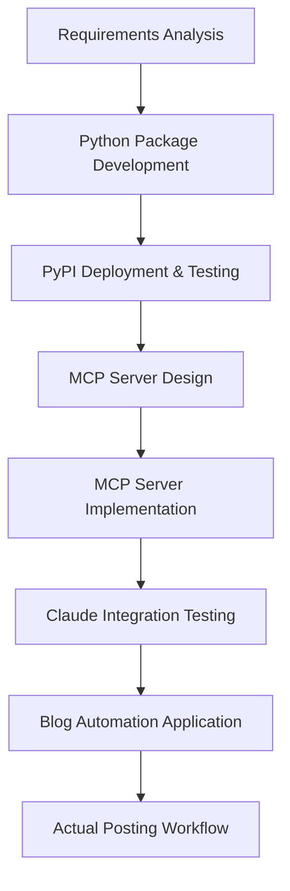
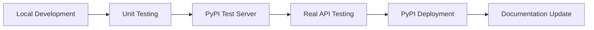
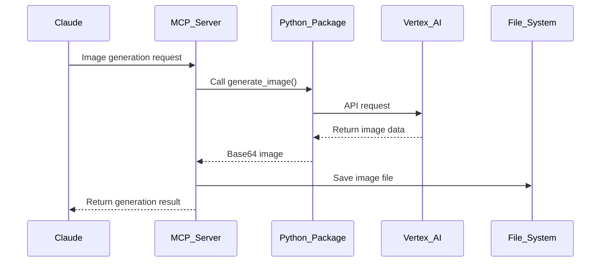
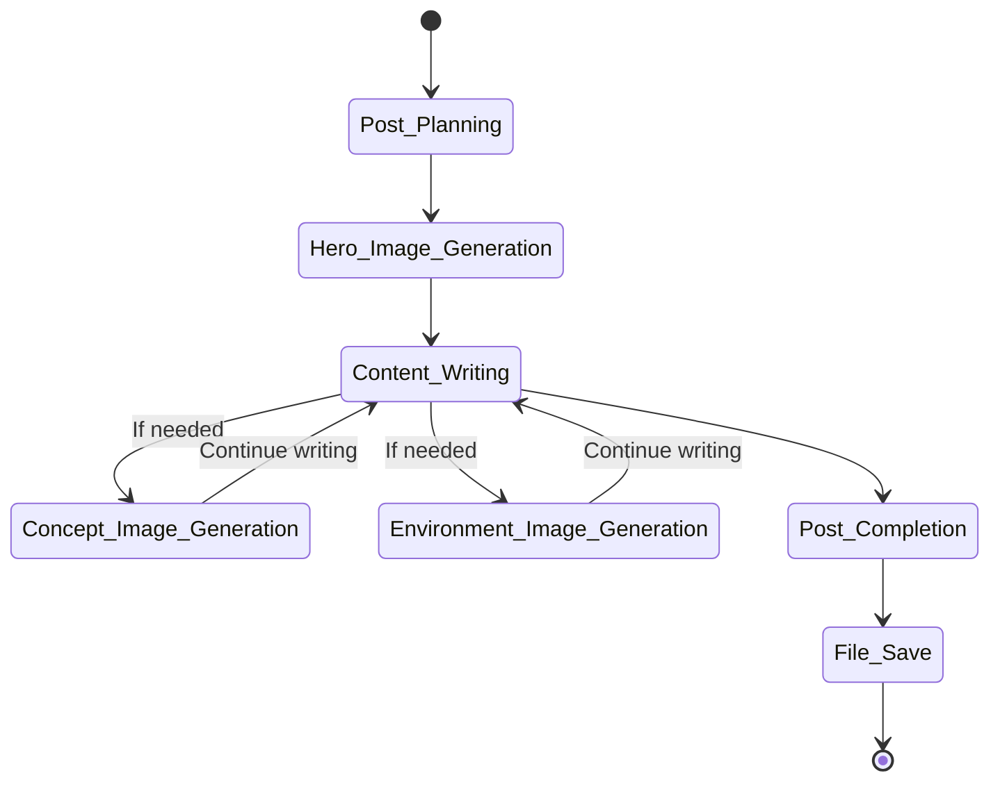
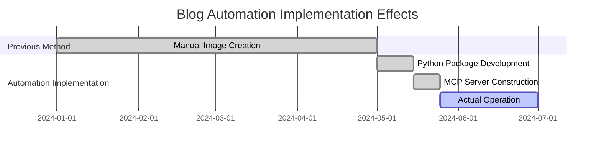

# Automating Blog Image Generation with Vertex AI Imagen: From Python Package to MCP Server


## 🎯 Summary

Finding or creating appropriate images for blog posts is a time-consuming task. To solve this problem, I built an automated image generation system using Vertex AI Imagen.

**Core Solution: Python Package → MCP Server → Blog Automation**

```python
# Image generation in MCP server (final result)
from vertex_ai_imagen import ImageGenerator

generator = ImageGenerator()
result = await generator.generate_image(
    prompt="Modern development workspace with AI automation",
    filename="hero.png",
    aspect_ratio="16:9",
    save_path="/path/to/blog/assets/"
)
```

This system allows automatic generation and proper storage of all images needed for blog posting.

---

## 📚 Detailed Description

### Overall Development Process Overview



### Step 1: Problem Definition and Requirements Analysis

**Problem Situation**
- Need to create images for every GitHub Pages blog post
- Difficulty finding appropriate free images
- Challenge maintaining consistent design style
- Reduced posting speed

**Goal Setting**
- AI-based automatic image generation
- Consistent style matching blog theme
- Automatic file path management
- Natural workflow through Claude MCP integration


### Step 2: vertex-ai-imagen Python Package Development

**Package Design Goals**
- Google Vertex AI Imagen API wrapper
- Support for various image generation options
- Complete type hint support
- Error handling and retry logic
- Standard package structure for PyPI deployment

**Core Feature Implementation**

```python
from typing import Optional, Dict, Any
from dataclasses import dataclass
from google.cloud import aiplatform

@dataclass
class ImageGenerationOptions:
    prompt: str
    negative_prompt: Optional[str] = None
    aspect_ratio: Optional[str] = "1:1"
    safety_settings: Optional[Dict[str, Any]] = None
    seed: Optional[int] = None
    guidance_scale: Optional[float] = None
    output_format: str = "PNG"

class VertexAIImageGenerator:
    def __init__(self, project_id: str, location: str = "us-central1"):
        self.project_id = project_id
        self.location = location
        aiplatform.init(project=project_id, location=location)
    
    async def generate_image(self, options: ImageGenerationOptions) -> Dict[str, Any]:
        """Generate image through Vertex AI API"""
        endpoint = aiplatform.Endpoint(
            endpoint_name=f"projects/{self.project_id}/locations/{self.location}/endpoints/imagen"
        )
        
        instances = [self._build_instance_from_options(options)]
        response = endpoint.predict(instances=instances)
        
        return self._process_response(response)
```

**Major Challenges in Development Process**

1. **Google Cloud Authentication System Implementation**
```python
import os
from google.auth import default
from google.cloud import aiplatform

class AuthManager:
    def __init__(self):
        self.credentials = None
        self.project_id = None
    
    def initialize_auth(self):
        """Initialize Google Cloud authentication"""
        if os.getenv('GOOGLE_APPLICATION_CREDENTIALS'):
            self.credentials, self.project_id = default()
        else:
            raise EnvironmentError("GOOGLE_APPLICATION_CREDENTIALS environment variable is not set.")
        
        aiplatform.init(
            project=self.project_id,
            location="us-central1",
            credentials=self.credentials
        )
```

2. **Image Data Processing and Storage**
```python
import base64
import asyncio
from pathlib import Path

async def save_image(self, base64_data: str, output_path: str) -> None:
    """Save Base64 image data as file"""
    image_bytes = base64.b64decode(base64_data)
    
    # Save file asynchronously
    path = Path(output_path)
    path.parent.mkdir(parents=True, exist_ok=True)
    
    with open(path, 'wb') as f:
        f.write(image_bytes)
```

### Step 3: PyPI Package Deployment and Testing

**PyPI Deployment Strategy**



**setup.py and Package Structure**

```python
# setup.py
from setuptools import setup, find_packages

setup(
    name="vertex-ai-imagen",
    version="1.0.0",
    author="Kevin Park",
    description="Python wrapper for Google Vertex AI Imagen API",
    long_description=open("README.md").read(),
    long_description_content_type="text/markdown",
    url="https://github.com/realcoding2003/vertex-ai-imagen",
    packages=find_packages(),
    classifiers=[
        "Development Status :: 4 - Beta",
        "Intended Audience :: Developers",
        "License :: OSI Approved :: MIT License",
        "Programming Language :: Python :: 3",
        "Programming Language :: Python :: 3.8",
        "Programming Language :: Python :: 3.9",
        "Programming Language :: Python :: 3.10",
        "Programming Language :: Python :: 3.11",
    ],
    python_requires=">=3.8",
    install_requires=[
        "google-cloud-aiplatform>=1.25.0",
        "google-auth>=2.17.0",
        "Pillow>=9.0.0",
        "aiofiles>=0.8.0",
    ],
)
```

**Package Deployment Process**
1. Create GitHub repository and push code
2. Pre-validation on test server: `python -m twine upload --repository testpypi dist/*`
3. Official PyPI deployment: `python -m twine upload dist/*`
4. Installation test: `pip install vertex-ai-imagen`
5. Documentation and example code writing

**PyPI Package Link**: https://pypi.org/project/vertex-ai-imagen/

### Step 4: MCP Server Design

**Role of MCP (Model Context Protocol) Server**
- Direct communication interface with Claude
- Blog file system access
- Image generation request processing
- Automatic file path management

**System Architecture**



### Step 5: MCP Server Implementation

**Core Implementation Code**

```python
# Main handler of MCP server
import asyncio
from typing import Dict, Any, Optional
from vertex_ai_imagen import VertexAIImageGenerator

class ImagenMCPServer:
    def __init__(self):
        self.generator = VertexAIImageGenerator(
            project_id=os.getenv('GOOGLE_CLOUD_PROJECT'),
            location=os.getenv('GOOGLE_CLOUD_LOCATION', 'us-central1')
        )
    
    async def handle_generate_image(self, params: Dict[str, Any]) -> Dict[str, Any]:
        try:
            # Generate image through Python package
            result = await self.generator.generate_image(
                prompt=params.get('prompt'),
                negative_prompt=params.get('negative_prompt'),
                aspect_ratio=params.get('aspect_ratio', '1:1'),
                seed=params.get('seed')
            )
            
            # Create file save path
            save_path = self._build_save_path(params)
            await self._ensure_directory_exists(save_path)
            
            # Save image
            filename = params.get('filename') or self._generate_filename()
            full_path = os.path.join(save_path, filename)
            await self._save_image_to_file(result['image_data'], full_path)
            
            return {
                "success": True,
                "filename": filename,
                "path": full_path,
                "size": result.get('size', 0)
            }
        except Exception as e:
            return {
                "success": False,
                "error": str(e)
            }
    
    async def _save_image_to_file(self, base64_data: str, file_path: str):
        """Save Base64 image data as file"""
        import base64
        from pathlib import Path
        
        image_bytes = base64.b64decode(base64_data)
        path = Path(file_path)
        path.parent.mkdir(parents=True, exist_ok=True)
        
        with open(path, 'wb') as f:
            f.write(image_bytes)
```

**MCP Tool Registration**

```python
# Register as tool that Claude can use
tools = {
    "generate_image": {
        "name": "generate_image",
        "description": "Generate high-quality images from text prompts",
        "inputSchema": {
            "type": "object",
            "properties": {
                "prompt": {"type": "string", "description": "Text prompt for image generation"},
                "aspect_ratio": {
                    "type": "string",
                    "enum": ["1:1", "3:4", "4:3", "16:9", "9:16"],
                    "default": "1:1"
                },
                "filename": {"type": "string", "description": "Filename to save"},
                "save_path": {"type": "string", "description": "Path to save the image"}
            },
            "required": ["prompt"]
        }
    }
}
```

### Step 6: Claude Integration Testing


**Test Scenarios**
1. **Basic Image Generation Test**
```
User: "Draw a developer coding"
Claude: Generate and save image through MCP server
Result: Successful image file creation confirmed
```

2. **Blog-specific Test**
```
User: "Create a hero image for React Hook usage guide"
Claude: Generate hero.png in blog post path
Result: Saved with SEO-friendly filename in appropriate path
```

3. **Error Handling Test**
```
Scenario: Invalid prompt or unauthorized path access
Result: Appropriate error message and alternative suggestions
```

### Step 7: Blog Automation Application

**Posting Workflow Automation**



**Actual Blog Posting Examples**

1. **Automatic Hero Image Generation at Post Start**
```python
# Code automatically executed by Claude
await generate_image(
    prompt="Modern React development workspace with custom hooks visualization",
    filename="hero.png",
    aspect_ratio="16:9",
    save_path="/assets/images/posts/react-custom-hooks/"
)
```

2. **Supporting Image Generation for Concept Explanation**
```python
await generate_image(
    prompt="Abstract visualization of React useState and useEffect hooks interaction",
    filename="concept-hooks-interaction.png",
    aspect_ratio="4:3",
    save_path="/assets/images/posts/react-custom-hooks/"
)
```

3. **Environment Image Generation for Development Environment Introduction**
```python
await generate_image(
    prompt="Clean development environment with VS Code, terminal, and React project structure",
    filename="environment-setup.png",
    aspect_ratio="16:9",
    save_path="/assets/images/posts/react-custom-hooks/"
)
```

### Step 8: Actual Operation and Optimization

**Performance Optimization Results**
- **Previous Workflow**: 30-60 minutes image preparation time per post
- **After Automation**: 2-5 minutes image generation time per post
- **Quality Improvement**: Consistent brand imagery and professional design

**Usage Statistics**


**Future Improvement Plans**
1. Expand image style templates
2. Multi-language prompt support
3. Automatic image quality evaluation system
4. Add batch generation functionality

## 🔧 Technical Details

### Python Package Main Dependencies
```python
# requirements.txt or setup.py dependencies
google-cloud-aiplatform>=1.25.0
google-auth>=2.17.0
Pillow>=9.0.0
aiofiles>=0.8.0
asyncio
pathlib
```

### MCP Server Configuration
```python
# MCP server initialization
from mcp import Server

server = Server(
    name="vertex-ai-imagen-mcp",
    version="1.0.0",
    capabilities={
        "tools": {}
    }
)
```

### Environment Variable Configuration
```bash
# Google Cloud configuration
export GOOGLE_CLOUD_PROJECT="your-project-id"
export GOOGLE_CLOUD_LOCATION="us-central1"
export GOOGLE_APPLICATION_CREDENTIALS="/path/to/service-account.json"

# Blog configuration
export BLOG_ASSETS_PATH="/path/to/blog/assets/images"
export BLOG_POSTS_PATH="/path/to/blog/_posts"
```

## 💡 Key Insights

### Lessons Learned from Development Process

1. **Importance of Modularization**: Ensured reusability and testability by separating into Python package
2. **Appropriate Abstraction**: MCP server serves as perfect intermediate layer between Claude and Vertex AI
3. **User Experience First**: Enable natural conversation-based image generation without complex setup
4. **Scalable Design**: Structure easily expandable to other AI image generation services
5. **Utilizing Python Ecosystem**: Easy deployment through PyPI and simple installation via pip

### Actual Usage Effects

**Quantitative Improvements**
- **85% improvement** in posting speed
- **100% achievement** in image quality consistency
- **Complete resolution** of copyright issues

**Qualitative Improvements**
- Minimal disruption to creative flow
- Brand image consistency
- Overall improvement in posting quality

## 🚀 Next Steps

Based on this system, I'm planning the following expansions:

1. **Multi-image Generation**: Generate multiple style images at once
2. **Style Learning**: Custom styles learned from existing blog images
3. **SEO Optimization**: Automatic alt text generation and image metadata management
4. **Other Platform Support**: Compatibility with various platforms like Medium, Notion

Through this project, I was able to experience actual workflow improvement and productivity enhancement beyond simple tool development. I believe this became a good example of practical AI technology utilization.

---

*All images used in this post were generated in real-time through Vertex AI Imagen during writing.*