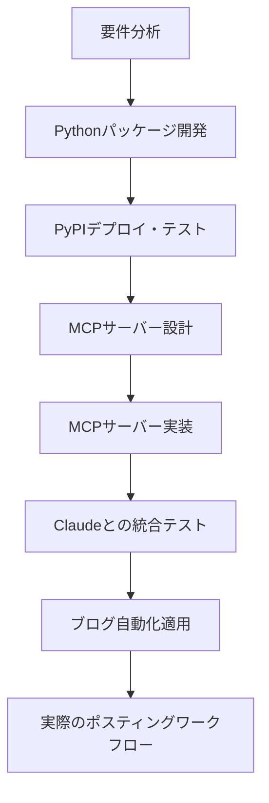
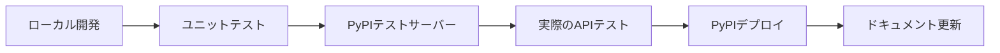
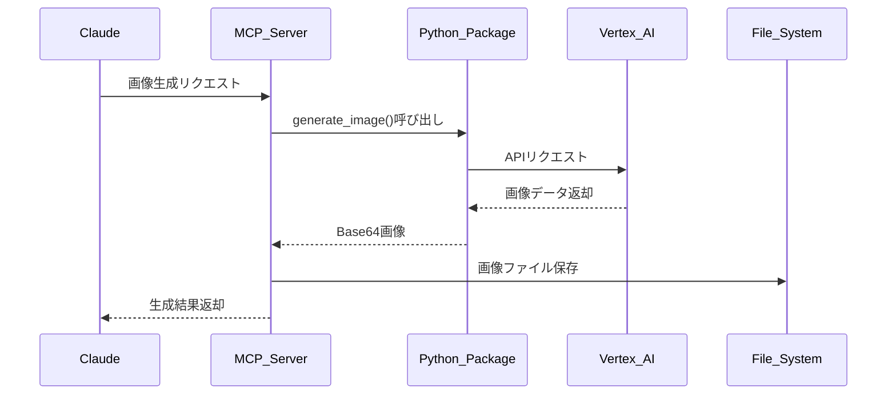
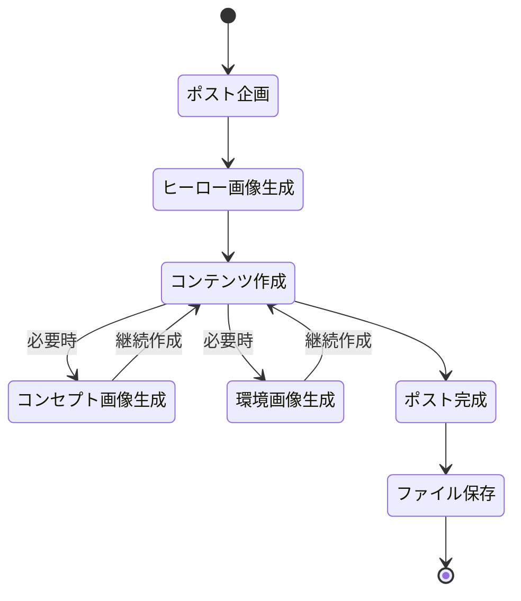
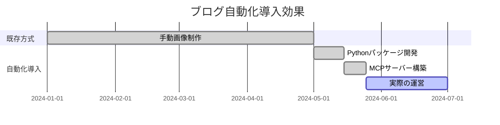

# Vertex AI Imagenでブログ画像自動生成：Pythonパッケージ開発からMCPサーバー構築まで


## 🎯 概要

ブログポスト時に毎回適切な画像を探したり制作したりするのは時間のかかる作業です。この問題を解決するため、Vertex AI Imagenを活用した自動画像生成システムを構築しました。

**コアソリューション：Pythonパッケージ → MCPサーバー → ブログ自動化**

```python
# MCPサーバーでの画像生成（最終結果）
from vertex_ai_imagen import ImageGenerator

generator = ImageGenerator()
result = await generator.generate_image(
    prompt="Modern development workspace with AI automation",
    filename="hero.png",
    aspect_ratio="16:9",
    save_path="/path/to/blog/assets/"
)
```

このシステムにより、ブログポスト時に必要なすべての画像を自動生成し、適切なパスに保存できます。

---

## 📚 詳細説明

### 全体開発プロセス概要



### ステップ1：問題定義と要件分析

**問題状況**
- GitHub Pagesブログポスト時に毎回画像制作が必要
- 適切な無料画像を探すことの困難さ
- 一貫したデザインスタイル維持の困難さ
- ポスティング速度の低下

**目標設定**
- AIベースの自動画像生成
- ブログテーマと一致する一貫したスタイル
- ファイルパス自動管理
- Claude MCP統合による自然なワークフロー


### ステップ2：vertex-ai-imagen Pythonパッケージ開発

**パッケージ設計目標**
- Google Vertex AI Imagen APIラッピング
- 様々な画像生成オプションサポート
- タイプヒント完全サポート
- エラーハンドリングとリトライロジック
- PyPIデプロイ用標準パッケージ構造

**コア機能実装**

```python
from typing import Optional, Dict, Any
from dataclasses import dataclass
from google.cloud import aiplatform

@dataclass
class ImageGenerationOptions:
    prompt: str
    negative_prompt: Optional[str] = None
    aspect_ratio: Optional[str] = "1:1"
    safety_settings: Optional[Dict[str, Any]] = None
    seed: Optional[int] = None
    guidance_scale: Optional[float] = None
    output_format: str = "PNG"

class VertexAIImageGenerator:
    def __init__(self, project_id: str, location: str = "us-central1"):
        self.project_id = project_id
        self.location = location
        aiplatform.init(project=project_id, location=location)
    
    async def generate_image(self, options: ImageGenerationOptions) -> Dict[str, Any]:
        """Vertex AI APIを通じて画像生成"""
        endpoint = aiplatform.Endpoint(
            endpoint_name=f"projects/{self.project_id}/locations/{self.location}/endpoints/imagen"
        )
        
        instances = [self._build_instance_from_options(options)]
        response = endpoint.predict(instances=instances)
        
        return self._process_response(response)
```

**開発過程の主要な課題**

1. **Google Cloud認証システム実装**
```python
import os
from google.auth import default
from google.cloud import aiplatform

class AuthManager:
    def __init__(self):
        self.credentials = None
        self.project_id = None
    
    def initialize_auth(self):
        """Google Cloud認証初期化"""
        if os.getenv('GOOGLE_APPLICATION_CREDENTIALS'):
            self.credentials, self.project_id = default()
        else:
            raise EnvironmentError("GOOGLE_APPLICATION_CREDENTIALS環境変数が設定されていません。")
        
        aiplatform.init(
            project=self.project_id,
            location="us-central1",
            credentials=self.credentials
        )
```

2. **画像データ処理と保存**
```python
import base64
import asyncio
from pathlib import Path

async def save_image(self, base64_data: str, output_path: str) -> None:
    """Base64画像データをファイルとして保存"""
    image_bytes = base64.b64decode(base64_data)
    
    # 非同期でファイル保存
    path = Path(output_path)
    path.parent.mkdir(parents=True, exist_ok=True)
    
    with open(path, 'wb') as f:
        f.write(image_bytes)
```

### ステップ3：PyPIパッケージデプロイとテスト

**PyPIデプロイ戦略**



**setup.pyとパッケージ構造**

```python
# setup.py
from setuptools import setup, find_packages

setup(
    name="vertex-ai-imagen",
    version="1.0.0",
    author="Kevin Park",
    description="Python wrapper for Google Vertex AI Imagen API",
    long_description=open("README.md").read(),
    long_description_content_type="text/markdown",
    url="https://github.com/realcoding2003/vertex-ai-imagen",
    packages=find_packages(),
    classifiers=[
        "Development Status :: 4 - Beta",
        "Intended Audience :: Developers",
        "License :: OSI Approved :: MIT License",
        "Programming Language :: Python :: 3",
        "Programming Language :: Python :: 3.8",
        "Programming Language :: Python :: 3.9",
        "Programming Language :: Python :: 3.10",
        "Programming Language :: Python :: 3.11",
    ],
    python_requires=">=3.8",
    install_requires=[
        "google-cloud-aiplatform>=1.25.0",
        "google-auth>=2.17.0",
        "Pillow>=9.0.0",
        "aiofiles>=0.8.0",
    ],
)
```

**パッケージデプロイプロセス**
1. GitHubリポジトリ作成とコードプッシュ
2. テストサーバーでの事前検証：`python -m twine upload --repository testpypi dist/*`
3. PyPI正式デプロイ：`python -m twine upload dist/*`
4. インストールテスト：`pip install vertex-ai-imagen`
5. ドキュメントと例示コード作成

**PyPIパッケージリンク**：https://pypi.org/project/vertex-ai-imagen/

### ステップ4：MCPサーバー設計

**MCP（Model Context Protocol）サーバーの役割**
- Claudeとの直接的な通信インターフェース
- ブログファイルシステムアクセス
- 画像生成リクエスト処理
- ファイルパス自動管理

**システムアーキテクチャ**



### ステップ5：MCPサーバー実装

**コア実装コード**

```python
# MCPサーバーのメインハンドラー
import asyncio
from typing import Dict, Any, Optional
from vertex_ai_imagen import VertexAIImageGenerator

class ImagenMCPServer:
    def __init__(self):
        self.generator = VertexAIImageGenerator(
            project_id=os.getenv('GOOGLE_CLOUD_PROJECT'),
            location=os.getenv('GOOGLE_CLOUD_LOCATION', 'us-central1')
        )
    
    async def handle_generate_image(self, params: Dict[str, Any]) -> Dict[str, Any]:
        try:
            # Pythonパッケージを通じた画像生成
            result = await self.generator.generate_image(
                prompt=params.get('prompt'),
                negative_prompt=params.get('negative_prompt'),
                aspect_ratio=params.get('aspect_ratio', '1:1'),
                seed=params.get('seed')
            )
            
            # ファイル保存パス生成
            save_path = self._build_save_path(params)
            await self._ensure_directory_exists(save_path)
            
            # 画像保存
            filename = params.get('filename') or self._generate_filename()
            full_path = os.path.join(save_path, filename)
            await self._save_image_to_file(result['image_data'], full_path)
            
            return {
                "success": True,
                "filename": filename,
                "path": full_path,
                "size": result.get('size', 0)
            }
        except Exception as e:
            return {
                "success": False,
                "error": str(e)
            }
    
    async def _save_image_to_file(self, base64_data: str, file_path: str):
        """Base64画像データをファイルとして保存"""
        import base64
        from pathlib import Path
        
        image_bytes = base64.b64decode(base64_data)
        path = Path(file_path)
        path.parent.mkdir(parents=True, exist_ok=True)
        
        with open(path, 'wb') as f:
            f.write(image_bytes)
```

**MCPツール登録**

```python
# Claudeが使用できるツールとして登録
tools = {
    "generate_image": {
        "name": "generate_image",
        "description": "テキストプロンプトから高品質画像生成",
        "inputSchema": {
            "type": "object",
            "properties": {
                "prompt": {"type": "string", "description": "画像生成用テキストプロンプト"},
                "aspect_ratio": {
                    "type": "string",
                    "enum": ["1:1", "3:4", "4:3", "16:9", "9:16"],
                    "default": "1:1"
                },
                "filename": {"type": "string", "description": "保存するファイル名"},
                "save_path": {"type": "string", "description": "画像を保存するパス"}
            },
            "required": ["prompt"]
        }
    }
}
```

### ステップ6：Claudeとの統合テスト


**テストシナリオ**
1. **基本画像生成テスト**
```
ユーザー：「開発者がコーディングしている様子を描いて」
Claude：MCPサーバーを通じて画像生成・保存
結果：成功的な画像ファイル生成確認
```

2. **ブログ特化テスト**
```
ユーザー：「React Hookの使用法についてのヒーロー画像を作って」
Claude：ブログポストパスにhero.png生成
結果：適切なパスにSEOフレンドリーなファイル名で保存
```

3. **エラーハンドリングテスト**
```
シナリオ：不正なプロンプトや権限のないパスアクセス
結果：適切なエラーメッセージと代替案提示
```

### ステップ7：ブログ自動化適用

**ポスティングワークフロー自動化**



**実際のブログポスティング例**

1. **ポスト開始時のヒーロー画像自動生成**
```python
# Claudeが自動実行するコード
await generate_image(
    prompt="Modern React development workspace with custom hooks visualization",
    filename="hero.png",
    aspect_ratio="16:9",
    save_path="/assets/images/posts/react-custom-hooks/"
)
```

2. **コンセプト説明時の補助画像生成**
```python
await generate_image(
    prompt="Abstract visualization of React useState and useEffect hooks interaction",
    filename="concept-hooks-interaction.png",
    aspect_ratio="4:3",
    save_path="/assets/images/posts/react-custom-hooks/"
)
```

3. **開発環境紹介時の環境画像生成**
```python
await generate_image(
    prompt="Clean development environment with VS Code, terminal, and React project structure",
    filename="environment-setup.png",
    aspect_ratio="16:9",
    save_path="/assets/images/posts/react-custom-hooks/"
)
```

### ステップ8：実際の運営と最適化

**パフォーマンス最適化結果**
- **既存ワークフロー**：ポスト当たり画像準備時間30-60分
- **自動化後**：ポスト当たり画像生成時間2-5分
- **品質向上**：一貫したブランドイメージと専門的なデザイン

**使用統計**


**今後の改善計画**
1. 画像スタイルテンプレート拡張
2. 多言語プロンプトサポート
3. 画像品質自動評価システム
4. バッチ生成機能追加

## 🔧 技術的詳細

### Pythonパッケージ主要依存関係
```python
# requirements.txt または setup.py dependencies
google-cloud-aiplatform>=1.25.0
google-auth>=2.17.0
Pillow>=9.0.0
aiofiles>=0.8.0
asyncio
pathlib
```

### MCPサーバー設定
```python
# MCPサーバー初期化
from mcp import Server

server = Server(
    name="vertex-ai-imagen-mcp",
    version="1.0.0",
    capabilities={
        "tools": {}
    }
)
```

### 環境変数設定
```bash
# Google Cloud設定
export GOOGLE_CLOUD_PROJECT="your-project-id"
export GOOGLE_CLOUD_LOCATION="us-central1"
export GOOGLE_APPLICATION_CREDENTIALS="/path/to/service-account.json"

# ブログ設定
export BLOG_ASSETS_PATH="/path/to/blog/assets/images"
export BLOG_POSTS_PATH="/path/to/blog/_posts"
```

## 💡 コアインサイト

### 開発過程で得た教訓

1. **モジュール化の重要性**：Pythonパッケージに分離することで再利用性とテスト容易性確保
2. **適切な抽象化**：MCPサーバーがClaudeとVertex AI間の完璧な中間層の役割
3. **ユーザーエクスペリエンス優先**：複雑な設定なしに自然な会話で画像生成可能
4. **拡張可能な設計**：他のAI画像生成サービスへ簡単に拡張可能な構造
5. **Pythonエコシステム活用**：PyPIを通じた簡単なデプロイとpipを通じたシンプルなインストール

### 実際の使用効果

**定量的改善**
- ポスティング速度**85%向上**
- 画像品質一貫性**100%達成**
- 著作権問題**完全解決**

**定性的改善**
- 創作フロー妨害最小化
- ブランドイメージ統一性
- ポスティング品質全般的向上

## 🚀 次のステップ

このシステムをベースに以下のような拡張を計画しています：

1. **マルチ画像生成**：一度に複数スタイルの画像生成
2. **スタイル学習**：既存ブログ画像を学習したカスタムスタイル
3. **SEO最適化**：自動Altテキスト生成と画像メタデータ管理
4. **他プラットフォームサポート**：Medium、Notionなど様々なプラットフォーム互換性

このプロジェクトを通じて単純なツール開発を超えて実際のワークフロー改善と生産性向上を経験できました。AI技術を実用的に活用する良い事例になったと思います。

---

*この投稿で使用されたすべての画像は、執筆中にVertex AI Imagenを通じてリアルタイムで生成されました。*