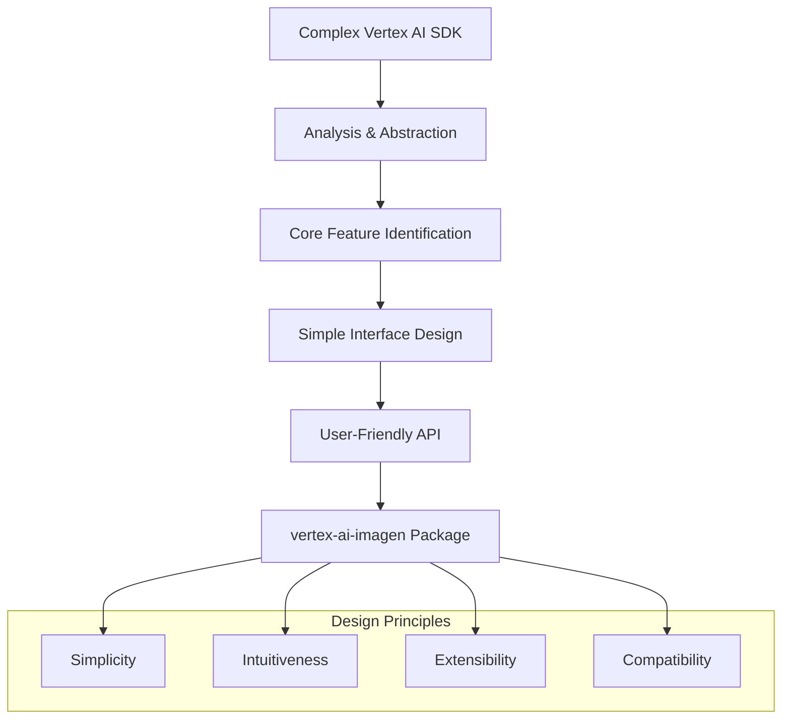
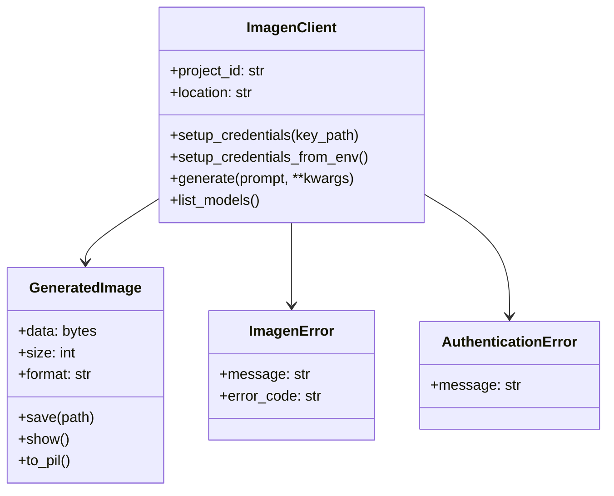
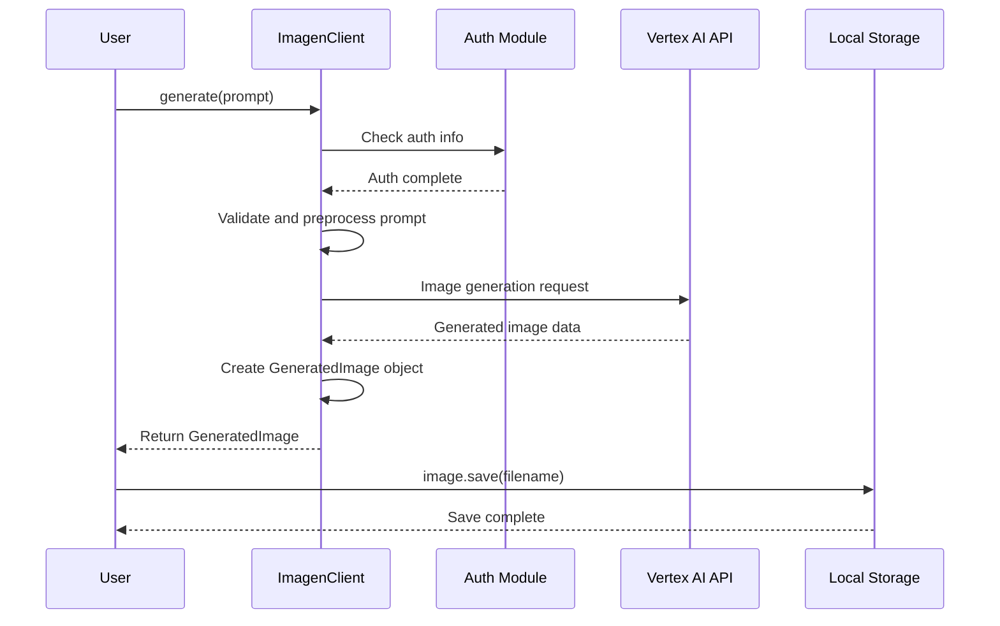
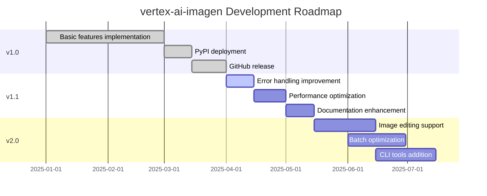

## 🎯 Summary

Do you want to generate AI images using Google Vertex AI's Imagen API but find the complex setup and lengthy code burdensome? With the `vertex-ai-imagen` package, you can implement powerful AI image generation functionality with just a few simple lines of code.

```python
import asyncio
from vertex_ai_imagen import ImagenClient

async def main():
    # Simple initialization
    client = ImagenClient(project_id="your-project")
    client.setup_credentials("path/to/service-account-key.json")
    
    # Generate image
    image = await client.generate(
        prompt="A serene mountain landscape at sunset",
        aspect_ratio="16:9"
    )
    
    # Save image
    image.save("sunset.png")
    print(f"Image saved! Size: {image.size:,} bytes")

asyncio.run(main())
```

**Key Features:**
- 🚀 **Easy Setup**: Simplifies complex Vertex AI configuration
- ⚡ **Async Support**: High performance with async/await patterns
- 🎯 **Type Safety**: Complete type hint support
- 🔒 **Security**: Google Cloud service account authentication
- 📦 **Clean Models**: Intuitive data classes

---

## 📚 Detailed Description

### Package Installation and Basic Setup

`vertex-ai-imagen` is a wrapper library designed to make Google Vertex AI's Imagen API easier to use in Python. It simplifies complex authentication processes and API calls, allowing developers to focus solely on image generation logic.

```bash
# Install package from PyPI
pip install vertex-ai-imagen
```

**📦 Distribution Information:**
- **PyPI Package**: [https://pypi.org/project/vertex-ai-imagen/](https://pypi.org/project/vertex-ai-imagen/)
- **GitHub Repository**: [https://github.com/realcoding2003/vertex-ai-imagen](https://github.com/realcoding2003/vertex-ai-imagen)
- **License**: MIT License
- **Supported Python Versions**: Python 3.7+

### Why is this Package Needed?

Google Vertex AI's basic SDK is very powerful, but it can sometimes be complex. Even simple image generation tasks require a considerable amount of boilerplate code.

**When using the existing Vertex AI SDK:**
```python
import vertexai
from vertexai.preview.vision_models import ImageGenerationModel

# Complex initialization process
vertexai.init(project="your-project-id", location="us-central1")
model = ImageGenerationModel.from_pretrained("imagen-3.0-generate-002")

# Image generation
images = model.generate_images(
    prompt="A serene mountain landscape at sunset",
    number_of_images=2,
    aspect_ratio="16:9",
    add_watermark=False,
    # Many optional parameters...
)

# Manually save images
for i, image in enumerate(images.images):
    image.save(f"generated_image_{i}.png")
```

**When using vertex-ai-imagen:**
```python
import asyncio
from vertex_ai_imagen import ImagenClient

async def main():
    # Simple initialization
    client = ImagenClient(project_id="your-project")
    client.setup_credentials("path/to/service-account-key.json")
    
    # Generate image in one line
    image = await client.generate(
        prompt="A serene mountain landscape at sunset",
        aspect_ratio="16:9"
    )
    
    # Save image
    image.save("sunset.png")
    print(f"Image saved! Size: {image.size:,} bytes")

asyncio.run(main())
```

### Development Process and Design Philosophy

This package was developed following these design principles:



#### 1. Simplicity
Minimized complex setup processes and designed to work with only essential parameters.

#### 2. Intuitiveness
Named methods and parameters intuitively for easy understanding.

#### 3. Extensibility
Kept basic functions simple while making advanced features easily accessible.

#### 4. Compatibility
Maintained compatibility with the existing Vertex AI SDK for low-level API access when needed.

### Key Features and Usage

#### Basic Image Generation
```python
import asyncio
from vertex_ai_imagen import ImagenClient

async def main():
    # Initialize client
    client = ImagenClient(project_id="your-gcp-project")
    client.setup_credentials("path/to/service-account-key.json")
    
    # Generate single image
    image = await client.generate(
        prompt="A futuristic city skyline with flying cars",
        aspect_ratio="16:9",
        model="imagen-3.0-generate-002"
    )
    
    # Save image and output information
    image.save("futuristic_city.png")
    print(f"Generated image size: {image.size:,} bytes")

asyncio.run(main())
```

#### Batch Image Generation
```python
import asyncio
from vertex_ai_imagen import ImagenClient

async def main():
    client = ImagenClient(project_id="your-project")
    client.setup_credentials_from_env()  # Load auth info from environment variables
    
    # Generate multiple images simultaneously
    prompts = [
        "A peaceful forest scene",
        "A bustling marketplace", 
        "A calm ocean sunset"
    ]
    
    for i, prompt in enumerate(prompts):
        images = await client.generate(
            prompt=prompt,
            count=2,  # Generate 2 images per prompt
            aspect_ratio="1:1"
        )
        
        # Save with automatic naming
        for j, image in enumerate(images):
            image.save(f"scene_{i}_{j}.png")

asyncio.run(main())
```

#### Advanced Configuration Options



### Environment Setup and Authentication

Before using the package, you need to set up Google Cloud authentication:

```python
from vertex_ai_imagen import ImagenClient

# Method 1: Directly specify service account key file
client = ImagenClient(project_id="your-project")
client.setup_credentials("path/to/service-account-key.json")

# Method 2: Use environment variables (recommended)
import os
os.environ['GOOGLE_APPLICATION_CREDENTIALS'] = 'path/to/service-account-key.json'

client = ImagenClient(project_id="your-project")
client.setup_credentials_from_env()
```

**Google Cloud Setup:**
```bash
# 1. Enable API
gcloud services enable aiplatform.googleapis.com

# 2. Create service account
gcloud iam service-accounts create imagen-client \
    --display-name="Imagen Client"

# 3. Grant permissions
gcloud projects add-iam-policy-binding PROJECT_ID \
    --member="serviceAccount:imagen-client@PROJECT_ID.iam.gserviceaccount.com" \
    --role="roles/aiplatform.user"

# 4. Create service account key
gcloud iam service-accounts keys create key.json \
    --iam-account=imagen-client@PROJECT_ID.iam.gserviceaccount.com
```

### Error Handling and Best Practices

```python
import asyncio
from vertex_ai_imagen import ImagenClient
from vertex_ai_imagen.exceptions import ImagenError, AuthenticationError

async def safe_generate():
    try:
        client = ImagenClient(project_id="your-project")
        client.setup_credentials_from_env()
        
        # Safe image generation
        image = await client.generate(
            prompt="A beautiful landscape",
            model="imagen-3.0-generate-002",
            safety_setting="block_medium_and_above"
        )
        
        image.save("landscape.png")
        print(f"✅ Success: {image.size:,} bytes")
        
    except AuthenticationError:
        print("❌ Authentication error: Please check your service account key")
    except ImagenError as e:
        print(f"❌ Image generation failed: {e}")
    except Exception as e:
        print(f"❌ Unexpected error: {e}")

asyncio.run(safe_generate())
```

**Supported Models:**
```python
client = ImagenClient(project_id="your-project")
models = client.list_models()
print(models)
# Output: ['imagegeneration@006', 'imagen-3.0-generate-001', 'imagen-3.0-fast-generate-001', ...]
```

| Model | Speed | Quality | Use Case |
|-------|-------|---------|----------|
| `imagen-3.0-fast-generate-001` | ⚡ Fast | 🟢 Good | Prototyping, batch generation |
| `imagegeneration@006` | 🟡 Medium | 🔵 Excellent | General use |
| `imagen-3.0-generate-002` | 🟡 Medium | 🟣 Best | High-quality work |

### Real-World Use Cases

#### 1. Web Application Integration
```python
from flask import Flask, request, jsonify
import asyncio
from vertex_ai_imagen import ImagenClient

app = Flask(__name__)
client = ImagenClient(project_id="your-project")
client.setup_credentials_from_env()

@app.route('/generate-image', methods=['POST'])
def generate_image():
    prompt = request.json.get('prompt')
    
    async def generate():
        try:
            image = await client.generate(
                prompt=prompt,
                aspect_ratio="1:1",
                model="imagen-3.0-fast-generate-001"
            )
            
            # Save to cloud storage
            image_url = save_to_storage(image)
            
            return {
                'success': True,
                'image_url': image_url,
                'size': image.size
            }
        except Exception as e:
            return {
                'success': False,
                'error': str(e)
            }
    
    # Execute async function synchronously
    result = asyncio.run(generate())
    
    if result['success']:
        return jsonify(result)
    else:
        return jsonify(result), 500
```

#### 2. Batch Processing Script
```python
import csv
import asyncio
from vertex_ai_imagen import ImagenClient

async def process_bulk_generation(csv_file):
    client = ImagenClient(project_id="your-project")
    client.setup_credentials_from_env()
    
    with open(csv_file, 'r') as file:
        reader = csv.DictReader(file)
        
        for row in reader:
            prompt = row['prompt']
            filename = row['filename']
            
            try:
                image = await client.generate(
                    prompt=prompt,
                    model="imagen-3.0-fast-generate-001"  # Fast generation
                )
                
                image.save(f"output/{filename}")
                print(f"✅ Generated: {filename} ({image.size:,} bytes)")
                
            except Exception as e:
                print(f"❌ Failed: {filename} - {e}")

# Usage
asyncio.run(process_bulk_generation('image_prompts.csv'))
```

### Performance Optimization and Cost Management

```python
import asyncio
from vertex_ai_imagen import ImagenClient

async def cost_efficient_generation():
    client = ImagenClient(project_id="your-project")
    client.setup_credentials_from_env()
    
    # Cost-efficient settings
    image = await client.generate(
        prompt="A beautiful landscape",
        model="imagen-3.0-fast-generate-001",  # Fast and cheap model
        aspect_ratio="1:1",  # Smaller size for cost savings
        enhance_prompt=False,  # Disable prompt enhancement
        seed=12345  # Reproducible results
    )
    
    return image

# Advanced options usage
async def advanced_generation():
    client = ImagenClient(project_id="your-project")
    client.setup_credentials_from_env()
    
    images = await client.generate(
        prompt="A futuristic cityscape at night",
        model="imagen-3.0-generate-002",  # Highest quality
        aspect_ratio="16:9",
        count=3,  # Generate multiple variations
        negative_prompt="blurry, low quality, distorted",
        safety_setting="block_medium_and_above"
    )
    
    return images

asyncio.run(cost_efficient_generation())
```

**Supported Aspect Ratios:**
- `1:1` - Square
- `16:9` - Widescreen 
- `9:16` - Portrait (mobile)
- `4:3` - Traditional landscape
- `3:4` - Traditional portrait

### API Call Flow



### Package Advantages and Limitations

#### Advantages
- **🚀 Easy Setup**: Simplifies complex Vertex AI configuration
- **⚡ Async Support**: High performance with async/await patterns
- **🎯 Type Safety**: Complete type hint support for IDE autocomplete
- **🔒 Security**: Google Cloud service account authentication
- **📦 Clean Models**: Intuitive data classes
- **🎛️ Full Control**: Access to all Imagen parameters
- **📚 Rich Examples**: [GitHub examples directory](https://github.com/realcoding2003/vertex-ai-imagen/tree/master/examples) provided

#### Limitations
- **Python 3.7+ Required**: Older Python versions not supported
- **Google Cloud Dependency**: GCP project and authentication required
- **Async Pattern**: Learning curve for developers unfamiliar with async/await
- **Network Dependent**: Internet connection and Google Cloud service availability required

### Resources and References

**📚 Official Documentation and Resources:**
- **PyPI Package**: [https://pypi.org/project/vertex-ai-imagen/](https://pypi.org/project/vertex-ai-imagen/)
- **GitHub Repository**: [https://github.com/realcoding2003/vertex-ai-imagen](https://github.com/realcoding2003/vertex-ai-imagen)
- **Basic Usage Examples**: [basic_usage.py](https://github.com/realcoding2003/vertex-ai-imagen/blob/master/examples/basic_usage.py)
- **Advanced Features Demo**: [test_image_generation.py](https://github.com/realcoding2003/vertex-ai-imagen/blob/master/examples/test_image_generation.py)

**🔧 Development Environment Setup:**
```bash
# 1. Install package
pip install vertex-ai-imagen

# 2. Set environment variables (optional)
export GOOGLE_CLOUD_PROJECT="your-project-id"
export GOOGLE_APPLICATION_CREDENTIALS="/path/to/key.json"

# 3. Quick test
python -c "from vertex_ai_imagen import ImagenClient; print('Installation complete!')"
```

**💡 Using in Jupyter Notebook:**
```python
# Display images directly in notebook
import asyncio
from vertex_ai_imagen import ImagenClient

async def notebook_demo():
    client = ImagenClient(project_id="your-project")
    client.setup_credentials_from_env()
    
    image = await client.generate("A cute cat wearing a hat")
    image.show()  # Inline display in notebook

# Run in Jupyter
await notebook_demo()  # or asyncio.run(notebook_demo())
```

### Future Plans and Roadmap



**Planned Features:**
- 🎨 **Image Editing**: Existing image modification and enhancement features
- 🚀 **Batch Optimization**: Large-scale image generation optimization
- 💻 **CLI Tools**: Command-line tools for direct use
- 🐳 **Docker Support**: Containerized deployment support
- 📊 **Usage Tracking**: Cost and usage monitoring

## Conclusion

The `vertex-ai-imagen` package is an excellent tool that makes Google Vertex AI's powerful image generation capabilities easier and more intuitive to use. By simplifying complex setup processes, providing high performance through asynchronous processing, and ensuring type safety, it helps developers focus on creative work.

**Key Achievements:**
- ✅ **Official PyPI Release**: [pypi.org/project/vertex-ai-imagen](https://pypi.org/project/vertex-ai-imagen/)
- ✅ **Open Source Release**: [GitHub Repository](https://github.com/realcoding2003/vertex-ai-imagen)
- ✅ **MIT License**: Free use and contribution possible
- ✅ **Complete Documentation**: Rich examples and guides provided

**Suitable Use Cases:**
- 🚀 **Rapid Prototyping**: Quickly validate AI image generation ideas
- 🎨 **Creative Tools**: AI assistance tools for artists and designers
- 📱 **Web/App Development**: Applications requiring dynamic image generation
- 🏢 **Enterprise Solutions**: Large-scale image generation and automation workflows

**Community Contribution:**
For continuous development of the package, we welcome issue reports, feature suggestions, and Pull Requests on GitHub. Anyone can freely use and contribute under the MIT license.

This package is particularly useful for developers who are just starting with AI image generation or projects that need rapid prototyping. The intuitive API and thorough documentation significantly lower the learning curve while providing complete access to all Imagen features for advanced users.

We expect continued updates and feature improvements to develop into an even more powerful and easy-to-use package. If you're planning an AI image generation project, please give the `vertex-ai-imagen` package a try! 