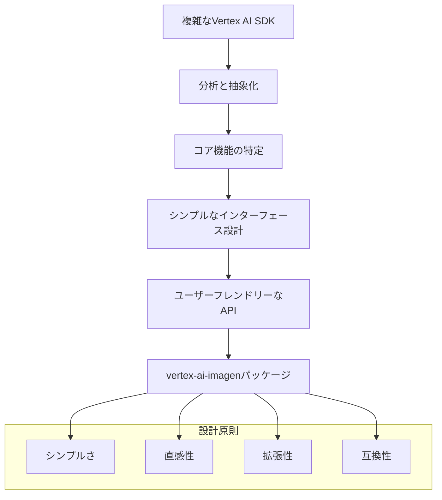
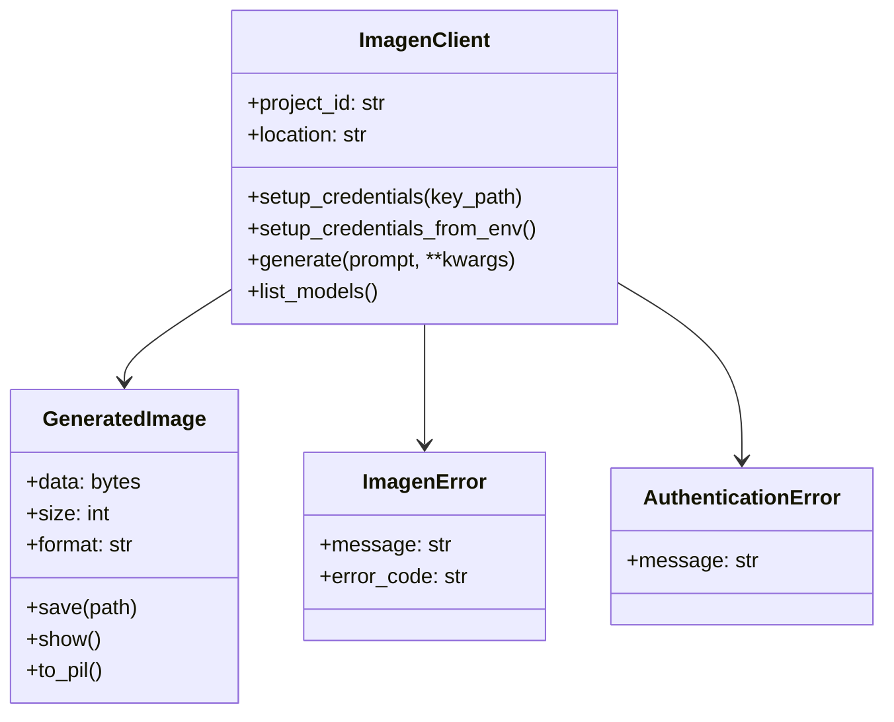
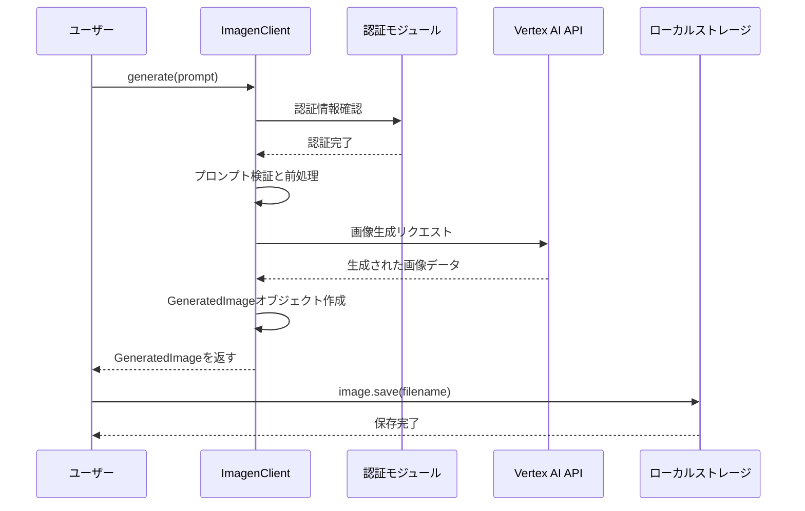
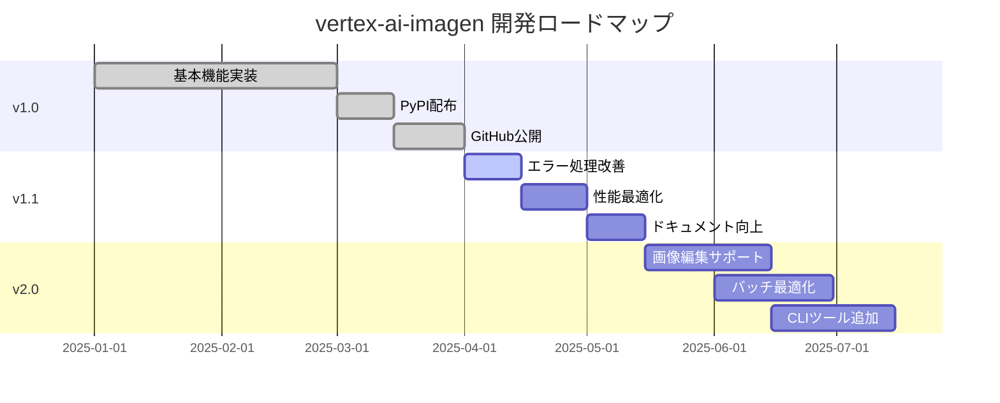

## 🎯 概要

Google Vertex AIのImagen APIを使用してAI画像を生成したいが、複雑な設定と長いコードが負担に感じていませんか？ `vertex-ai-imagen`パッケージを使用すれば、数行のシンプルなコードで強力なAI画像生成機能を実装できます。

```python
import asyncio
from vertex_ai_imagen import ImagenClient

async def main():
    # シンプルな初期化
    client = ImagenClient(project_id="your-project")
    client.setup_credentials("path/to/service-account-key.json")
    
    # 画像生成
    image = await client.generate(
        prompt="A serene mountain landscape at sunset",
        aspect_ratio="16:9"
    )
    
    # 画像保存
    image.save("sunset.png")
    print(f"Image saved! Size: {image.size:,} bytes")

asyncio.run(main())
```

**主な特徴:**
- 🚀 **簡単セットアップ**: 複雑なVertex AI設定を簡素化
- ⚡ **非同期サポート**: async/awaitパターンによる高性能
- 🎯 **型安全性**: 完全な型ヒント対応
- 🔒 **セキュリティ**: Google Cloudサービスアカウント認証
- 📦 **クリーンなモデル**: 直感的なデータクラス

---

## 📚 詳細説明

### パッケージのインストールと基本設定

`vertex-ai-imagen`は、Google Vertex AIのImagen APIをPythonでより簡単に使用できるように設計されたラッパーライブラリです。複雑な認証プロセスとAPI呼び出しを簡素化し、開発者が画像生成ロジックに集中できるよう支援します。

```bash
# PyPIからパッケージをインストール
pip install vertex-ai-imagen
```

**📦 配布情報:**
- **PyPIパッケージ**: [https://pypi.org/project/vertex-ai-imagen/](https://pypi.org/project/vertex-ai-imagen/)
- **GitHubリポジトリ**: [https://github.com/realcoding2003/vertex-ai-imagen](https://github.com/realcoding2003/vertex-ai-imagen)
- **ライセンス**: MIT License
- **サポートするPythonバージョン**: Python 3.7+

### なぜこのパッケージが必要なのか？

Google Vertex AIの基本SDKは非常に強力ですが、時として複雑になることがあります。シンプルな画像生成タスクでも、かなりの量のボイラープレートコードが必要です。

**既存のVertex AI SDK使用時:**
```python
import vertexai
from vertexai.preview.vision_models import ImageGenerationModel

# 複雑な初期化プロセス
vertexai.init(project="your-project-id", location="us-central1")
model = ImageGenerationModel.from_pretrained("imagen-3.0-generate-002")

# 画像生成
images = model.generate_images(
    prompt="A serene mountain landscape at sunset",
    number_of_images=2,
    aspect_ratio="16:9",
    add_watermark=False,
    # 多くのオプションパラメータ...
)

# 手動で画像保存
for i, image in enumerate(images.images):
    image.save(f"generated_image_{i}.png")
```

**vertex-ai-imagen使用時:**
```python
import asyncio
from vertex_ai_imagen import ImagenClient

async def main():
    # シンプルな初期化
    client = ImagenClient(project_id="your-project")
    client.setup_credentials("path/to/service-account-key.json")
    
    # 一行で画像生成
    image = await client.generate(
        prompt="A serene mountain landscape at sunset",
        aspect_ratio="16:9"
    )
    
    # 画像保存
    image.save("sunset.png")
    print(f"Image saved! Size: {image.size:,} bytes")

asyncio.run(main())
```

### 開発プロセスと設計哲学

このパッケージは以下の設計原則に従って開発されました:



#### 1. シンプルさ (Simplicity)
複雑なセットアップ過程を最小化し、必須パラメータのみでも動作するよう設計しました。

#### 2. 直感性 (Intuitiveness)
メソッド名とパラメータ名を直感的に理解できるよう命名しました。

#### 3. 拡張性 (Extensibility)
基本機能はシンプルに保ちながら、高度な機能も簡単にアクセスできるようにしました。

#### 4. 互換性 (Compatibility)
既存のVertex AI SDKとの互換性を維持し、必要時に低レベルAPIにもアクセス可能です。

### 主な機能と使い方

#### 基本的な画像生成
```python
import asyncio
from vertex_ai_imagen import ImagenClient

async def main():
    # クライアント初期化
    client = ImagenClient(project_id="your-gcp-project")
    client.setup_credentials("path/to/service-account-key.json")
    
    # 単一画像生成
    image = await client.generate(
        prompt="A futuristic city skyline with flying cars",
        aspect_ratio="16:9",
        model="imagen-3.0-generate-002"
    )
    
    # 画像保存と情報出力
    image.save("futuristic_city.png")
    print(f"Generated image size: {image.size:,} bytes")

asyncio.run(main())
```

#### バッチ画像生成
```python
import asyncio
from vertex_ai_imagen import ImagenClient

async def main():
    client = ImagenClient(project_id="your-project")
    client.setup_credentials_from_env()  # 環境変数から認証情報をロード
    
    # 複数画像を同時生成
    prompts = [
        "A peaceful forest scene",
        "A bustling marketplace", 
        "A calm ocean sunset"
    ]
    
    for i, prompt in enumerate(prompts):
        images = await client.generate(
            prompt=prompt,
            count=2,  # プロンプトごとに2枚ずつ生成
            aspect_ratio="1:1"
        )
        
        # 自動命名で保存
        for j, image in enumerate(images):
            image.save(f"scene_{i}_{j}.png")

asyncio.run(main())
```

#### 高度な設定オプション



### 環境設定と認証

パッケージを使用する前に、Google Cloud認証を設定する必要があります：

```python
from vertex_ai_imagen import ImagenClient

# 方法1: サービスアカウントキーファイルを直接指定
client = ImagenClient(project_id="your-project")
client.setup_credentials("path/to/service-account-key.json")

# 方法2: 環境変数を使用（推奨）
import os
os.environ['GOOGLE_APPLICATION_CREDENTIALS'] = 'path/to/service-account-key.json'

client = ImagenClient(project_id="your-project")
client.setup_credentials_from_env()
```

**Google Cloud設定:**
```bash
# 1. API有効化
gcloud services enable aiplatform.googleapis.com

# 2. サービスアカウント作成
gcloud iam service-accounts create imagen-client \
    --display-name="Imagen Client"

# 3. 権限付与
gcloud projects add-iam-policy-binding PROJECT_ID \
    --member="serviceAccount:imagen-client@PROJECT_ID.iam.gserviceaccount.com" \
    --role="roles/aiplatform.user"

# 4. サービスアカウントキー生成
gcloud iam service-accounts keys create key.json \
    --iam-account=imagen-client@PROJECT_ID.iam.gserviceaccount.com
```

### エラー処理とベストプラクティス

```python
import asyncio
from vertex_ai_imagen import ImagenClient
from vertex_ai_imagen.exceptions import ImagenError, AuthenticationError

async def safe_generate():
    try:
        client = ImagenClient(project_id="your-project")
        client.setup_credentials_from_env()
        
        # 安全な画像生成
        image = await client.generate(
            prompt="A beautiful landscape",
            model="imagen-3.0-generate-002",
            safety_setting="block_medium_and_above"
        )
        
        image.save("landscape.png")
        print(f"✅ 成功: {image.size:,} bytes")
        
    except AuthenticationError:
        print("❌ 認証エラー: サービスアカウントキーを確認してください")
    except ImagenError as e:
        print(f"❌ 画像生成失敗: {e}")
    except Exception as e:
        print(f"❌ 予期しないエラー: {e}")

asyncio.run(safe_generate())
```

**サポートされるモデル:**
```python
client = ImagenClient(project_id="your-project")
models = client.list_models()
print(models)
# 出力: ['imagegeneration@006', 'imagen-3.0-generate-001', 'imagen-3.0-fast-generate-001', ...]
```

| モデル | 速度 | 品質 | 用途 |
|--------|------|------|------|
| `imagen-3.0-fast-generate-001` | ⚡ 高速 | 🟢 良好 | プロトタイピング、バッチ生成 |
| `imagegeneration@006` | 🟡 普通 | 🔵 優秀 | 一般的な用途 |
| `imagen-3.0-generate-002` | 🟡 普通 | 🟣 最高 | 高品質作業 |

### 実際の使用例

#### 1. Webアプリケーション統合
```python
from flask import Flask, request, jsonify
import asyncio
from vertex_ai_imagen import ImagenClient

app = Flask(__name__)
client = ImagenClient(project_id="your-project")
client.setup_credentials_from_env()

@app.route('/generate-image', methods=['POST'])
def generate_image():
    prompt = request.json.get('prompt')
    
    async def generate():
        try:
            image = await client.generate(
                prompt=prompt,
                aspect_ratio="1:1",
                model="imagen-3.0-fast-generate-001"
            )
            
            # クラウドストレージに保存
            image_url = save_to_storage(image)
            
            return {
                'success': True,
                'image_url': image_url,
                'size': image.size
            }
        except Exception as e:
            return {
                'success': False,
                'error': str(e)
            }
    
    # 非同期関数を同期的に実行
    result = asyncio.run(generate())
    
    if result['success']:
        return jsonify(result)
    else:
        return jsonify(result), 500
```

#### 2. バッチ処理スクリプト
```python
import csv
import asyncio
from vertex_ai_imagen import ImagenClient

async def process_bulk_generation(csv_file):
    client = ImagenClient(project_id="your-project")
    client.setup_credentials_from_env()
    
    with open(csv_file, 'r') as file:
        reader = csv.DictReader(file)
        
        for row in reader:
            prompt = row['prompt']
            filename = row['filename']
            
            try:
                image = await client.generate(
                    prompt=prompt,
                    model="imagen-3.0-fast-generate-001"  # 高速生成
                )
                
                image.save(f"output/{filename}")
                print(f"✅ 生成完了: {filename} ({image.size:,} bytes)")
                
            except Exception as e:
                print(f"❌ 生成失敗: {filename} - {e}")

# 使用法
asyncio.run(process_bulk_generation('image_prompts.csv'))
```

### パフォーマンス最適化とコスト管理

```python
import asyncio
from vertex_ai_imagen import ImagenClient

async def cost_efficient_generation():
    client = ImagenClient(project_id="your-project")
    client.setup_credentials_from_env()
    
    # コスト効率的な設定
    image = await client.generate(
        prompt="A beautiful landscape",
        model="imagen-3.0-fast-generate-001",  # 高速で安価なモデル
        aspect_ratio="1:1",  # 小さなサイズでコスト節約
        enhance_prompt=False,  # プロンプト改善を無効化
        seed=12345  # 再現可能な結果
    )
    
    return image

# 高度なオプション活用
async def advanced_generation():
    client = ImagenClient(project_id="your-project")
    client.setup_credentials_from_env()
    
    images = await client.generate(
        prompt="A futuristic cityscape at night",
        model="imagen-3.0-generate-002",  # 最高品質
        aspect_ratio="16:9",
        count=3,  # 複数のバリエーション生成
        negative_prompt="blurry, low quality, distorted",
        safety_setting="block_medium_and_above"
    )
    
    return images

asyncio.run(cost_efficient_generation())
```

**サポートされるアスペクト比:**
- `1:1` - 正方形
- `16:9` - ワイドスクリーン 
- `9:16` - 縦向き（モバイル）
- `4:3` - 従来の横向き
- `3:4` - 従来の縦向き

### API呼び出しフロー



### パッケージの利点と制限

#### 利点
- **🚀 簡単セットアップ**: 複雑なVertex AI設定を簡素化
- **⚡ 非同期サポート**: async/awaitパターンによる高性能
- **🎯 型安全性**: IDE自動補完のための完全な型ヒント対応
- **🔒 セキュリティ**: Google Cloudサービスアカウント認証
- **📦 クリーンなモデル**: 直感的なデータクラス
- **🎛️ 完全制御**: すべてのImagenパラメータへのアクセス
- **📚 豊富な例**: [GitHub例ディレクトリ](https://github.com/realcoding2003/vertex-ai-imagen/tree/master/examples)提供

#### 制限
- **Python 3.7+要求**: 古いPythonバージョンは非対応
- **Google Cloud依存**: GCPプロジェクトと認証が必須
- **非同期パターン**: async/awaitに慣れていない開発者には学習コスト
- **ネットワーク依存**: インターネット接続とGoogle Cloudサービス可用性が必須

### リソースと参考資料

**📚 公式ドキュメントとリソース:**
- **PyPIパッケージ**: [https://pypi.org/project/vertex-ai-imagen/](https://pypi.org/project/vertex-ai-imagen/)
- **GitHubリポジトリ**: [https://github.com/realcoding2003/vertex-ai-imagen](https://github.com/realcoding2003/vertex-ai-imagen)
- **基本使用例**: [basic_usage.py](https://github.com/realcoding2003/vertex-ai-imagen/blob/master/examples/basic_usage.py)
- **高度な機能デモ**: [test_image_generation.py](https://github.com/realcoding2003/vertex-ai-imagen/blob/master/examples/test_image_generation.py)

**🔧 開発環境設定:**
```bash
# 1. パッケージインストール
pip install vertex-ai-imagen

# 2. 環境変数設定（オプション）
export GOOGLE_CLOUD_PROJECT="your-project-id"
export GOOGLE_APPLICATION_CREDENTIALS="/path/to/key.json"

# 3. クイックテスト
python -c "from vertex_ai_imagen import ImagenClient; print('インストール完了!')"
```

**💡 Jupyterノートブックでの使用:**
```python
# ノートブックで画像を直接表示
import asyncio
from vertex_ai_imagen import ImagenClient

async def notebook_demo():
    client = ImagenClient(project_id="your-project")
    client.setup_credentials_from_env()
    
    image = await client.generate("A cute cat wearing a hat")
    image.show()  # ノートブックでインライン表示

# Jupyterで実行
await notebook_demo()  # または asyncio.run(notebook_demo())
```

### 今後の計画とロードマップ



**計画された機能:**
- 🎨 **画像編集**: 既存画像の修正と改善機能
- 🚀 **バッチ最適化**: 大量画像生成の最適化
- 💻 **CLIツール**: コマンドラインから直接使用可能なツール
- 🐳 **Dockerサポート**: コンテナ化されたデプロイメントサポート
- 📊 **使用量追跡**: コストと使用量のモニタリング

## 結論

`vertex-ai-imagen`パッケージは、Google Vertex AIの強力な画像生成機能をより簡単で直感的に使用できる優れたツールです。複雑なセットアップ過程を簡素化し、非同期処理による高性能を提供し、型安全性を保証することで、開発者が創造的な作業に集中できるよう支援します。

**主な成果:**
- ✅ **PyPI公式リリース**: [pypi.org/project/vertex-ai-imagen](https://pypi.org/project/vertex-ai-imagen/)
- ✅ **オープンソース公開**: [GitHubリポジトリ](https://github.com/realcoding2003/vertex-ai-imagen)
- ✅ **MITライセンス**: 自由な使用と貢献が可能
- ✅ **完全なドキュメント**: 豊富な例とガイドを提供

**適した使用例:**
- 🚀 **迅速なプロトタイピング**: AI画像生成アイデアを素早く検証
- 🎨 **創作ツール**: アーティストとデザイナーのためのAI補助ツール
- 📱 **Web/アプリ開発**: 動的画像生成が必要なアプリケーション
- 🏢 **企業ソリューション**: 大量画像生成と自動化ワークフロー

**コミュニティ貢献:**
パッケージの継続的な発展のため、GitHubでのイシューレポート、機能提案、プルリクエストを歓迎します。MITライセンスの下で誰でも自由に使用し、貢献できます。

特にAI画像生成を初めて始める開発者や、迅速なプロトタイピングが必要なプロジェクトに非常に有用です。パッケージの直感的なAPIと充実したドキュメントは学習コストを大幅に下げ、同時に上級ユーザーのためのすべてのImagen機能への完全なアクセス性を提供します。

今後も継続的なアップデートと機能改善により、さらに強力で使いやすいパッケージに発展することが期待されます。AI画像生成プロジェクトを計画している方は、ぜひ`vertex-ai-imagen`パッケージをお試しください！ 