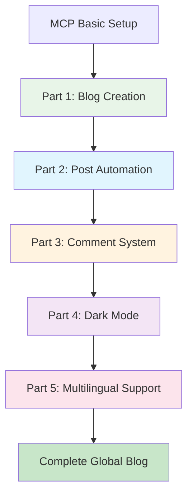

# Building a GitHub Pages Tech Blog with AI - Complete Series Guide


## 🎯 Series Overview

**Goal**: Build professional tech blog from start to finish using Claude Desktop MCP
**Features**: Complete blog system through AI conversation without copy/paste
**Deliverable**: Production-level blog with SEO optimization, comment system, dark mode, and multilingual support



## 📚 Series Composition

### [Part 1: Creating Jekyll Blog Locally with Claude Desktop MCP](/en/2025/06/09/claude-desktop-mcp-blog-setup-en/)

**Core Content**: Revolutionary value of MCP and complete Jekyll blog auto-generation
- MCP (Model Context Protocol) introduction and setup
- Game-changing experience of direct local filesystem access
- Complete Jekyll project structure generation at once
- GitHub Pages deployment setup automation

**Time Savings**: Manual setup 2 hours → MCP 10 minutes (92% reduction)

**Key Achievements**:
```bash
# Complete project generated with single conversation
realcoding.github.io/
├── _config.yml          # ✅ Jekyll configuration
├── _layouts/            # ✅ Custom layouts
├── _includes/           # ✅ Reusable components
├── assets/             # ✅ CSS/JS/images
└── GitHub Actions      # ✅ Auto deployment
```

---

### [Part 2: Complete Automation of SEO-Optimized Tech Posting with MCP](/en/2025/06/09/mcp-automated-blog-posting-en/)

**Core Content**: Auto-generate complete tech posts from just presenting ideas
- Smart prompt design and template systems
- SEO metadata automatic optimization
- Practical code examples and automatic image generation
- Consistent posting quality assurance system

**Time Savings**: Manual writing 3 hours → MCP 20 minutes (87% reduction)

**Auto-generated Elements**:
- ✅ SEO-optimized titles and meta descriptions
- ✅ Structured content and code examples
- ✅ Related image auto-generation
- ✅ Appropriate category/tag auto-classification

---

### [Part 3: Setting up Giscus Comment System in 5 Minutes with MCP](/en/2025/06/09/mcp-giscus-comments-setup-en/)

**Core Content**: Complete automatic setup of GitHub Issues-based comment system
- Comparative analysis of Giscus vs other comment systems
- GitHub Issues integration auto-setup
- Jekyll layout automatic integration
- Responsive comment UI customization

**Time Savings**: Manual setup 30 minutes → MCP 5 minutes (83% reduction)

**Implementation Result**:
```html
<!-- Auto-generated comment system -->
<script src="https://giscus.app/client.js"
        data-repo="username/blog-repo"
        data-repo-id="[AUTO_GENERATED_ID]"
        data-category="General"
        data-category-id="[AUTO_GENERATED_ID]"
        data-mapping="pathname"
        crossorigin="anonymous"
        async>
</script>
```

---

### [Part 4: Perfect Implementation of Dark/Light Mode with MCP](/en/2025/06/09/mcp-dark-light-mode-implementation-en/)

**Core Content**: Complete theme system from CSS variables to comment synchronization
- CSS Custom Properties-based theme architecture
- System preference auto-detection and localStorage integration
- Smooth transition animations with accessibility considerations
- Giscus comment theme real-time synchronization

**Implementation Complexity**: High → Completely resolved with MCP

**Core Features**:
```javascript
// Auto-generated theme management system
const theme = localStorage.getItem('theme') || 
  (window.matchMedia('(prefers-color-scheme: dark)').matches ? 'dark' : 'light');
```

---

### [Part 5: Completing Jekyll Multilingual Blog with MCP](/en/2025/06/09/mcp-jekyll-multilingual-blog-en/)

**Core Content**: Complete multilingual system construction for global accessibility
- GitHub Pages compatible custom multilingual solution
- Language-specific URL routing system (/, /en/, /ja/)
- hreflang SEO optimization automatic application
- Dynamic language switching UI and translation management system

**Final Achievement**: Global blog supporting Korean/English/Japanese completed

## 🚀 Core Value of the Series

### 1. Paradigm Shift: AI Collaborative Development
```
Before: Humans learn and adapt to tools
MCP: Tools understand human intentions and auto-execute
```

### 2. Overwhelming Efficiency
- **Total Time**: Manual implementation 20-30 hours → MCP 1-2 hours
- **Time Savings**: 94%
- **Learning Curve**: 95% reduction
- **Code Quality**: Expert-level consistency maintained

### 3. Complete Integration System
Each part is independent yet perfectly integrated:
- Basic blog structure → Content automation → Social features → UX enhancement → Global expansion

## 📋 Series Usage Guide

### Recommended Learning Order

**1. Sequential Learning** (Recommended):
Follow all parts in order to build complete blog

**2. Selective Learning**:
- Basic blog only: Part 1
- Content-focused: Parts 1-2
- Community features: Parts 1-3
- Complete user experience: Parts 1-4
- Global blog: Complete series

### Required Prerequisites

**Essential**:
- GitHub account and basic Git usage
- Claude Desktop installation and MCP setup

**Recommended**:
- Basic understanding of Jekyll/Markdown
- Web development fundamentals (HTML/CSS/JavaScript)

**Not Required**:
- Complex Jekyll configuration knowledge
- Advanced web development skills
- Server management experience

## 🎯 What You'll Gain After Completing the Series

### Technical Achievements
- ✅ Production-level tech blog
- ✅ Master MCP-based automation workflows
- ✅ Apply modern web development best practices
- ✅ Implement SEO optimization and global accessibility

### Practical Value
- ✅ Professional platform for personal branding
- ✅ Tech knowledge sharing and community building
- ✅ Enhanced portfolio quality
- ✅ AI tool utilization expertise

## 🎉 Getting Started

If you're ready, start with [Part 1: Creating Jekyll Blog Locally with Claude Desktop MCP](/en/2025/06/09/claude-desktop-mcp-blog-setup-en/)!

Each part consists of about 10-15 minutes of hands-on time, and you can complete the entire series within a day.

---

**📚 Complete Series List**:
1. [Building a GitHub Pages Tech Blog with AI (1) - Creating Jekyll Blog Locally with Claude Desktop MCP](/en/2025/06/09/claude-desktop-mcp-blog-setup-en/)
2. [Building a GitHub Pages Tech Blog with AI (2) - Complete Automation of SEO-Optimized Tech Posting with MCP](/en/2025/06/09/mcp-automated-blog-posting-en/)
3. [Building a GitHub Pages Tech Blog with AI (3) - Setting up Giscus Comment System in 5 Minutes with MCP](/en/2025/06/09/mcp-giscus-comments-setup-en/)
4. [Building a GitHub Pages Tech Blog with AI (4) - Perfect Implementation of Dark/Light Mode with MCP](/en/2025/06/09/mcp-dark-light-mode-implementation-en/)
5. [Building a GitHub Pages Tech Blog with AI (5) - Completing Jekyll Multilingual Blog with MCP](/en/2025/06/09/mcp-jekyll-multilingual-blog-en/)

---

**Next in Series**: [Building a GitHub Pages Tech Blog with AI (1) - Creating Jekyll Blog Locally with Claude Desktop MCP](/en/2025/06/09/claude-desktop-mcp-blog-setup-en/)
