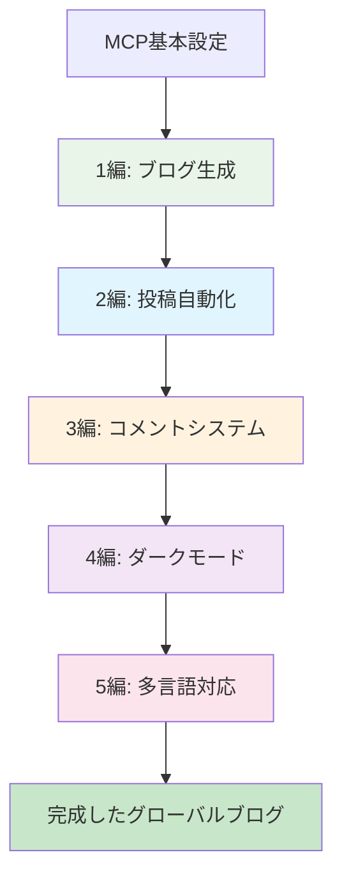

# AIでGitHub Pages技術ブログを作る - 完全シリーズガイド


## 🎯 シリーズ概要

**目標**: Claude Desktop MCPを活用して専門的な技術ブログを最初から完成まで構築
**特徴**: コピー&ペーストなしにAIとの対話だけで完全なブログシステム完成
**成果物**: SEO最適化、コメントシステム、ダークモード、多言語対応が含まれたプロダクションレベルブログ



## 📚 シリーズ構成

### [1編: Claude Desktop MCPでローカルに直接Jekyllブログを生成](/ja/2025/06/09/claude-desktop-mcp-blog-setup-ja/)

**核心内容**: MCPの革新的価値とJekyllブログ完全自動生成
- MCP（Model Context Protocol）紹介と設定
- ローカルファイルシステム直接アクセスのゲームチェンジング体験
- 完全なJekyllプロジェクト構造一度に生成
- GitHub Pages配備設定自動化

**時間節約**: 手動設定2時間 → MCP 10分（92%短縮）

**核心成果**:
```bash
# 一度の対話で生成される完全なプロジェクト
realcoding.github.io/
├── _config.yml          # ✅ Jekyll設定
├── _layouts/            # ✅ カスタムレイアウト
├── _includes/           # ✅ 再利用コンポーネント
├── assets/             # ✅ CSS/JS/画像
└── GitHub Actions      # ✅ 自動配備
```

---

### [2編: MCPでSEO最適化された技術投稿完全自動化](/ja/2025/06/09/mcp-automated-blog-posting-ja/)

**核心内容**: アイデアを提示するだけで完成した技術投稿自動生成
- スマートプロンプト設計とテンプレートシステム
- SEOメタデータ自動最適化
- 実用的コード例と画像自動生成
- 一貫した投稿品質保証システム

**時間節約**: 手動作成3時間 → MCP 20分（87%短縮）

**自動生成要素**:
- ✅ SEO最適化されたタイトルとメタ説明
- ✅ 構造化されたコンテンツとコード例
- ✅ 関連画像自動生成
- ✅ 適切なカテゴリ/タグ自動分類

---

### [3編: MCPでGiscusコメントシステムを5分で完成](/ja/2025/06/09/mcp-giscus-comments-setup-ja/)

**核心内容**: GitHub Issues基盤コメントシステム完全自動設定
- Giscus vs他のコメントシステム比較分析
- GitHub Issues連動自動設定
- Jekyllレイアウト自動統合
- レスポンシブコメントUIカスタマイズ

**時間節約**: 手動設定30分 → MCP 5分（83%短縮）

**実装結果**:
```html
<!-- 自動生成されたコメントシステム -->
<script src="https://giscus.app/client.js"
        data-repo="username/blog-repo"
        data-repo-id="[自動生成ID]"
        data-category="General"
        data-category-id="[自動生成ID]"
        data-mapping="pathname"
        crossorigin="anonymous"
        async>
</script>
```

---

### [4編: MCPでダーク/ライトモード完璧実装](/ja/2025/06/09/mcp-dark-light-mode-implementation-ja/)

**核心内容**: CSS変数からコメント同期まで完全なテーマシステム
- CSS Custom Properties基盤テーマアーキテクチャ
- システム嗜好度自動感知とlocalStorage連動
- 滑らかな遷移アニメーションとアクセシビリティ考慮
- Giscusコメントテーマリアルタイム同期

**実装複雑度**: 高い → MCPで完全解決

**核心機能**:
```javascript
// 自動生成されたテーマ管理システム
const theme = localStorage.getItem('theme') || 
  (window.matchMedia('(prefers-color-scheme: dark)').matches ? 'dark' : 'light');
```

---

### [5編: MCPでJekyll多言語ブログ完成](/ja/2025/06/09/mcp-jekyll-multilingual-blog-ja/)

**核心内容**: グローバルアクセシビリティのための完全な多言語システム構築
- GitHub Pages互換カスタム多言語ソリューション
- 言語別URLルーティングシステム（/、/en/、/ja/）
- hreflang SEO最適化自動適用
- 動的言語切り替えUIと翻訳管理システム

**最終成果**: 韓国語/英語/日本語対応グローバルブログ完成

## 🚀 シリーズの核心価値

### 1. パラダイム転換: AI協業開発
```
既存: 人間がツールに合わせて学習し適応
MCP: ツールが人間の意図を理解し自動実行
```

### 2. 圧倒的効率性
- **総所要時間**: 手動実装20-30時間 → MCP 1-2時間
- **時間節約率**: 94%
- **学習曲線**: 95%減少
- **コード品質**: 専門家水準の一貫性維持

### 3. 完全統合システム
各編が独立的でありながら完璧に連動するシステム：
- ブログ基本構造 → コンテンツ自動化 → ソーシャル機能 → UX向上 → グローバル拡張

## 📋 シリーズ活用ガイド

### 推奨学習順序

**1. 順次学習**（推奨）：
すべての編を順序通りに従って完全なブログ構築

**2. 選択的学習**：
- 基本ブログのみ: 1編
- コンテンツ中心: 1-2編
- コミュニティ機能: 1-3編
- 完全なユーザーエクスペリエンス: 1-4編
- グローバルブログ: 全体シリーズ

### 必要な事前知識

**必須**：
- GitHubアカウントと基本Git使用法
- Claude Desktop インストールとMCP設定

**推奨**：
- Jekyll/Markdown基本理解
- ウェブ開発基礎知識（HTML/CSS/JavaScript）

**不要**：
- 複雑なJekyll設定知識
- 高級ウェブ開発技術
- サーバー管理経験

## 🎯 シリーズ完走後に得られるもの

### 技術的成果
- ✅ プロダクションレベルの技術ブログ
- ✅ MCP基盤自動化ワークフローマスター
- ✅ 現代的ウェブ開発ベストプラクティス適用
- ✅ SEO最適化とグローバルアクセシビリティ実装

### 実用的価値
- ✅ 個人ブランディングのための専門的プラットフォーム
- ✅ 技術知識共有とコミュニティ構築
- ✅ ポートフォリオ品質向上
- ✅ AIツール活用専門性確保

## 🎉 始める

準備ができたら[1編: Claude Desktop MCPでローカルに直接Jekyllブログを生成](/ja/2025/06/09/claude-desktop-mcp-blog-setup-ja/)から始めてください！

各編は約10-15分の実習時間で構成されており、全体シリーズを1日以内に完走できます。

---

**📚 シリーズ全体リスト**:
1. [AIでGitHub Pages技術ブログを作る (1) - Claude Desktop MCPでローカルに直接Jekyllブログを生成](/ja/2025/06/09/claude-desktop-mcp-blog-setup-ja/)
2. [AIでGitHub Pages技術ブログを作る (2) - MCPでSEO最適化された技術投稿完全自動化](/ja/2025/06/09/mcp-automated-blog-posting-ja/)
3. [AIでGitHub Pages技術ブログを作る (3) - MCPでGiscusコメントシステムを5分で完成](/ja/2025/06/09/mcp-giscus-comments-setup-ja/)
4. [AIでGitHub Pages技術ブログを作る (4) - MCPでダーク/ライトモード完璧実装](/ja/2025/06/09/mcp-dark-light-mode-implementation-ja/)
5. [AIでGitHub Pages技術ブログを作る (5) - MCPでJekyll多言語ブログ完成](/ja/2025/06/09/mcp-jekyll-multilingual-blog-ja/)

---

**シリーズ次の記事**: [AIでGitHub Pages技術ブログを作る (1) - Claude Desktop MCPでローカルに直接Jekyllブログを生成](/ja/2025/06/09/claude-desktop-mcp-blog-setup-ja/)
