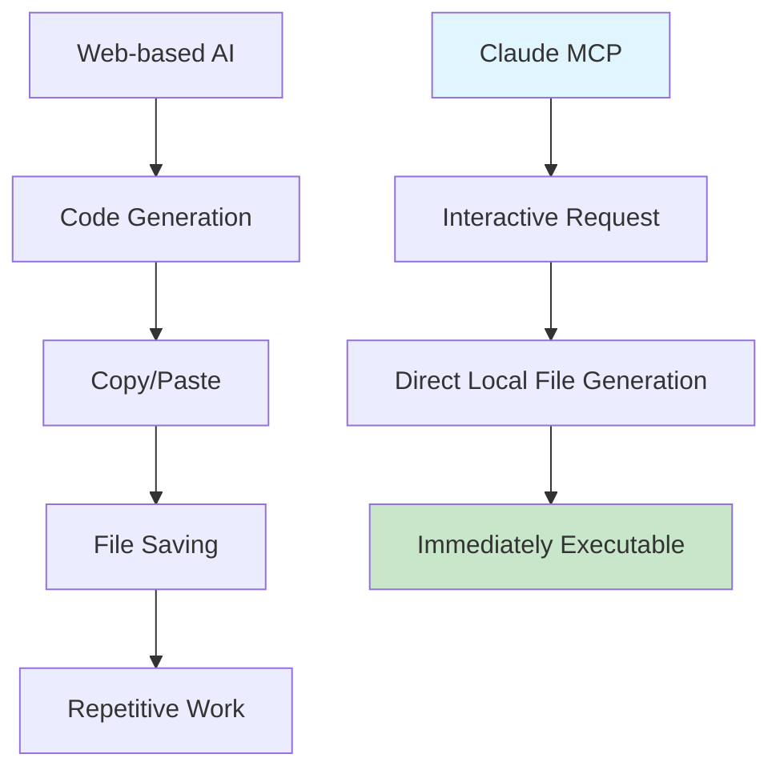

# Building a GitHub Pages Tech Blog with AI (1) - Creating Jekyll Blog Locally with Claude Desktop MCP


## 🎯 Key Summary
**Existing Problem**: Tedious copy/paste workflow and manual file creation when using AI coding tools
**MCP Solution**: Claude Desktop directly accesses local filesystem to generate complete project structure at once

```bash
# Run the MCP-generated result immediately
cd /path/to/generated/blog
bundle exec jekyll serve
# ✨ Complete blog runs instantly
```

## 🚀 What is MCP (Model Context Protocol)?

MCP is a protocol that enables Claude Desktop to directly interact with local environments. Key difference from web-based AI tools:

**Web-based AI**: Code generation → Copy → Paste → Save file (repeat)
**Claude MCP**: Conversation → Direct local file generation → Immediately executable



## 🛠️ Practical Jekyll Blog Creation with MCP

### Step 1: Verify MCP Server Setup

Check MCP connection status in Claude Desktop:
```
Ask Claude: "Can you access my local file system?"
```

When MCP works properly, Claude will show your current directory structure.

### Step 2: Project Generation Command

```
Actual prompt used:
"Create a Jekyll tech blog called realcoding.github.io 
in my local `/Users/kevinpark/Documents/projects/` folder.

Requirements:
- Clean developer theme
- Category/tag functionality
- Search feature
- SEO optimization
- GitHub Pages deployment setup

Generate all files directly in local environment."
```

### Step 3: Actual MCP Workflow

Tasks performed by Claude MCP:

**File Structure Generation**:
```
realcoding.github.io/
├── _config.yml          # ✅ Generated by MCP
├── Gemfile              # ✅ Generated by MCP  
├── _layouts/
│   ├── default.html     # ✅ Generated by MCP
│   └── post.html        # ✅ Generated by MCP
├── _includes/
│   ├── header.html      # ✅ Generated by MCP
│   └── footer.html      # ✅ Generated by MCP
├── _sass/
│   └── main.scss        # ✅ Generated by MCP
├── assets/
│   └── css/main.scss    # ✅ Generated by MCP
├── _posts/              # ✅ Generated by MCP
└── index.html           # ✅ Generated by MCP
```

**Generated with Single Command**:
- Complete Jekyll project structure
- Custom layouts and styles
- GitHub Actions deployment workflow
- SEO meta-tag templates
- Responsive CSS stylesheets

### Step 4: Immediate Execution and Verification

```bash
cd realcoding.github.io

# Install dependencies with MCP-generated Gemfile
bundle install

# Run local server
bundle exec jekyll serve

# Check in browser at http://localhost:4000
```

## 💡 Game-Changing Points of MCP

### 1. Completely Automated Workflow
- **Before**: 20-30 copy/paste operations per file
- **MCP**: Complete project generation with single conversation

### 2. Real-time Debugging
```
When error occurs:
"I got an error in Jekyll build: [error message]"

Claude MCP response:
→ Automatically identify problem file
→ Directly modify local file
→ Notify completion
```

### 3. Iterative Improvement
Even after project generation, continue conversing with Claude to:
- Add new layouts
- Modify CSS styles  
- Change plugin settings
- Optimize deployment scripts

All work is directly reflected in local files.

## 📊 Actual Time Comparison

**Traditional Method (Manual Setup)**:
- Reading Jekyll documentation: 30 minutes
- Theme selection and download: 20 minutes  
- Configuration file modification: 40 minutes
- Debugging: 30 minutes
- **Total time: 2 hours**

**Claude MCP Method**:
- Requirements preparation: 5 minutes
- MCP project generation: 3 minutes
- Local execution verification: 2 minutes
- **Total time: 10 minutes**

## 🎉 Next Steps and Series Preview

MCP has completed the basic blog skeleton. Content to cover in upcoming posts:

1. **Sample Post Generation**: Directly generate markdown files with MCP
2. **Comment System**: Automate Giscus setup with MCP
3. **Dark Mode**: Implement theme toggle with MCP
4. **Multilingual**: Apply i18n settings batch with MCP

## Conclusion

Claude Desktop's MCP goes beyond simple code generation to become **an AI assistant fully integrated with local development environment**. It provides revolutionary experience of implementing ideas directly into code without copy/paste hassles.

---

**📚 Complete Series List**:
1. [Building a GitHub Pages Tech Blog with AI (1) - Creating Jekyll Blog Locally with Claude Desktop MCP](/en/2025/06/09/claude-desktop-mcp-blog-setup-en/) ← Current post
2. [Building a GitHub Pages Tech Blog with AI (2) - Complete Automation of SEO-Optimized Tech Posting with MCP](/en/2025/06/09/mcp-automated-blog-posting-en/)
3. [Building a GitHub Pages Tech Blog with AI (3) - Setting up Giscus Comment System in 5 Minutes with MCP](/en/2025/06/09/mcp-giscus-comments-setup-en/)
4. [Building a GitHub Pages Tech Blog with AI (4) - Perfect Implementation of Dark/Light Mode with MCP](/en/2025/06/09/mcp-dark-light-mode-implementation-en/)
5. [Building a GitHub Pages Tech Blog with AI (5) - Completing Jekyll Multilingual Blog with MCP](/en/2025/06/09/mcp-jekyll-multilingual-blog-en/)

---

**Next in Series**: [Building a GitHub Pages Tech Blog with AI (2) - Complete Automation of SEO-Optimized Tech Posting with MCP](/en/2025/06/09/mcp-automated-blog-posting-en/)
