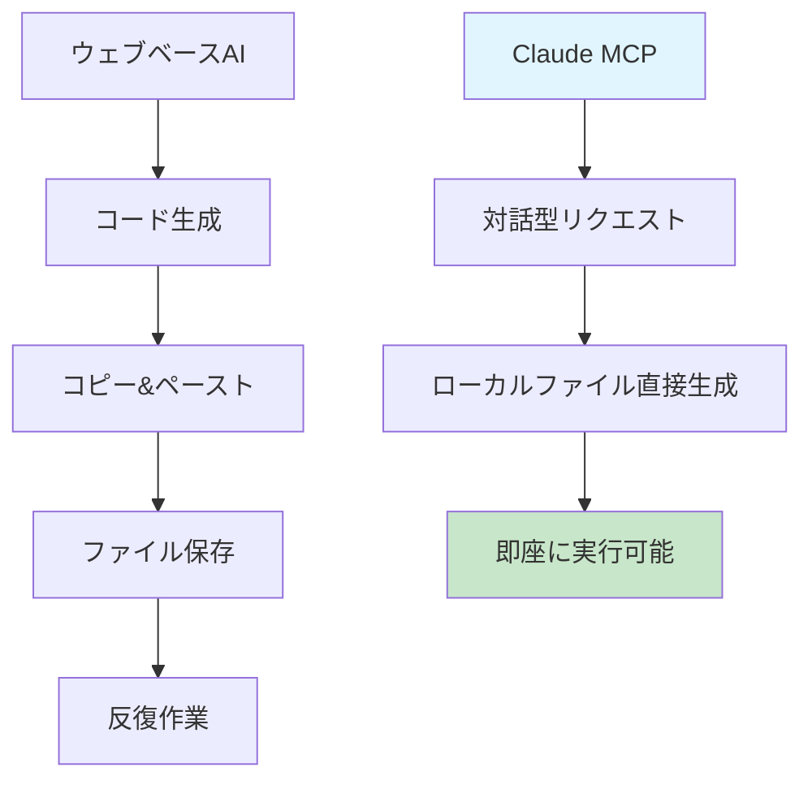

# AIでGitHub Pages技術ブログを作る (1) - Claude Desktop MCPでローカルに直接Jekyllブログを生成


## 🎯 核心要約
**既存の問題**: AIコーディングツール使用時のコピー&ペーストの手間とファイル別手動生成
**MCP解決策**: Claude Desktopがローカルファイルシステムに直接アクセスして完全なプロジェクト構造を一度に生成

```bash
# MCP生成結果をすぐに実行
cd /path/to/generated/blog
bundle exec jekyll serve
# ✨ 完成したブログが即座に実行
```

## 🚀 MCP（Model Context Protocol）とは？

MCPはClaude Desktopがローカル環境と直接相互作用できるプロトコルです。ウェブベースAIツールとの決定的違い：

**ウェブベースAI**: コード生成 → コピー → ペースト → ファイル保存（繰り返し）
**Claude MCP**: 対話 → ローカルファイル直接生成 → 即座に実行可能



## 🛠️ MCPでJekyllブログ生成実戦

### ステップ1: MCPサーバー設定確認

Claude DesktopでMCP接続状態確認：
```
Claudeに質問：「私のローカルファイルシステムにアクセスできますか？」
```

MCPが正常動作すれば、Claudeが現在のディレクトリ構造を表示します。

### ステップ2: プロジェクト生成コマンド

```
実際使用したプロンプト：
「私のローカル `/Users/kevinpark/Documents/projects/` フォルダに 
realcoding.github.io というJekyll技術ブログを生成してください。

要求事項：
- 洗練された開発者テーマ
- カテゴリ/タグ機能
- 検索機能
- SEO最適化
- GitHub Pages デプロイ設定

すべてのファイルをローカルに直接生成してください。」
```

### ステップ3: MCPの実際の作業過程

Claude MCPが実行した作業：

**ファイル構造生成**:
```
realcoding.github.io/
├── _config.yml          # ✅ MCP直接生成
├── Gemfile              # ✅ MCP直接生成  
├── _layouts/
│   ├── default.html     # ✅ MCP直接生成
│   └── post.html        # ✅ MCP直接生成
├── _includes/
│   ├── header.html      # ✅ MCP直接生成
│   └── footer.html      # ✅ MCP直接生成
├── _sass/
│   └── main.scss        # ✅ MCP直接生成
├── assets/
│   └── css/main.scss    # ✅ MCP直接生成
├── _posts/              # ✅ MCP直接生成
└── index.html           # ✅ MCP直接生成
```

**一回のコマンドで生成されたもの**:
- 完全なJekyllプロジェクト構造
- カスタムレイアウトとスタイル
- GitHub Actionsデプロイワークフロー
- SEOメタタグテンプレート
- レスポンシブCSSスタイルシート

### ステップ4: 即座実行と確認

```bash
cd realcoding.github.io

# MCP生成のGemfileで依存関係インストール
bundle install

# ローカルサーバー実行
bundle exec jekyll serve

# ブラウザでhttp://localhost:4000確認
```

## 💡 MCPのゲームチェンジングポイント

### 1. 完全自動化されたワークフロー
- **既存**: ファイル別にコピー&ペースト20-30回
- **MCP**: 一回の対話で完全なプロジェクト生成

### 2. リアルタイムデバッグ
```
エラー発生時：
「Jekyllビルドでエラーが出ました：[エラーメッセージ]」

Claude MCP応答：
→ 問題ファイル自動識別
→ ローカルファイル直接修正
→ 修正完了通知
```

### 3. 段階的改善
プロジェクト生成後もClaudeと対話しながら：
- 新しいレイアウト追加
- CSSスタイル修正  
- プラグイン設定変更
- デプロイスクリプト最適化

すべての作業がローカルファイルに直接反映されます。

## 📊 実際の作業時間比較

**従来の方法（手動設定）**:
- Jekyllドキュメント読み：30分
- テーマ選択とダウンロード：20分  
- 設定ファイル修正：40分
- デバッグ：30分
- **総所要時間：2時間**

**Claude MCP方法**:
- 要求事項整理：5分
- MCPプロジェクト生成：3分
- ローカル実行確認：2分
- **総所要時間：10分**

## 🎉 次のステップとシリーズ予告

MCPで基本ブログ骨格が完成しました。次回の投稿で扱う内容：

1. **サンプル投稿生成**: MCPでマークダウンファイル直接生成
2. **コメントシステム**: Giscus設定をMCPで自動化
3. **ダークモード**: テーマトグル機能をMCPで実装
4. **多言語**: i18n設定をMCPで一括適用

## 結論

Claude DesktopのMCPは単純なコード生成ツールを超えて**ローカル開発環境と完全統合されたAIアシスタント**です。コピー&ペーストの煩わしさなしに思考を直接コードに実装できる革新的体験を提供します。

---

**📚 シリーズ全体リスト**:
1. [AIでGitHub Pages技術ブログを作る (1) - Claude Desktop MCPでローカルに直接Jekyllブログを生成](/ja/2025/06/09/claude-desktop-mcp-blog-setup-ja/) ← 現在の記事
2. [AIでGitHub Pages技術ブログを作る (2) - MCPでSEO最適化された技術投稿完全自動化](/ja/2025/06/09/mcp-automated-blog-posting-ja/)
3. [AIでGitHub Pages技術ブログを作る (3) - MCPでGiscusコメントシステムを5分で完成](/ja/2025/06/09/mcp-giscus-comments-setup-ja/)
4. [AIでGitHub Pages技術ブログを作る (4) - MCPでダーク/ライトモード完璧実装](/ja/2025/06/09/mcp-dark-light-mode-implementation-ja/)
5. [AIでGitHub Pages技術ブログを作る (5) - MCPでJekyll多言語ブログ完成](/ja/2025/06/09/mcp-jekyll-multilingual-blog-ja/)

---

**シリーズ次の記事**: [AIでGitHub Pages技術ブログを作る (2) - MCPでSEO最適化された技術投稿完全自動化](/ja/2025/06/09/mcp-automated-blog-posting-ja/)
