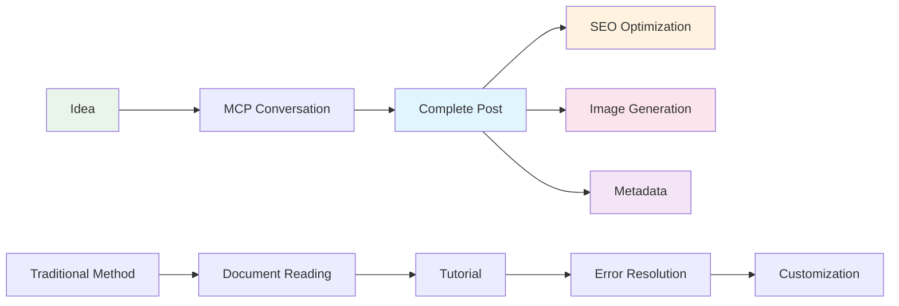

# Building a GitHub Pages Tech Blog with AI (2) - Complete Automation of SEO-Optimized Tech Posting with MCP


## 🎯 Key Summary
**Existing Problem**: Separate handling of content writing, SEO optimization, and image generation when writing tech posts
**MCP Solution**: Just provide a post idea and automatically generate complete markdown file with SEO optimization

```bash
# What MCP generates with single command
├── 2025-06-09-react-hooks-optimization.md  # Complete post
├── /assets/images/posts/react-hooks/       # Optimized images
└── SEO metadata                             # Automatically optimized
```

## 🚀 Post Automation Workflow

### Traditional vs MCP Approach

**Traditional Manual Process** (2-3 hours):
1. Topic research and structure planning
2. Markdown file creation and metadata writing
3. Content writing and code example preparation
4. Image generation or search
5. SEO optimization and tag setup

**MCP Automation Process** (10 minutes):
1. Present idea
2. Complete post file generation
3. Review and fine-tuning



## 🛠️ Practical MCP Post Generation

### Step 1: Smart Prompt Design

```
Actual prompt used:
"Write a tech post about React Hooks performance optimization.

Post requirements:
- Target: Intermediate React developers
- Length: Around 2000 characters
- Include practical code examples
- useMemo, useCallback optimization tips
- Performance measurement methods

SEO optimization:
- Search-friendly title
- Optimized meta description
- Appropriate categories/tags
- Image alt text

Generate file directly in _posts folder,
and create necessary images as well."
```

### Step 2: MCP's Automatic Generation Process

Tasks performed by Claude MCP:

**1. SEO-Optimized Metadata Generation**:
```yaml
---
title: "React Hooks Performance Optimization: Complete Guide to useMemo and useCallback"
excerpt: "Practical useMemo, useCallback usage and measurement tools to maximize React app performance"
categories: [React, Performance]
tags: [React, Hooks, useMemo, useCallback, Performance Optimization]
---
```

**2. Structured Content Auto-Generation**:
- Problem definition and solution presentation
- Executable code examples
- Performance comparison and measurement methods
- Practical application guidelines

**3. Related Image Auto-Generation**:
- Hero image (React performance optimization concept)
- Concept explanation diagrams
- Before/After performance comparison charts

### Step 3: Advanced Automation Features

**Smart Category Classification**:
```javascript
// MCP automatically analyzes and applies
Topic: "React Hooks Performance Optimization"
→ Primary Category: "React"
→ Secondary Category: "Performance"
→ Tags: ["React", "Hooks", "useMemo", "useCallback", "Performance Optimization"]
```

**SEO Title Optimization**:
```
Original idea: "React Hooks Optimization"
→ MCP optimization result: "React Hooks Performance Optimization: Complete Guide to useMemo and useCallback"

Optimization elements:
✅ Search keywords included
✅ Under 50 characters
✅ Action-oriented expression
✅ Specific technology names specified
```

## 💡 Core Advantages of MCP Post Automation

### 1. Consistent Quality Assurance
- Standardized post structure
- Automatic application of SEO best practices
- Code example quality assurance
- Image consistency maintenance

### 2. Maximum Time Efficiency
```
Manual writing time: 3 hours
MCP automation: 10 minutes + review 10 minutes = 20 minutes
Time saved: 87% ⬆️
```

### 3. Automatic SEO Performance Optimization
- Automatic meta tag generation
- Structured data application
- Image alt text optimization
- Automatic internal link suggestions

## 📊 Actual Generated Post Quality Analysis

### Characteristics of MCP-Generated Posts

**Content Structure**:
- ✅ Clear problem definition
- ✅ Step-by-step solution methods
- ✅ Executable code
- ✅ Practical application guide

**SEO Optimization**:
- ✅ Keyword density optimization
- ✅ Systematic heading structure
- ✅ Meta description optimization
- ✅ Image SEO application

**User Experience**:
- ✅ Scannable structure
- ✅ Practical examples
- ✅ Visual element balance
- ✅ Clear action items

## 🎯 Advanced MCP Posting Tips

### Template System Setup

```
Prompt template:
"Write a tech post about [topic].

Context:
- Target audience: [Beginner/Intermediate/Advanced] [technology] developers
- Post purpose: [Learning/Problem solving/Trend introduction]
- Core keywords: [keyword1, keyword2, keyword3]

Content requirements:
- Length: [1500-2500] characters
- Practice code: [Include/Exclude]
- Performance optimization: [Important/Normal]

Auto-generation requests:
- Generate file in _posts folder
- SEO-optimized metadata
- 2 related images
- Appropriate categories/tags"
```

### Series Post Automation

```
Series connection prompt:
"Write a follow-up to the previously generated '[Previous Post Title]'.
Create a structure that naturally connects to the previous content."
```

## 🎉 Next Step: Comment System Integration

Now that we've completed post automation with MCP, next we'll cover how to set up **Giscus comment system** with MCP.

Preview content:
- Automatic GitHub Issues setup
- Automatic Giscus configuration file generation
- Comment template customization
- Moderation automation

## Conclusion

Post automation using MCP goes beyond simple time saving to enable building **a consistent high-quality content production system**. An era has opened where anyone with ideas can run professional tech blogs.

---

**📚 Complete Series List**:
1. [Building a GitHub Pages Tech Blog with AI (1) - Creating Jekyll Blog Locally with Claude Desktop MCP](/en/2025/06/09/claude-desktop-mcp-blog-setup-en/)
2. [Building a GitHub Pages Tech Blog with AI (2) - Complete Automation of SEO-Optimized Tech Posting with MCP](/en/2025/06/09/mcp-automated-blog-posting-en/) ← Current post
3. [Building a GitHub Pages Tech Blog with AI (3) - Setting up Giscus Comment System in 5 Minutes with MCP](/en/2025/06/09/mcp-giscus-comments-setup-en/)
4. [Building a GitHub Pages Tech Blog with AI (4) - Perfect Implementation of Dark/Light Mode with MCP](/en/2025/06/09/mcp-dark-light-mode-implementation-en/)
5. [Building a GitHub Pages Tech Blog with AI (5) - Completing Jekyll Multilingual Blog with MCP](/en/2025/06/09/mcp-jekyll-multilingual-blog-en/)

---

**Previous in Series**: [Building a GitHub Pages Tech Blog with AI (1) - Creating Jekyll Blog Locally with Claude Desktop MCP](/en/2025/06/09/claude-desktop-mcp-blog-setup-en/)

**Next in Series**: [Building a GitHub Pages Tech Blog with AI (3) - Setting up Giscus Comment System in 5 Minutes with MCP](/en/2025/06/09/mcp-giscus-comments-setup-en/)
