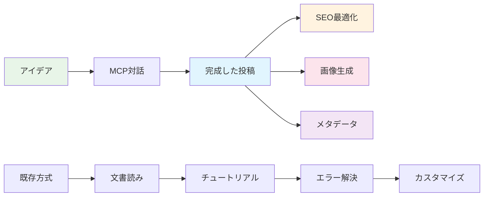

# AIでGitHub Pages技術ブログを作る (2) - MCPでSEO最適化された技術投稿完全自動化


## 🎯 核心要約
**既存の問題**: 技術投稿作成時にコンテンツ作成、SEO最適化、画像生成をそれぞれ別々に処理
**MCP解決策**: 投稿アイデアを提示するだけで完全なマークダウンファイルをSEO最適化と共に自動生成

```bash
# MCP一回のコマンドで生成されるもの
├── 2025-06-09-react-hooks-optimization.md  # 完成した投稿
├── /assets/images/posts/react-hooks/       # 最適化された画像
└── SEOメタデータ                            # 自動最適化完了
```

## 🚀 投稿自動化ワークフロー

### 既存方式 vs MCP方式

**既存手動プロセス** (2-3時間):
1. トピックリサーチと構造企画
2. マークダウンファイル生成とメタデータ作成
3. コンテンツ作成とコード例準備
4. 画像生成または検索
5. SEO最適化とタグ設定

**MCP自動化プロセス** (10分):
1. アイデア提示
2. 完成した投稿ファイル生成
3. レビューと微調整



## 🛠️ 実戦MCP投稿生成

### ステップ1: スマートプロンプト設計

```
実際使用プロンプト:
「React Hooksパフォーマンス最適化に関する技術投稿を作成してください。

投稿要求事項:
- ターゲット: 中級React開発者
- 長さ: 2000字程度
- 実用的なコード例を含む
- useMemo、useCallback最適化ティップス
- パフォーマンス測定方法

SEO最適化:
- 検索親和的タイトル
- メタ説明最適化
- 適切なカテゴリ/タグ
- 画像altテキスト

ファイルを_postsフォルダに直接生成し、
必要な画像も一緒に生成してください。」
```

### ステップ2: MCPの自動生成過程

Claude MCPが実行した作業：

**1. SEO最適化されたメタデータ生成**:
```yaml
---
title: "React Hooksパフォーマンス最適化: useMemoとuseCallback完璧ガイド"
excerpt: "React アプリのパフォーマンスを最大化するuseMemo、useCallback実戦活用法と測定ツール"
categories: [React, Performance]
tags: [React, Hooks, useMemo, useCallback, パフォーマンス最適化]
---
```

**2. 構造化されたコンテンツ自動生成**:
- 問題定義と解決策提示
- 実行可能なコード例
- パフォーマンス比較と測定方法
- 実務適用ガイドライン

**3. 関連画像自動生成**:
- ヒーロー画像（React パフォーマンス最適化コンセプト）
- 概念説明ダイアグラム
- Before/Afterパフォーマンス比較チャート

### ステップ3: 高級自動化機能

**スマートカテゴリ分類**:
```javascript
// MCPが自動で分析して適用
トピック: "React Hooksパフォーマンス最適化"
→ Primary Category: "React"
→ Secondary Category: "Performance"
→ Tags: ["React", "Hooks", "useMemo", "useCallback", "パフォーマンス最適化"]
```

**SEOタイトル最適化**:
```
原本アイデア: "React Hooks最適化"
→ MCP最適化結果: "React Hooksパフォーマンス最適化: useMemoとuseCallback完璧ガイド"

最適化要素:
✅ 検索キーワード含有
✅ 50字以内長さ
✅ アクション中心表現
✅ 具体的技術名明示
```

## 💡 MCP投稿自動化の核心利点

### 1. 一貫した品質保証
- 標準化された投稿構造
- SEOベストプラクティス自動適用
- コード例品質保証
- 画像一貫性維持

### 2. 時間効率性極大化
```
手動作成時間: 3時間
MCP自動化: 10分 + レビュー10分 = 20分
時間節約: 87% ⬆️
```

### 3. SEOパフォーマンス自動最適化
- メタタグ自動生成
- 構造化データ適用
- 画像altテキスト最適化
- 内部リンク自動提案

## 📊 実際生成された投稿品質分析

### MCP生成投稿の特徴

**コンテンツ構造**:
- ✅ 明確な問題定義
- ✅ 段階別解決方法
- ✅ 実行可能なコード
- ✅ 実務適用ガイド

**SEO最適化**:
- ✅ キーワード密度最適化
- ✅ ヘディング構造体系化
- ✅ メタ説明最適化
- ✅ 画像SEO適用

**ユーザーエクスペリエンス**:
- ✅ スキャン可能な構造
- ✅ 実用的な例
- ✅ 視覚的要素バランス
- ✅ 明確なアクションアイテム

## 🎯 高級MCP投稿ティップス

### テンプレートシステム構築

```
プロンプトテンプレート:
「[トピック]に関する技術投稿を作成してください。

コンテキスト:
- ターゲット読者: [初級/中級/高級] [技術名] 開発者
- 投稿目的: [学習/問題解決/トレンド紹介]
- 核心キーワード: [キーワード1, キーワード2, キーワード3]

コンテンツ要求事項:
- 長さ: [1500-2500]字
- 実習コード: [含む/含まない]
- パフォーマンス最適化: [重要/普通]

自動生成要請:
- _postsフォルダにファイル生成
- SEO最適化メタデータ
- 関連画像2個
- 適切なカテゴリ/タグ」
```

### シリーズ投稿自動化

```
シリーズ連結プロンプト:
「以前に生成した'[前回投稿タイトル]'の後続編を作成してください。
前回内容を参照して自然に繋がる構造で作ってください。」
```

## 🎉 次のステップ: コメントシステム統合

MCPで投稿自動化を完成したので、次は**Giscusコメントシステム**をMCPで設定する方法を扱います。

予告内容:
- GitHub Issues自動設定
- Giscus設定ファイル自動生成
- コメントテンプレートカスタマイズ
- モデレーション自動化

## 結論

MCPを活用した投稿自動化は単純な時間節約を超えて**一貫した高品質コンテンツ生産システム**を構築することができます。アイデアさえあれば誰でも専門的な技術ブログを運営できる時代が開かれました。

---

**📚 シリーズ全体リスト**:
1. [AIでGitHub Pages技術ブログを作る (1) - Claude Desktop MCPでローカルに直接Jekyllブログを生成](/ja/2025/06/09/claude-desktop-mcp-blog-setup-ja/)
2. [AIでGitHub Pages技術ブログを作る (2) - MCPでSEO最適化された技術投稿完全自動化](/ja/2025/06/09/mcp-automated-blog-posting-ja/) ← 現在の記事
3. [AIでGitHub Pages技術ブログを作る (3) - MCPでGiscusコメントシステムを5分で完成](/ja/2025/06/09/mcp-giscus-comments-setup-ja/)
4. [AIでGitHub Pages技術ブログを作る (4) - MCPでダーク/ライトモード完璧実装](/ja/2025/06/09/mcp-dark-light-mode-implementation-ja/)
5. [AIでGitHub Pages技術ブログを作る (5) - MCPでJekyll多言語ブログ完成](/ja/2025/06/09/mcp-jekyll-multilingual-blog-ja/)

---

**シリーズ前の記事**: [AIでGitHub Pages技術ブログを作る (1) - Claude Desktop MCPでローカルに直接Jekyllブログを生成](/ja/2025/06/09/claude-desktop-mcp-blog-setup-ja/)

**シリーズ次の記事**: [AIでGitHub Pages技術ブログを作る (3) - MCPでGiscusコメントシステムを5分で完成](/ja/2025/06/09/mcp-giscus-comments-setup-ja/)
