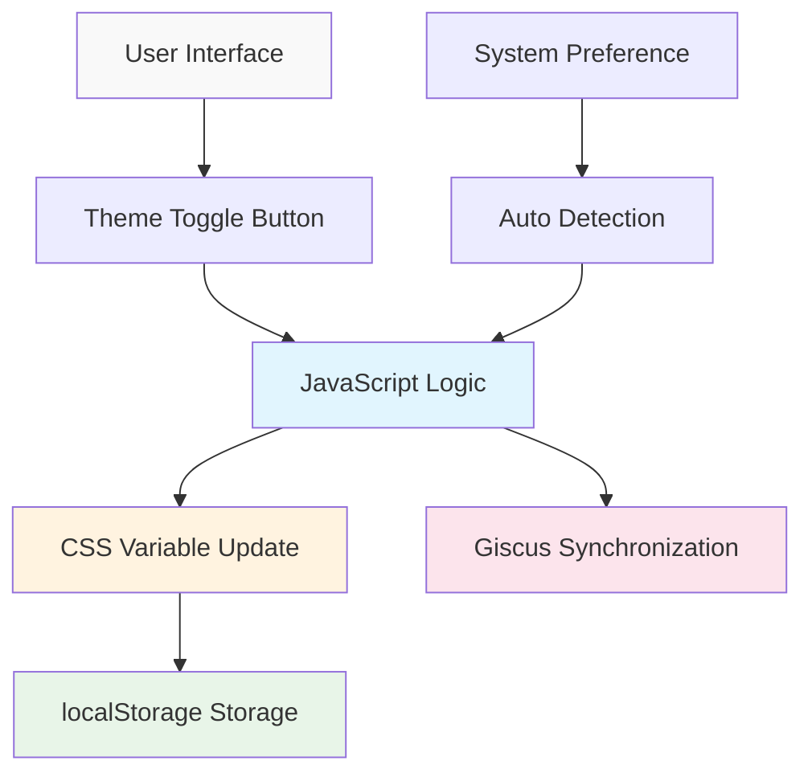

# Building a GitHub Pages Tech Blog with AI (4) - Perfect Implementation of Dark/Light Mode with MCP


## 🎯 Key Summary
**Problem**: Dark mode implementation involves complex intertwined elements like CSS variables, JavaScript logic, state storage, and component synchronization
**Solution**: MCP automatically builds complete theme system achieving both user experience and development efficiency

```javascript
// Core functionality of MCP-generated result
const theme = localStorage.getItem('theme') || 
  (window.matchMedia('(prefers-color-scheme: dark)').matches ? 'dark' : 'light');
document.documentElement.setAttribute('data-theme', theme);
```

## 🛠️ Basic Usage (Core Code)

### Complete Theme System Generation with MCP Prompt

```
MCP execution prompt:
"Implement complete dark/light mode system for Jekyll blog.

Requirements:
1. CSS Custom Properties-based theme system
2. Toggle button with smooth transition animations  
3. User selection localStorage storage
4. Automatic system preference detection
5. Giscus comment theme synchronization
6. Consistent theme application across all pages

Files to generate:
- assets/css/themes.css (theme CSS variables)
- assets/js/theme-toggle.js (toggle logic)
- _includes/theme-toggle.html (toggle button)
- _layouts/default.html modification (theme application)
- Giscus configuration update

Generate all files directly and modify existing files appropriately."
```



## 📊 Core Components Auto-Generated by MCP

### 1. CSS Theme Variable System (themes.css)

```css
/* MCP auto-generation - Complete theme variables */
:root {
  /* Light Mode (default) */
  --bg-primary: #ffffff;
  --bg-secondary: #f8f9fa;
  --text-primary: #212529;
  --text-secondary: #6c757d;
  --accent: #007bff;
  --border: #dee2e6;
  --shadow: rgba(0,0,0,0.1);
  
  /* Transition animations */
  --transition: all 0.3s cubic-bezier(0.4, 0, 0.2, 1);
}

[data-theme="dark"] {
  /* Dark Mode */
  --bg-primary: #1a1a1a;
  --bg-secondary: #2d2d2d;
  --text-primary: #ffffff;
  --text-secondary: #a0a0a0;
  --accent: #4dabf7;
  --border: #404040;
  --shadow: rgba(255,255,255,0.1);
}

/* Apply theme to all elements */
body {
  background-color: var(--bg-primary);
  color: var(--text-primary);
  transition: var(--transition);
}
```

### 2. Smart Theme Toggle Logic (theme-toggle.js)

```javascript
// MCP auto-generation - Complete theme management system
class ThemeManager {
  constructor() {
    this.init();
  }
  
  init() {
    // Check saved theme or system preference
    const savedTheme = localStorage.getItem('theme');
    const systemPreference = window.matchMedia('(prefers-color-scheme: dark)').matches ? 'dark' : 'light';
    const initialTheme = savedTheme || systemPreference;
    
    this.setTheme(initialTheme);
    this.setupToggle();
    this.watchSystemChanges();
  }
  
  setTheme(theme) {
    document.documentElement.setAttribute('data-theme', theme);
    localStorage.setItem('theme', theme);
    this.updateGiscus(theme);
    this.updateToggleButton(theme);
  }
  
  toggleTheme() {
    const currentTheme = document.documentElement.getAttribute('data-theme');
    const newTheme = currentTheme === 'dark' ? 'light' : 'dark';
    this.setTheme(newTheme);
  }
  
  updateGiscus(theme) {
    // Synchronize Giscus comment theme
    const giscusFrame = document.querySelector('.giscus-frame');
    if (giscusFrame) {
      const message = {
        type: 'set-theme',
        theme: theme === 'dark' ? 'github-dark' : 'github-light'
      };
      giscusFrame.contentWindow.postMessage(message, 'https://giscus.app');
    }
  }
}

// Initialize theme manager on page load
document.addEventListener('DOMContentLoaded', () => {
  window.themeManager = new ThemeManager();
});
```

### 3. Elegant Toggle Button (theme-toggle.html)

```html
<!-- MCP auto-generation - Animated toggle button -->
<button class="theme-toggle" onclick="window.themeManager.toggleTheme()" aria-label="Toggle theme">
  <svg class="sun-icon" width="20" height="20" viewBox="0 0 24 24">
    <path d="M12 7a5 5 0 1 1 0 10 5 5 0 0 1 0-10z"/>
    <path d="M12 1v2M12 21v2M4.22 4.22l1.42 1.42M18.36 18.36l1.42 1.42M1 12h2M21 12h2"/>
  </svg>
  <svg class="moon-icon" width="20" height="20" viewBox="0 0 24 24">
    <path d="M21 12.79A9 9 0 1 1 11.21 3 7 7 0 0 0 21 12.79z"/>
  </svg>
</button>

<style>
.theme-toggle {
  position: relative;
  background: var(--bg-secondary);
  border: 1px solid var(--border);
  border-radius: 50%;
  width: 44px;
  height: 44px;
  cursor: pointer;
  transition: var(--transition);
}

.theme-toggle:hover {
  transform: scale(1.1);
  box-shadow: 0 4px 12px var(--shadow);
}

[data-theme="light"] .moon-icon,
[data-theme="dark"] .sun-icon {
  opacity: 0;
  transform: rotate(180deg);
}

[data-theme="light"] .sun-icon,
[data-theme="dark"] .moon-icon {
  opacity: 1;
  transform: rotate(0deg);
}

.sun-icon, .moon-icon {
  position: absolute;
  top: 50%;
  left: 50%;
  transform: translate(-50%, -50%);
  transition: var(--transition);
  stroke: var(--text-primary);
  fill: none;
  stroke-width: 2;
}
</style>
```

## 💭 Advanced Feature Implementation

### Real-time System Preference Detection

```javascript
// Advanced features automatically included by MCP
watchSystemChanges() {
  const mediaQuery = window.matchMedia('(prefers-color-scheme: dark)');
  mediaQuery.addListener((e) => {
    // Follow system changes if user hasn't manually set preference
    if (!localStorage.getItem('theme')) {
      this.setTheme(e.matches ? 'dark' : 'light');
    }
  });
}
```

### Page Load Optimization

```html
<!-- Flicker prevention code automatically added to <head> by MCP -->
<script>
(function() {
  const theme = localStorage.getItem('theme') || 
    (window.matchMedia('(prefers-color-scheme: dark)').matches ? 'dark' : 'light');
  document.documentElement.setAttribute('data-theme', theme);
})();
</script>
```

### Perfect Giscus Synchronization

```javascript
// Comment theme synchronization automatically implemented by MCP
updateGiscusTheme(theme) {
  const iframe = document.querySelector('.giscus-frame');
  if (iframe) {
    const message = {
      type: 'set-theme',
      theme: theme === 'dark' ? 'github-dark' : 'github-light'
    };
    iframe.contentWindow.postMessage(message, 'https://giscus.app');
  }
}
```

## 📈 User Experience Optimization

### 1. Smooth Transition Animations
- 300ms cubic-bezier animation for all color changes
- Toggle button hover effects and icon rotation
- Flicker prevention on page load

### 2. Accessibility Considerations
- ARIA labels and keyboard navigation support
- High contrast color combinations
- Respect user preferences

### 3. Performance Optimization
- Efficient styling through CSS variables
- localStorage-based state persistence
- Minimal JavaScript code

## 🎉 Features of Completed Theme System

Final results of theme system built with MCP:

- ✅ **Complete Automation**: All files generated with single command
- ✅ **System Integration**: Perfect integration with OS dark mode
- ✅ **State Persistence**: Remember and restore user selections
- ✅ **Component Synchronization**: Theme applied to all elements including Giscus
- ✅ **Performance Optimization**: Instant loading without flicker
- ✅ **User Experience**: Smooth animations and intuitive UI

## Next Step: Multilingual Support

Now that the theme system is complete, we'll cover implementing **multilingual (i18n) support system** with MCP as the final part of the series. We'll create a complete multilingual blog that integrates with the theme system.

---

**📚 Complete Series List**:
1. [Building a GitHub Pages Tech Blog with AI (1) - Creating Jekyll Blog Locally with Claude Desktop MCP](/en/2025/06/09/claude-desktop-mcp-blog-setup-en/)
2. [Building a GitHub Pages Tech Blog with AI (2) - Complete Automation of SEO-Optimized Tech Posting with MCP](/en/2025/06/09/mcp-automated-blog-posting-en/)
3. [Building a GitHub Pages Tech Blog with AI (3) - Setting up Giscus Comment System in 5 Minutes with MCP](/en/2025/06/09/mcp-giscus-comments-setup-en/)
4. [Building a GitHub Pages Tech Blog with AI (4) - Perfect Implementation of Dark/Light Mode with MCP](/en/2025/06/09/mcp-dark-light-mode-implementation-en/) ← Current post
5. [Building a GitHub Pages Tech Blog with AI (5) - Completing Jekyll Multilingual Blog with MCP](/en/2025/06/09/mcp-jekyll-multilingual-blog-en/)

---

**Previous in Series**: [Building a GitHub Pages Tech Blog with AI (3) - Setting up Giscus Comment System in 5 Minutes with MCP](/en/2025/06/09/mcp-giscus-comments-setup-en/)

**Next in Series**: [Building a GitHub Pages Tech Blog with AI (5) - Completing Jekyll Multilingual Blog with MCP](/en/2025/06/09/mcp-jekyll-multilingual-blog-en/)
