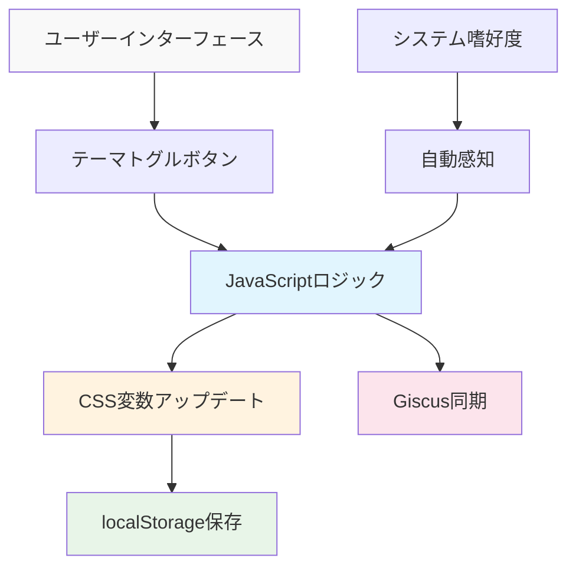

# AIでGitHub Pages技術ブログを作る (4) - MCPでダーク/ライトモード完璧実装


## 🎯 核心要約
**問題**: ダークモード実装はCSS変数、JavaScriptロジック、状態保存、コンポーネント同期など複雑な要素が絡み合っている
**解決策**: MCPが完全なテーマシステムを自動構築してユーザーエクスペリエンスと開発効率性を同時に達成

```javascript
// MCP生成結果物の核心機能
const theme = localStorage.getItem('theme') || 
  (window.matchMedia('(prefers-color-scheme: dark)').matches ? 'dark' : 'light');
document.documentElement.setAttribute('data-theme', theme);
```

## 🛠️ 基本使用法（核心コード）

### MCPプロンプトで完全なテーマシステム生成

```
MCP実行プロンプト:
「Jekyllブログに完全なダーク/ライトモードシステムを実装してください。

要求事項:
1. CSS Custom Properties基盤テーマシステム
2. トグルボタンと滑らかな遷移アニメーション  
3. ユーザー選択localStorage保存
4. システム嗜好度自動感知
5. Giscusコメントテーマ同期
6. 全ページに一貫したテーマ適用

生成するファイル:
- assets/css/themes.css (テーマCSS変数)
- assets/js/theme-toggle.js (トグルロジック)
- _includes/theme-toggle.html (トグルボタン)
- _layouts/default.html 修正 (テーマ適用)
- Giscus設定アップデート

すべてのファイルを直接生成し、既存ファイルを適切に修正してください。」
```



## 📊 MCPが自動生成する核心コンポーネント

### 1. CSSテーマ変数システム (themes.css)

```css
/* MCP自動生成 - 完全なテーマ変数 */
:root {
  /* Light Mode (デフォルト) */
  --bg-primary: #ffffff;
  --bg-secondary: #f8f9fa;
  --text-primary: #212529;
  --text-secondary: #6c757d;
  --accent: #007bff;
  --border: #dee2e6;
  --shadow: rgba(0,0,0,0.1);
  
  /* 遷移アニメーション */
  --transition: all 0.3s cubic-bezier(0.4, 0, 0.2, 1);
}

[data-theme="dark"] {
  /* Dark Mode */
  --bg-primary: #1a1a1a;
  --bg-secondary: #2d2d2d;
  --text-primary: #ffffff;
  --text-secondary: #a0a0a0;
  --accent: #4dabf7;
  --border: #404040;
  --shadow: rgba(255,255,255,0.1);
}

/* すべての要素にテーマ適用 */
body {
  background-color: var(--bg-primary);
  color: var(--text-primary);
  transition: var(--transition);
}
```

### 2. スマートテーマトグルロジック (theme-toggle.js)

```javascript
// MCP自動生成 - 完全なテーマ管理システム
class ThemeManager {
  constructor() {
    this.init();
  }
  
  init() {
    // 保存されたテーマまたはシステム嗜好度確認
    const savedTheme = localStorage.getItem('theme');
    const systemPreference = window.matchMedia('(prefers-color-scheme: dark)').matches ? 'dark' : 'light';
    const initialTheme = savedTheme || systemPreference;
    
    this.setTheme(initialTheme);
    this.setupToggle();
    this.watchSystemChanges();
  }
  
  setTheme(theme) {
    document.documentElement.setAttribute('data-theme', theme);
    localStorage.setItem('theme', theme);
    this.updateGiscus(theme);
    this.updateToggleButton(theme);
  }
  
  toggleTheme() {
    const currentTheme = document.documentElement.getAttribute('data-theme');
    const newTheme = currentTheme === 'dark' ? 'light' : 'dark';
    this.setTheme(newTheme);
  }
  
  updateGiscus(theme) {
    // Giscusコメントテーマ同期
    const giscusFrame = document.querySelector('.giscus-frame');
    if (giscusFrame) {
      const message = {
        type: 'set-theme',
        theme: theme === 'dark' ? 'github-dark' : 'github-light'
      };
      giscusFrame.contentWindow.postMessage(message, 'https://giscus.app');
    }
  }
}

// ページロード時にテーママネージャー初期化
document.addEventListener('DOMContentLoaded', () => {
  window.themeManager = new ThemeManager();
});
```

### 3. エレガントなトグルボタン (theme-toggle.html)

```html
<!-- MCP自動生成 - アニメーショントグルボタン -->
<button class="theme-toggle" onclick="window.themeManager.toggleTheme()" aria-label="テーマ切り替え">
  <svg class="sun-icon" width="20" height="20" viewBox="0 0 24 24">
    <path d="M12 7a5 5 0 1 1 0 10 5 5 0 0 1 0-10z"/>
    <path d="M12 1v2M12 21v2M4.22 4.22l1.42 1.42M18.36 18.36l1.42 1.42M1 12h2M21 12h2"/>
  </svg>
  <svg class="moon-icon" width="20" height="20" viewBox="0 0 24 24">
    <path d="M21 12.79A9 9 0 1 1 11.21 3 7 7 0 0 0 21 12.79z"/>
  </svg>
</button>

<style>
.theme-toggle {
  position: relative;
  background: var(--bg-secondary);
  border: 1px solid var(--border);
  border-radius: 50%;
  width: 44px;
  height: 44px;
  cursor: pointer;
  transition: var(--transition);
}

.theme-toggle:hover {
  transform: scale(1.1);
  box-shadow: 0 4px 12px var(--shadow);
}

[data-theme="light"] .moon-icon,
[data-theme="dark"] .sun-icon {
  opacity: 0;
  transform: rotate(180deg);
}

[data-theme="light"] .sun-icon,
[data-theme="dark"] .moon-icon {
  opacity: 1;
  transform: rotate(0deg);
}

.sun-icon, .moon-icon {
  position: absolute;
  top: 50%;
  left: 50%;
  transform: translate(-50%, -50%);
  transition: var(--transition);
  stroke: var(--text-primary);
  fill: none;
  stroke-width: 2;
}
</style>
```

## 💭 高級機能実装

### システム嗜好度リアルタイム感知

```javascript
// MCPが自動で含める高級機能
watchSystemChanges() {
  const mediaQuery = window.matchMedia('(prefers-color-scheme: dark)');
  mediaQuery.addListener((e) => {
    // ユーザーが手動設定していなければシステム変更に従う
    if (!localStorage.getItem('theme')) {
      this.setTheme(e.matches ? 'dark' : 'light');
    }
  });
}
```

### ページロード最適化

```html
<!-- MCPが<head>に自動追加するフリッカー防止コード -->
<script>
(function() {
  const theme = localStorage.getItem('theme') || 
    (window.matchMedia('(prefers-color-scheme: dark)').matches ? 'dark' : 'light');
  document.documentElement.setAttribute('data-theme', theme);
})();
</script>
```

### Giscus完璧同期

```javascript
// MCPが自動実装するコメントテーマ同期
updateGiscusTheme(theme) {
  const iframe = document.querySelector('.giscus-frame');
  if (iframe) {
    const message = {
      type: 'set-theme',
      theme: theme === 'dark' ? 'github-dark' : 'github-light'
    };
    iframe.contentWindow.postMessage(message, 'https://giscus.app');
  }
}
```

## 📈 ユーザーエクスペリエンス最適化

### 1. 滑らかな遷移アニメーション
- すべての色変更に300ms cubic-bezierアニメーション
- トグルボタンホバー効果とアイコン回転
- ページロード時フリッカー防止

### 2. アクセシビリティ考慮事項
- ARIAラベルとキーボードナビゲーション対応
- 高コントラスト色組み合わせ
- ユーザー嗜好度尊重

### 3. パフォーマンス最適化
- CSS変数による効率的スタイリング
- localStorage基盤状態持続性
- 最小限のJavaScriptコード

## 🎉 完成したテーマシステムの特徴

MCPで構築されたテーマシステムの最終結果:

- ✅ **完全自動化**: 一回のコマンドですべてのファイル生成
- ✅ **システム統合**: OSダークモードと完璧連動
- ✅ **状態持続**: ユーザー選択記憶・復元
- ✅ **コンポーネント同期**: Giscus含むすべての要素テーマ適用
- ✅ **パフォーマンス最適化**: フリッカーなしの即座ローディング
- ✅ **ユーザーエクスペリエンス**: 滑らかなアニメーションと直感的UI

## 次のステップ: 多言語対応

テーマシステムが完成したので、シリーズ最後として**多言語（i18n）対応システム**をMCPで実装する方法を扱います。テーマと連動する完全な多言語ブログを作ってみます。

---

**📚 シリーズ全体リスト**:
1. [AIでGitHub Pages技術ブログを作る (1) - Claude Desktop MCPでローカルに直接Jekyllブログを生成](/ja/2025/06/09/claude-desktop-mcp-blog-setup-ja/)
2. [AIでGitHub Pages技術ブログを作る (2) - MCPでSEO最適化された技術投稿完全自動化](/ja/2025/06/09/mcp-automated-blog-posting-ja/)
3. [AIでGitHub Pages技術ブログを作る (3) - MCPでGiscusコメントシステムを5分で完成](/ja/2025/06/09/mcp-giscus-comments-setup-ja/)
4. [AIでGitHub Pages技術ブログを作る (4) - MCPでダーク/ライトモード完璧実装](/ja/2025/06/09/mcp-dark-light-mode-implementation-ja/) ← 現在の記事
5. [AIでGitHub Pages技術ブログを作る (5) - MCPでJekyll多言語ブログ完成](/ja/2025/06/09/mcp-jekyll-multilingual-blog-ja/)

---

**シリーズ前の記事**: [AIでGitHub Pages技術ブログを作る (3) - MCPでGiscusコメントシステムを5分で完成](/ja/2025/06/09/mcp-giscus-comments-setup-ja/)

**シリーズ次の記事**: [AIでGitHub Pages技術ブログを作る (5) - MCPでJekyll多言語ブログ完成](/ja/2025/06/09/mcp-jekyll-multilingual-blog-ja/)
