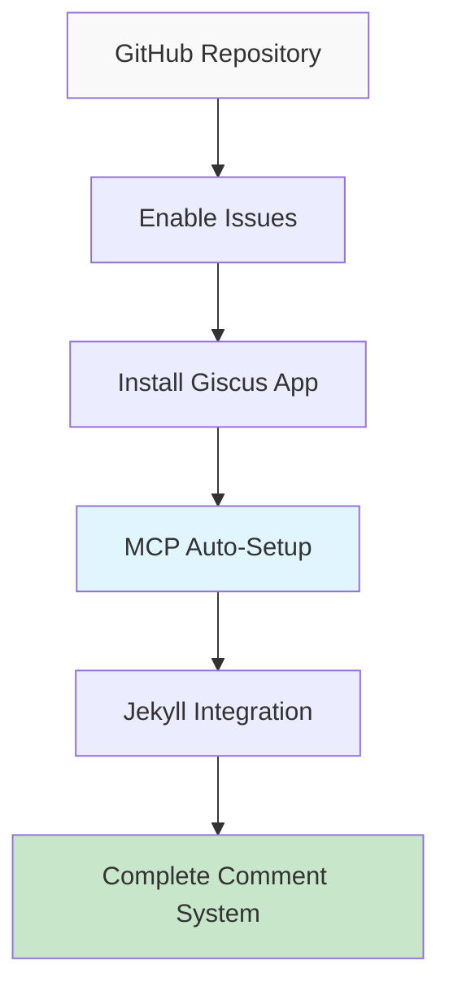

# Building a GitHub Pages Tech Blog with AI (3) - Setting up Giscus Comment System in 5 Minutes with MCP


## 💡 Solution (Ready-to-Use Code)

**Problem**: Adding comment system to Jekyll blog requires multiple service configurations and complex integration process
**Solution**: MCP automates GitHub Issues + Giscus setup to instantly build complete comment system

```bash
# MCP execution results
├── _includes/comments.html          # ✅ Auto-generated
├── _layouts/post.html              # ✅ Auto-modified  
├── _config.yml                     # ✅ Giscus config added
└── assets/css/comments.scss        # ✅ Comment styling
```

## 📋 Implementation Method (3 Steps)



### Step 1: GitHub Repository Preparation

Minimum manual setup required in GitHub:
```
1. Repository → Settings → Features
2. Check Issues checkbox ✅
3. Install Giscus app: https://github.com/apps/giscus
4. Grant repository permissions ✅
```

### Step 2: Automatic Setup with MCP

```
MCP Prompt:
"Set up Giscus comment system for my Jekyll blog.

Repository info:
- GitHub username: kevinpark
- Repository: realcoding.github.io  
- Default language: en
- Theme: Match blog design

Required tasks:
1. Create _includes/comments.html
2. Add comment section to post.html layout
3. Add Giscus configuration to _config.yml
4. Style comment area

Generate and modify all files directly."
```

### Step 3: Immediate Verification

```bash
# Restart local server
bundle exec jekyll serve

# Check comment section in post pages
# http://localhost:4000/posts/[post-name]
```

## 🔍 Why This Approach? (Simple Background)

### Why Choose Giscus

**Problems with existing comment systems**:
- Disqus: Advertising and privacy collection issues
- Facebook Comments: Platform dependency
- Self-hosted: Server management burden

**Advantages of Giscus**:
- ✅ GitHub account based (developer-friendly)
- ✅ Free and open source
- ✅ Complete integration with GitHub Issues
- ✅ Markdown support
- ✅ Responsive design

### Core Value of MCP Automation

**Manual Setup** (30 minutes):
```
1. Generate configuration values on Giscus website
2. Copy/modify HTML code
3. Modify Jekyll layout files
4. Add CSS styling
5. Test configuration and debug
```

**MCP Automation** (5 minutes):
```
1. Input prompt
2. Verify auto-generated files
3. Test on local server
```

## 🛠️ Files Auto-Generated by MCP

### 1. _includes/comments.html
```html
<!-- MCP auto-generation example -->
<div class="comments-section">
  <script src="https://giscus.app/client.js"
          data-repo="kevinpark/realcoding.github.io"
          data-repo-id="[AUTO_GENERATED_ID]"
          data-category="General"
          data-category-id="[AUTO_GENERATED_ID]"
          data-mapping="pathname"
          data-strict="0"
          data-reactions-enabled="1"
          data-emit-metadata="0"
          data-input-position="bottom"
          data-theme="preferred_color_scheme"
          data-lang="en"
          crossorigin="anonymous"
          async>
  </script>
</div>
```

### 2. Automatic Post Layout Modification

```html
<!-- Auto-added to _layouts/post.html -->
<article class="post">
  {{ content }}
  
  
    
  
</article>
```


### 3. Configuration File Update
```yaml
# Auto-added to _config.yml
comments:
  provider: giscus
  giscus:
    repo: "kevinpark/realcoding.github.io"
    repo_id: "[AUTO_GENERATED]"
    category: "General"
    category_id: "[AUTO_GENERATED]"
    mapping: "pathname"
    reactions_enabled: true
    theme: "preferred_color_scheme"
```

## ⚡ Advanced Customization

### Comment Disable Option
```yaml
# Disable comments for specific posts
---
layout: post
title: "Title"
comments: false  # Disable comments for this post
---
```

### Dark Mode Integration
MCP auto-generated styles:
```scss
// assets/css/comments.scss
.giscus-frame {
  max-width: 100%;
  margin: 2rem 0;
}

@media (prefers-color-scheme: dark) {
  .giscus-frame {
    color-scheme: dark;
  }
}
```

## 🎉 Result Verification

Post-setup checklist:
- ✅ Comment section displays at bottom of posts
- ✅ Can write comments with GitHub login
- ✅ Auto-links to GitHub Issues
- ✅ Responsive design applied
- ✅ Dark mode theme synchronization

## Next Step: Dark Mode Implementation

Now that the comment system is complete, next we'll cover implementing **dark/light mode toggle** with MCP. We'll create a theme system that perfectly integrates with Giscus comments.

---

**📚 Complete Series List**:
1. [Building a GitHub Pages Tech Blog with AI (1) - Creating Jekyll Blog Locally with Claude Desktop MCP](/en/2025/06/09/claude-desktop-mcp-blog-setup-en/)
2. [Building a GitHub Pages Tech Blog with AI (2) - Complete Automation of SEO-Optimized Tech Posting with MCP](/en/2025/06/09/mcp-automated-blog-posting-en/)
3. [Building a GitHub Pages Tech Blog with AI (3) - Setting up Giscus Comment System in 5 Minutes with MCP](/en/2025/06/09/mcp-giscus-comments-setup-en/) ← Current post
4. [Building a GitHub Pages Tech Blog with AI (4) - Perfect Implementation of Dark/Light Mode with MCP](/en/2025/06/09/mcp-dark-light-mode-implementation-en/)
5. [Building a GitHub Pages Tech Blog with AI (5) - Completing Jekyll Multilingual Blog with MCP](/en/2025/06/09/mcp-jekyll-multilingual-blog-en/)

---

**Previous in Series**: [Building a GitHub Pages Tech Blog with AI (2) - Complete Automation of SEO-Optimized Tech Posting with MCP](/en/2025/06/09/mcp-automated-blog-posting-en/)

**Next in Series**: [Building a GitHub Pages Tech Blog with AI (4) - Perfect Implementation of Dark/Light Mode with MCP](/en/2025/06/09/mcp-dark-light-mode-implementation-en/)
