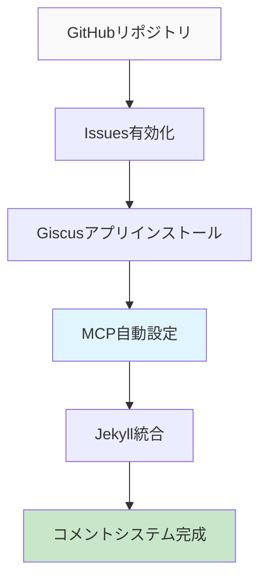

# AIでGitHub Pages技術ブログを作る (3) - MCPでGiscusコメントシステムを5分で完成


## 💡 解決策（すぐに使えるコード）

**問題**: Jekyllブログにコメントシステムを追加するには複数のサービス設定と複雑な統合過程が必要
**解決策**: MCPがGitHub Issues + Giscus設定を自動化して完全なコメントシステムを即座に構築

```bash
# MCP実行結果物
├── _includes/comments.html          # ✅ 自動生成
├── _layouts/post.html              # ✅ 自動修正  
├── _config.yml                     # ✅ Giscus設定追加
└── assets/css/comments.scss        # ✅ コメントスタイリング
```

## 📋 適用方法（3ステップ）



### ステップ1: GitHubリポジトリ準備

まずGitHubで手動設定が必要な最小要素：
```
1. Repository → Settings → Features
2. Issuesチェックボックス有効化 ✅
3. Giscusアプリインストール: https://github.com/apps/giscus
4. リポジトリ権限付与 ✅
```

### ステップ2: MCPで自動設定

```
MCPプロンプト:
「私のJekyllブログにGiscusコメントシステムを設定してください。

リポジトリ情報:
- GitHubユーザー名: kevinpark
- リポジトリ: realcoding.github.io  
- 基本言語: ja
- テーマ: ブログデザインに合わせて

必要な作業:
1. _includes/comments.html生成
2. post.htmlレイアウトにコメントセクション追加
3. _config.ymlにGiscus設定追加
4. コメント領域スタイリング

すべてのファイルを直接生成・修正してください。」
```

### ステップ3: 即座確認

```bash
# ローカルサーバー再起動
bundle exec jekyll serve

# 投稿ページでコメントセクション確認
# http://localhost:4000/posts/[投稿名]
```

## 🔍 なぜこの方法？（簡単な背景）

### Giscus選択理由

**既存コメントシステムの問題点**:
- Disqus: 広告および個人情報収集問題
- Facebook Comments: プラットフォーム依存性
- 自社構築: サーバー管理負担

**Giscusの利点**:
- ✅ GitHubアカウント基盤（開発者親和的）
- ✅ 無料およびオープンソース
- ✅ GitHub Issuesと完全統合
- ✅ マークダウンサポート
- ✅ レスポンシブデザイン

### MCP自動化の核心価値

**手動設定**（30分）:
```
1. Giscusサイトで設定値生成
2. HTMLコードコピー/修正
3. Jekyllレイアウトファイル修正
4. CSSスタイリング追加
5. 設定テストおよびデバッグ
```

**MCP自動化**（5分）:
```
1. プロンプト入力
2. 自動生成されたファイル確認
3. ローカルサーバーでテスト
```

## 🛠️ MCPが自動生成するファイル

### 1. _includes/comments.html
```html
<!-- MCP自動生成例 -->
<div class="comments-section">
  <script src="https://giscus.app/client.js"
          data-repo="kevinpark/realcoding.github.io"
          data-repo-id="[自動生成ID]"
          data-category="General"
          data-category-id="[自動生成ID]"
          data-mapping="pathname"
          data-strict="0"
          data-reactions-enabled="1"
          data-emit-metadata="0"
          data-input-position="bottom"
          data-theme="preferred_color_scheme"
          data-lang="ja"
          crossorigin="anonymous"
          async>
  </script>
</div>
```

### 2. 投稿レイアウト自動修正

```html
<!-- _layouts/post.htmlに自動追加 -->
<article class="post">
  {{ content }}
  
  
    
  
</article>
```


### 3. 設定ファイル更新
```yaml
# _config.yml自動追加
comments:
  provider: giscus
  giscus:
    repo: "kevinpark/realcoding.github.io"
    repo_id: "[自動生成]"
    category: "General"
    category_id: "[自動生成]"
    mapping: "pathname"
    reactions_enabled: true
    theme: "preferred_color_scheme"
```

## ⚡ 高級カスタマイズ

### コメント無効化オプション
```yaml
# 特定投稿でコメント無効化
---
layout: post
title: "タイトル"
comments: false  # この投稿はコメント無効化
---
```

### ダークモード連動
MCPが自動生成するスタイル:
```scss
// assets/css/comments.scss
.giscus-frame {
  max-width: 100%;
  margin: 2rem 0;
}

@media (prefers-color-scheme: dark) {
  .giscus-frame {
    color-scheme: dark;
  }
}
```

## 🎉 結果確認

設定完了後の確認事項:
- ✅ 投稿下部にコメントセクション表示
- ✅ GitHubログインでコメント作成可能
- ✅ GitHub Issuesに自動連動
- ✅ レスポンシブデザイン適用
- ✅ ダークモードテーマ同期

## 次のステップ: ダークモード実装

コメントシステムが完成したので、次は**ダーク/ライトモードトグル**をMCPで実装する方法を扱います。Giscusコメントと完璧に連動するテーマシステムを作ってみます。

---

**📚 シリーズ全体リスト**:
1. [AIでGitHub Pages技術ブログを作る (1) - Claude Desktop MCPでローカルに直接Jekyllブログを生成](/ja/2025/06/09/claude-desktop-mcp-blog-setup-ja/)
2. [AIでGitHub Pages技術ブログを作る (2) - MCPでSEO最適化された技術投稿完全自動化](/ja/2025/06/09/mcp-automated-blog-posting-ja/)
3. [AIでGitHub Pages技術ブログを作る (3) - MCPでGiscusコメントシステムを5分で完成](/ja/2025/06/09/mcp-giscus-comments-setup-ja/) ← 現在の記事
4. [AIでGitHub Pages技術ブログを作る (4) - MCPでダーク/ライトモード完璧実装](/ja/2025/06/09/mcp-dark-light-mode-implementation-ja/)
5. [AIでGitHub Pages技術ブログを作る (5) - MCPでJekyll多言語ブログ完成](/ja/2025/06/09/mcp-jekyll-multilingual-blog-ja/)

---

**シリーズ前の記事**: [AIでGitHub Pages技術ブログを作る (2) - MCPでSEO最適化された技術投稿完全自動化](/ja/2025/06/09/mcp-automated-blog-posting-ja/)

**シリーズ次の記事**: [AIでGitHub Pages技術ブログを作る (4) - MCPでダーク/ライトモード完璧実装](/ja/2025/06/09/mcp-dark-light-mode-implementation-ja/)
