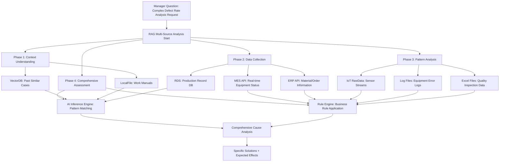

# Complete RAG Guide: Understanding True Data Integration AI through Manufacturing MES Systems


*RAG-based intelligent analysis system in manufacturing environments*

## 🎯 The True Meaning of RAG: Beyond Vector Databases to Data Integration

Understanding **RAG (Retrieval-Augmented Generation)** as simply "AI utilizing vector databases" is like seeing only the tip of the iceberg.

True RAG is **"a system that connects all forms of data to create contextual intelligence."**

**Common Misconception vs True RAG**
- **Wrong Perception**: "Technology that just vectorizes and searches documents"
- **Actual RAG**: "Intelligent platform connecting VectorDB + RDS + RawData + LocalFile + API"

## 🏭 Real-world Example: Manufacturing Multi-Data Source RAG System

### Scenario: Production Manager's Complex Question
> **"The defect rate on Line A has suddenly increased. Please analyze past similar cases and current situations comprehensively to provide causes and solutions."**

This question cannot be answered with a single data source and requires **collaboration of at least 5 different data types**.



## 🕸️ Data Source Roles and Collaboration Structure

### 1. VectorDB: Repository of Experience and Knowledge
**Stored Data**: Work manuals, quality guidelines, past problem-solving cases, technical documents
**Role**: "How did we solve similar situations in the past?"

```
Search Result: "Identical defect rate increase occurred on Line A in July 2023
→ Cause: Raw material composition differences due to supplier change
→ Solution: Process temperature reduced by 2°C + pressure increased by 5%
→ Effect: Defect rate normalized within 3 days"
```

### 2. RDS (Relational Database): Precise Tracking of Structured Data
**Stored Data**: Production records, quality data, equipment history, worker information
**Role**: "Exactly when did what change?"

```sql
-- Defect rate change trend analysis
SELECT production_date, defect_rate, material_supplier, operator_shift
FROM production_log 
WHERE line = 'A' AND production_date >= '2024-05-01'
ORDER BY production_date;

Result: "Defect rate increase started from May 15th, supplier change from B→C confirmed simultaneously"
```

### 3. RawData (IoT Sensors): Real-time Physical Conditions
**Stored Data**: Real-time sensor data including temperature, pressure, vibration, humidity, power consumption
**Role**: "What's actually happening on the shop floor right now?"

```json
{
  "timestamp": "2024-06-10T14:30:00",
  "line_A": {
    "temperature": 78.5,  // Standard: 75±2°C
    "pressure": 2.3,      // Standard: 2.0±0.2bar  
    "vibration": 0.8,     // Standard: <0.5mm/s
    "status": "ABNORMAL"
  }
}

Result: "Current temperature 3.5°C over limit, vibration 60% higher → Equipment abnormality detected"
```

### 4. LocalFile: Business Documents and Manuals
**Stored Data**: PDF manuals, Excel quality data, work instructions, equipment drawings
**Role**: "What are the exact procedures and standards?"

```
Work Manual_LineA_v2.3.pdf Search Result:
"Essential checklist when changing suppliers
1. Raw material composition analysis (within ±5%)
2. Process parameter readjustment (temperature, pressure)
3. Intensive monitoring for first 3 days"
```

### 5. External API: External System Integration
**Integration Target**: ERP, SCM, quality management systems, external vendor APIs
**Role**: "How are related systems performing?"

```
ERP API Query:
- Recent delivery quality grade from Supplier C: B+ (previously A-)
- Inventory status: Supplier A material shortage, Supplier C substitution
- Order schedule: Large order next week (urgent resolution needed)
```

## 📊 Data Source Characteristics and RAG Utilization Strategy

| Data Source | Data Characteristics | Search Method | RAG Purpose | Actual Answer Example |
|------------|---------------------|---------------|-------------|----------------------|
| **VectorDB** | Unstructured, embedded | Similarity search | Experiential knowledge | "Had similar case before" |
| **RDS** | Structured, formatted | SQL queries | Precise facts | "Exactly from May 15th" |
| **RawData** | Stream, real-time | Time series analysis | Current status | "Temperature 3°C higher now" |
| **LocalFile** | Documents, semi-structured | Text parsing | Procedures/standards | "According to manual..." |
| **External API** | Integration, dynamic | REST/GraphQL | External context | "ERP confirms material change" |


*Structure showing various data sources integrated into a unified RAG system*

## 🔄 5-Phase Multi-Source RAG Collaboration Process

### Phase 1: Context Understanding (VectorDB + LocalFile)
**Purpose**: Understanding question background and identifying similar cases

```
VectorDB Search: "Line A defect rate increase"
→ 5 related documents found
→ Most similar case: July 2023 incident

LocalFile Search: "Defect rate analysis manual"
→ Standard analysis procedure confirmed
→ Checkpoint list extracted
```

### Phase 2: Current Status Data Collection (RDS + External API)
**Purpose**: Identifying precise facts and current situation

```
RDS Query: Production data for last 2 weeks
→ Defect rate trend: 2.1% → 5.8%
→ Change point: Supplier change on May 15th

ERP API Call: Material information query
→ Supplier: B → C change
→ Raw material grade: A- → B+ downgrade
```

### Phase 3: Real-time Status Analysis (RawData + Log Files)
**Purpose**: Checking current physical conditions and equipment status

```
IoT Sensor Data: Last 24 hours
→ Average temperature increased by 3°C
→ Vibration level increased by 60%

Equipment Log Analysis:
→ Temperature alarms: 12 occurrences
→ Pressure adjustment requests: 8 times
```

### Phase 4: Pattern Matching (AI Inference + Rule Engine)
**Purpose**: Deriving causal relationships from collected data

```
AI Pattern Analysis:
- Supplier change + temperature rise + defect rate increase = strong correlation
- 90% similar pattern to 2023 case

Business Rule Application:
- Raw material grade decline → Process parameter readjustment required
- Large order next week → Resolution needed within 48 hours
```

### Phase 5: Comprehensive Conclusion
**Result**: Final answer integrating information from all data sources

```
Comprehensive Analysis Result:

Root Cause Analysis:
1. Primary cause: Quality degradation of Supplier C's raw materials (A- → B+)
2. Direct impact: Mismatch with existing process parameters
3. Physical symptoms: Temperature rise, vibration increase causing 5.8% defect rate spike

Solutions (by priority):
1. Immediate action: Reduce process temperature by 3°C (78.5→75.5°C)
2. Short-term response: Increase pressure by 10% for compensation (Expected: <3% defect rate)
3. Mid-term measure: Renegotiate quality standards with Supplier C
4. Long-term strategy: Secure alternative inventory from Supplier B

Expected Results:
- Defect rate normalization possible within 48 hours (based on past cases)
- No disruption to next week's large order
- Monthly quality targets achievable
```

## 💡 RAG Evolution: From Simple Search to Intelligent Integration

### 1st Generation RAG: Vector Search Focused
```
User Question → Vector Search → Similar Documents → LLM Answer
Limitation: Cannot utilize real-time data, structured data
```

### 2nd Generation RAG: Multi-Source Integration (Current)
```
User Question → Intent Analysis → Multi-Source Search → Data Fusion → Contextual Answer
Strength: Utilizes all data types, real-time reflection, provides accurate facts
```

### Next-Generation RAG Characteristics

**1. Adaptive Data Routing**
- Automatic optimal data source selection based on question type
- Dynamic real-time data priority adjustment

**2. Context-Aware Search**
- Understanding situations and intentions beyond simple keywords
- Balance between domain expertise and common knowledge

**3. Automatic Data Quality Assessment**
- Apply reliability weights by source
- Additional verification when conflicting information is detected

## 🚀 RAG Implementation Roadmap for Planners

### Stage 1: Data Status Assessment (1-2 weeks)
**Checklist**
- [ ] VectorDB targets: Manuals, reports, case documents
- [ ] RDS integration: MES, ERP, quality management DB
- [ ] RawData collection: IoT sensors, log files
- [ ] LocalFile organization: Excel, PDF, image files
- [ ] External API: External system integration possibilities

### Stage 2: Priority Definition (1 week)

#### Scoring by criteria

| Evaluation Criteria | Weight | Evaluation Method |
|-------------------|--------|-------------------|
| Usage Frequency | 30% | Monthly question count |
| Data Quality | 25% | Completeness, accuracy |
| Business Impact | 25% | Decision-making importance |
| Implementation Ease | 20% | Technical complexity |

### Stage 3: Pilot Construction (4-6 weeks)
**Recommended starting point**
1. **VectorDB + RDS combination**: Past cases + current data
2. **One core business**: Most frequent question type
3. **Measurable KPIs**: Answer accuracy, response time

### Stage 4: Gradual Expansion (3-6 months)
**Expansion sequence**
1. Connect additional data sources
2. Expand question types
3. Reflect real-time feedback
4. Spread to other departments

## 📈 ROI Measurement and Success Metrics

### Quantitative Metrics
- **Response Time**: 4 hours → 5 minutes (95% reduction)
- **Accuracy**: 70% → 95% (25%p improvement)
- **Throughput**: 10 cases/day → 100 cases/day (10x increase)

### Qualitative Metrics
- **Decision Quality**: Experience-dependent → Data-driven
- **Knowledge Transfer**: Individual know-how → System accumulation
- **Job Satisfaction**: Reduced repetitive work → Focus on creative work

RAG is not just an AI technology, but an **intelligent platform that connects all corporate knowledge and data**. In manufacturing, it particularly demonstrates its value at the intersection of various data sources, ultimately becoming a key tool for creating a **"data-driven decision-making culture."**

---

🔗 **Related Articles**
* [MCP Practical Implementation: Complete File Management Automation Guide](/)
* [AI Workflow Optimization: 3x Development Productivity Enhancement Strategy](/)
* [LLM API Utilization: Practical Comparison of OpenAI, Claude, and Gemini](/)
