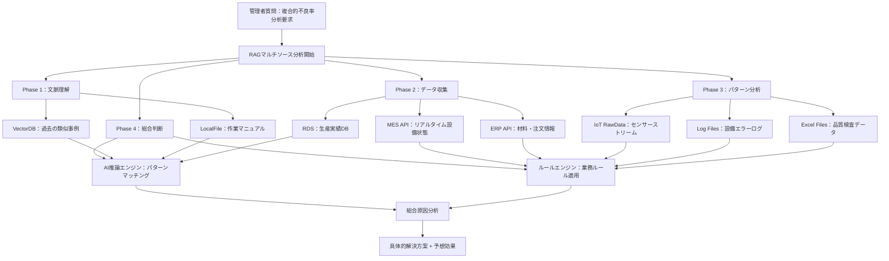

# RAG完全解説：製造業MESシステムで理解する真のデータ統合AI


*製造業現場のRAGベースインテリジェント分析システム*

## 🎯 RAGの真の意味：ベクターDBを超えたデータ統合

**RAG（Retrieval-Augmented Generation）**を単純に「ベクターデータベース活用AI」として理解するのは、氷山の一角だけを見ることです。

真のRAGは**「あらゆる形態のデータを接続して文脈的知能を作るシステム」**です。

**既存の誤解 vs 真のRAG**
- **間違った認識**: 「文書をベクター化して検索する技術」
- **実際のRAG**: 「VectorDB + RDS + RawData + LocalFile + APIをすべて接続するインテリジェントプラットフォーム」

## 🏭 実戦例：製造業マルチデータソースRAGシステム

### 状況：生産管理者の複合的質問
> **「Aラインの不良率が急に高くなったが、過去の類似事例と現在の状況を総合して原因と解決方案を提示してください」**

この質問を解決するには単一データソースでは不可能で、**最低5種類以上のデータが協力**する必要があります。



## 🕸️ データソース別役割と協力構造

### 1. VectorDB：経験と知識の貯蔵庫
**保存データ**: 作業マニュアル、品質ガイドライン、過去の問題解決事例、技術文書
**役割**: 「こんな状況で過去はどうやって解決したっけ？」

```
検索結果: 「2023年7月Aラインで同一の不良率増加発生
→ 原因：サプライヤー変更による原材料成分差異
→ 解決：工程温度2度下降調整 + 圧力5%増加
→ 効果：3日で不良率正常化」
```

### 2. RDS（関係データベース）：定型データの正確な追跡
**保存データ**: 生産実績、品質データ、設備履歴、作業者情報
**役割**: 「正確にいつから何が変わったのか？」

```sql
-- 不良率変化推移分析
SELECT production_date, defect_rate, material_supplier, operator_shift
FROM production_log 
WHERE line = 'A' AND production_date >= '2024-05-01'
ORDER BY production_date;

結果: 「5月15日から不良率増加開始、同時にサプライヤーB社→C社変更確認」
```

### 3. RawData（IoTセンサー）：リアルタイム物理的状況
**保存データ**: 温度、圧力、振動、湿度、電力使用量等のリアルタイムセンサーデータ
**役割**: 「今現場で実際に何が起こっているのか？」

```json
{
  "timestamp": "2024-06-10T14:30:00",
  "line_A": {
    "temperature": 78.5,  // 基準: 75±2度
    "pressure": 2.3,      // 基準: 2.0±0.2bar  
    "vibration": 0.8,     // 基準: <0.5mm/s
    "status": "ABNORMAL"
  }
}

結果: 「現在温度3.5度超過、振動60%高い → 設備異常兆候」
```

### 4. LocalFile：業務文書とマニュアル
**保存データ**: PDFマニュアル、Excel品質データ、作業指示書、設備図面
**役割**: 「正確な手順と基準は何？」

```
作業マニュアル_Aライン_v2.3.pdf 検索結果:
「サプライヤー変更時必須確認事項
1. 原材料成分分析（±5%以内）
2. 工程パラメータ再調整（温度、圧力）
3. 初期3日間集中モニタリング」
```

### 5. External API：外部システム連動
**連動対象**: ERP、SCM、品質管理システム、外部業者API
**役割**: 「関連する他システムの状況はどう？」

```
ERP API照会:
- 原材料C社最近納品分品質等級: B+（既存A-）
- 在庫現況: A社原材料在庫不足でC社代替供給
- 注文日程: 来週大量注文予定（緊急解決必要）
```

## 📊 データソース別特性とRAG活用戦略

| データソース | データ特性 | 検索方式 | RAG活用目的 | 実際例示答弁 |
|------------|------------|----------|--------------|---------------|
| **VectorDB** | 非定型、埋め込み | 類似度検索 | 経験的知識 | 「過去にこんな事例があった」 |
| **RDS** | 定型、構造化 | SQLクエリ | 正確なファクト | 「正確に5月15日から」 |
| **RawData** | ストリーム、リアルタイム | 時系列分析 | 現在状態 | 「今温度が3度高い」 |
| **LocalFile** | 文書、半定型 | テキストパース | 手順・基準 | 「マニュアルによると...」 |
| **External API** | 連動、動的 | REST/GraphQL | 外部文脈 | 「ERPで原材料変更確認」 |


*様々なデータソースが統合されて一つのRAGシステムに接続される構造*

## 🔄 5段階マルチソースRAG協力過程

### Phase 1: 文脈理解（VectorDB + LocalFile）
**目的**: 質問の背景と類似事例把握

```
VectorDB検索: 「Aライン不良率増加」
→ 関連文書5件発見
→ 最も類似した事例: 2023年7月事件

LocalFile検索: 「不良率分析マニュアル」
→ 標準分析手順確認
→ チェックポイントリスト抽出
```

### Phase 2: 現況データ収集（RDS + External API）
**目的**: 正確なファクトと現在状況把握

```
RDS クエリ: 最近2週間生産データ
→ 不良率変化推移: 2.1% → 5.8%
→ 変更点: 5月15日サプライヤー変更

ERP API呼び出し: 資材情報照会
→ サプライヤー: B社 → C社変更
→ 原材料等級: A- → B+ 下降
```

### Phase 3: リアルタイム状態分析（RawData + Log Files）
**目的**: 現在の物理的状況と設備状態確認

```
IoTセンサーデータ: 過去24時間
→ 平均温度3度上昇
→ 振動数値60%増加

設備ログ分析:
→ 温度アラーム12回発生
→ 圧力調整要求8回
```

### Phase 4: パターンマッチング（AI推論 + Rule Engine）
**目的**: 収集されたデータから因果関係導出

```
AIパターン分析:
- サプライヤー変更 + 温度上昇 + 不良率増加 = 強い相関関係
- 2023年事例と90%類似パターン

業務ルール適用:
- 原材料等級下落時 → 工程パラメータ再調整必須
- 来週大量注文 → 48時間以内解決必要
```

### Phase 5: 総合結論導出
**結果**: すべてのデータソースの情報を統合した最終回答

```
総合分析結果:

原因分析:
1. 主要原因: サプライヤーC社の原材料品質低下（A- → B+）
2. 直接影響: 既存工程パラメータと不適合
3. 物理的症状: 温度上昇、振動増加で不良率5.8%急増

解決方案（優先順位別）:
1. 即時措置: 工程温度3度下降調整（78.5→75.5度）
2. 短期対応: 圧力10%増加で補償（予想効果: 不良率3%以下）
3. 中期対策: 原材料C社と品質基準再協議
4. 長期戦略: 代替サプライヤーB社在庫確保

予想効果:
- 48時間以内不良率正常化可能（過去事例基準）
- 来週大量注文支障なし
- 月間品質目標達成可能
```

## 💡 RAGの進化：単純検索からインテリジェント統合へ

### 1世代RAG：ベクター検索中心
```
ユーザー質問 → ベクター検索 → 類似文書 → LLM回答
限界: リアルタイムデータ、定型データ活用不可
```

### 2世代RAG：マルチソース統合（現在）
```
ユーザー質問 → 意図分析 → 多重ソース検索 → データ融合 → 文脈的回答
強み: すべてのデータタイプ活用、リアルタイム反映、正確なファクト提供
```

### 次世代RAGの特徴

**1. 適応型データルーティング**
- 質問タイプに応じて最適データソース自動選択
- リアルタイムデータ優先順位動的調整

**2. 文脈認知検索**
- 単純キーワードではなく状況と意図理解
- ドメイン別専門知識と一般常識バランス

**3. データ品質自動評価**
- ソース別信頼度重み適用
- 相反する情報発見時追加検証

## 🚀 企画者のためのRAG導入ロードマップ

### 1段階：データ現況把握（1-2週間）
**チェックリスト**
- [ ] VectorDB対象: マニュアル、報告書、事例文書
- [ ] RDS連動: MES、ERP、品質管理DB
- [ ] RawData収集: IoTセンサー、ログファイル
- [ ] LocalFile整理: Excel、PDF、画像ファイル
- [ ] External API: 外部システム連動可能性

### 2段階：優先順位定義（1週間）

#### 基準別スコア化

| 評価基準 | 重み | 評価方法 |
|----------|--------|----------|
| 使用頻度 | 30% | 月間質問回数 |
| データ品質 | 25% | 完整性、正確性 |
| ビジネスインパクト | 25% | 意思決定重要度 |
| 実装容易性 | 20% | 技術的複雑度 |

### 3段階：パイロット構築（4-6週間）
**推奨開始点**
1. **VectorDB + RDS組み合わせ**: 過去事例 + 現在データ
2. **コア業務1個**: 最も頻繁な質問タイプ
3. **測定可能なKPI**: 回答正確度、応答時間

### 4段階：段階的拡張（3-6ヶ月）
**拡張順序**
1. 追加データソース接続
2. 質問タイプ拡大
3. リアルタイムフィードバック反映
4. 他部署拡散

## 📈 ROI測定および成功指標

### 定量的指標
- **応答時間**: 4時間 → 5分（95%短縮）
- **正確度**: 70% → 95%（25%p向上）
- **処理量**: 日10件 → 100件（10倍増加）

### 定性的指標
- **意思決定品質**: 経験依存 → データベース
- **知識伝授**: 個人ノウハウ → システム蓄積
- **業務満足度**: 反復業務減少 → 創意的業務集中

RAGは単純なAI技術ではなく、**企業のすべての知識とデータを接続するインテリジェントプラットフォーム**です。製造業では特に様々なデータソースが出会う地点でその真価を発揮し、最終的には**「データに基づく意思決定文化」**を作る核心ツールとなります。

---

🔗 **関連記事**
* [MCP実戦実装：ファイル管理自動化完全ガイド](/)
* [AIワークフロー最適化：開発生産性3倍向上戦略](/)
* [LLM API活用法：OpenAI、Claude、Gemini実戦比較](/)
