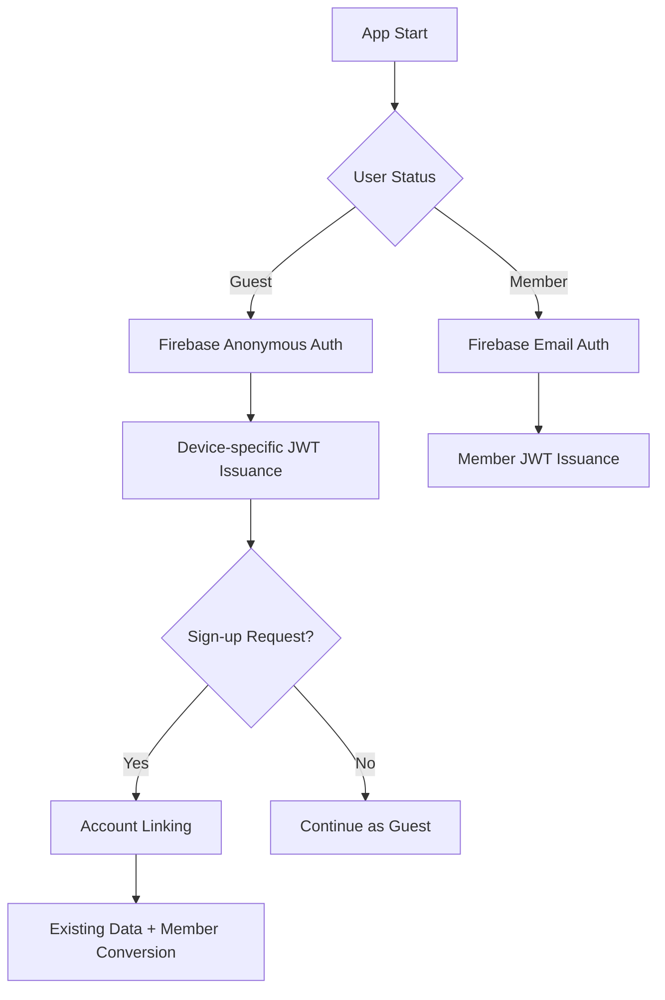

# Unity + Firebase Authentication Journey: From Anonymous to Account Linking


*The trials and errors encountered while implementing Firebase dual authentication system in Unity*

## 🤦‍♂️ It All Started with This Problem

**Problem**: How to allow guest users to save data in a game app while preserving their existing data when they sign up later?

**Solution**: Implement seamless user experience with Firebase Anonymous Authentication + Account Linking

Initially, I thought "Can't we just use device ID?" But I realized data would be lost when changing devices or reinstalling the app. Firebase Anonymous Auth was the answer.



## 💻 Core Implementation Code

### Firebase Anonymous Authentication (Unity)

```csharp
// Initially, I only did this...
FirebaseAuth.DefaultInstance.SignInAnonymouslyAsync().ContinueWith(task => {
    if (task.IsCompletedSuccessfully) {
        FirebaseUser user = task.Result.User;
        Debug.Log("Anonymous login successful: " + user.UserId);
    }
});

// Actually need to get ID Token for server verification
private async void AuthenticateAnonymously() {
    try {
        var result = await FirebaseAuth.DefaultInstance.SignInAnonymouslyAsync();
        var idToken = await result.User.GetIdTokenAsync(false);
        
        // Send ID Token to server
        await SendDeviceAuthRequest(idToken);
    } catch (Exception e) {
        Debug.LogError($"Anonymous authentication failed: {e.Message}");
    }
}
```

### Account Linking Implementation (The most challenging part)

```csharp
// Initially didn't understand why this wasn't working
private async void LinkWithEmail(string email, string password) {
    try {
        var credential = EmailAuthProvider.GetCredential(email, password);
        
        // Key: Link email account to current anonymous user
        var result = await FirebaseAuth.DefaultInstance.CurrentUser
            .LinkWithCredentialAsync(credential);
            
        // Notify server with new ID Token
        var newIdToken = await result.User.GetIdTokenAsync(false);
        await SendLoginRequest(newIdToken);
        
        Debug.Log("Account Linking successful!");
    } catch (FirebaseException e) {
        if (e.ErrorCode == AuthError.EmailAlreadyInUse) {
            Debug.LogError("Email is already in use");
        }
    }
}
```

### Server-side Processing (AWS Lambda)

```javascript
// User processing after Firebase ID Token verification
exports.handler = async (event) => {
    try {
        const { idToken } = JSON.parse(event.body);
        
        // Verify token with Firebase Admin SDK
        const decodedToken = await admin.auth().verifyIdToken(idToken);
        const { uid, email, firebase } = decodedToken;
        
        // Query existing user from DynamoDB
        const existingUser = await getUserByUID(uid);
        
        if (existingUser) {
            // Account Linking: Anonymous → Member conversion
            if (!existingUser.email && email) {
                await updateUserToMember(uid, email);
                return { 
                    success: true, 
                    isUpgrade: true,
                    message: "Can continue using existing JWT token"
                };
            }
        } else {
            // Create new user
            await createNewUser(uid, email || null);
        }
        
        // Issue JWT (no distinction between anonymous/member)
        const jwt = generateJWT({ uid, email, type: email ? 'user' : 'anonymous' });
        
        return { success: true, jwt, isNewUser: !existingUser };
    } catch (error) {
        return { success: false, error: error.message };
    }
};
```

## 🔧 Lessons Learned from Trial and Error

### 1. Importance of Unified JWT Secret
Initially, I tried to create separate JWT secrets for anonymous and member users. This caused users to be logged out when Account Linking invalidated existing tokens.

**Solution**: Use single JWT secret to ensure session continuity during mode transitions

### 2. Firebase ID Token Expiration Handling
Firebase ID Tokens expire every hour. I didn't know this initially and wondered "Why does authentication suddenly fail?"

**Solution**: Firebase SDK automatically refreshes tokens, so no additional client-side handling needed

### 3. DynamoDB User Data Structure
```json
{
  "uid": "firebase_uid_here",
  "type": "anonymous", // or "user"
  "email": null, // Updated during Account Linking
  "createdAt": "2025-06-21T10:00:00Z",
  "lastLoginAt": "2025-06-21T15:30:00Z",
  "learningData": { /* Game progress data */ }
}
```

**Key Point**: During Account Linking, only update `type` and `email` while preserving `learningData`

### 4. Importance of Network Error Handling
High dependency on Firebase makes the system sensitive to network issues. Offline scenarios must also be considered.

```csharp
// Including retry logic
private async Task<string> GetIdTokenWithRetry(int maxRetries = 3) {
    for (int i = 0; i < maxRetries; i++) {
        try {
            return await FirebaseAuth.DefaultInstance.CurrentUser.GetIdTokenAsync(false);
        } catch (Exception e) {
            if (i == maxRetries - 1) throw;
            await Task.Delay(1000 * (i + 1)); // Exponential backoff
        }
    }
    return null;
}
```

## 💡 Results and Insights

### Achievements
- **Perfect Data Continuity**: 100% data preservation during guest → member transition
- **Seamless UX**: So natural that users don't notice mode transitions
- **Scalable Architecture**: Social login additions possible with the same pattern

### Limitations
- **Firebase Dependency**: Entire authentication system vulnerable to Firebase outages
- **Token Management Complexity**: JWT expiration handling on client-side more challenging than expected

I plan to add OAuth social login using the same Account Linking pattern. Hope this helps anyone implementing similar systems, and please share better approaches in the comments if you know any! 🙏