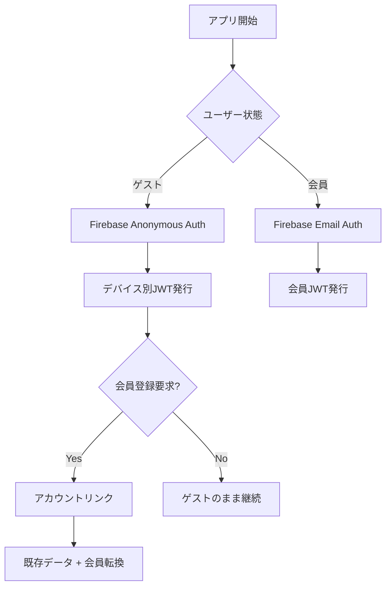

# Unity + Firebase認証の苦労話：Anonymousからアカウントリンクまで


*UnityでFirebase二重認証システムを実装する際に経験した試行錯誤*

## 🤦‍♂️ こんな悩みから始まった

**問題**: ゲームアプリでゲストユーザーもデータを保存し、後から会員登録しても既存データを失わないようにするには？

**解決**: Firebase Anonymous Authentication + アカウントリンクでスムーズなユーザー体験を実装

最初は「デバイスIDを使えばいいんじゃない？」と思ったが、デバイス変更やアプリ再インストール時にデータが消失するのを見て気づいた。Firebase Anonymous Authが答えだった。



## 💻 核心実装コード

### Firebase Anonymous認証 (Unity)

```csharp
// 最初はこれだけしかしなかった...
FirebaseAuth.DefaultInstance.SignInAnonymouslyAsync().ContinueWith(task => {
    if (task.IsCompletedSuccessfully) {
        FirebaseUser user = task.Result.User;
        Debug.Log("匿名ログイン成功: " + user.UserId);
    }
});

// 実際にはID Tokenまで取得してサーバーで検証可能にする必要がある
private async void AuthenticateAnonymously() {
    try {
        var result = await FirebaseAuth.DefaultInstance.SignInAnonymouslyAsync();
        var idToken = await result.User.GetIdTokenAsync(false);
        
        // サーバーにID Token送信
        await SendDeviceAuthRequest(idToken);
    } catch (Exception e) {
        Debug.LogError($"匿名認証失敗: {e.Message}");
    }
}
```

### アカウントリンク実装 (最も苦労した部分)

```csharp
// 最初はなぜこれが動かないのかわからなかった
private async void LinkWithEmail(string email, string password) {
    try {
        var credential = EmailAuthProvider.GetCredential(email, password);
        
        // キーポイント: 現在の匿名ユーザーにメールアカウントをリンク
        var result = await FirebaseAuth.DefaultInstance.CurrentUser
            .LinkWithCredentialAsync(credential);
            
        // 新しいID Tokenでサーバーに通知
        var newIdToken = await result.User.GetIdTokenAsync(false);
        await SendLoginRequest(newIdToken);
        
        Debug.Log("アカウントリンク成功!");
    } catch (FirebaseException e) {
        if (e.ErrorCode == AuthError.EmailAlreadyInUse) {
            Debug.LogError("既に使用中のメールアドレスです");
        }
    }
}
```

### サーバーサイド処理 (AWS Lambda)

```javascript
// Firebase ID Token検証後のユーザー処理
exports.handler = async (event) => {
    try {
        const { idToken } = JSON.parse(event.body);
        
        // Firebase Admin SDKでトークン検証
        const decodedToken = await admin.auth().verifyIdToken(idToken);
        const { uid, email, firebase } = decodedToken;
        
        // DynamoDBから既存ユーザー照会
        const existingUser = await getUserByUID(uid);
        
        if (existingUser) {
            // アカウントリンク: 匿名 → 会員転換
            if (!existingUser.email && email) {
                await updateUserToMember(uid, email);
                return { 
                    success: true, 
                    isUpgrade: true,
                    message: "既存JWTトークンで継続使用可能です"
                };
            }
        } else {
            // 新規ユーザー作成
            await createNewUser(uid, email || null);
        }
        
        // JWT発行 (匿名/会員を区別しない)
        const jwt = generateJWT({ uid, email, type: email ? 'user' : 'anonymous' });
        
        return { success: true, jwt, isNewUser: !existingUser };
    } catch (error) {
        return { success: false, error: error.message };
    }
};
```

## 🔧 試行錯誤の過程で学んだこと

### 1. JWT Secret統一の重要性
最初は匿名用、会員用JWT Secretを別々に作ろうとした。アカウントリンク時に既存トークンが無効化されてユーザーがログアウトされる問題が発生した。

**解決**: 単一JWT Secret使用でモード切り替え時のセッション継続性を保証

### 2. Firebase ID Token有効期限処理
Firebase ID Tokenは1時間ごとに期限切れになる。最初はこれを知らずに「なぜ急に認証できなくなるんだ？」と思った。

**解決**: Firebase SDKが自動で更新してくれるのでクライアントサイドで別途処理不要

### 3. DynamoDBユーザーデータ構造
```json
{
  "uid": "firebase_uid_here",
  "type": "anonymous", // または "user"
  "email": null, // アカウントリンク時に更新
  "createdAt": "2025-06-21T10:00:00Z",
  "lastLoginAt": "2025-06-21T15:30:00Z",
  "learningData": { /* ゲーム進行データ */ }
}
```

**キーポイント**: アカウントリンク時は`type`と`email`のみ更新し、`learningData`はそのまま維持

### 4. ネットワークエラー処理の重要性
Firebase依存度が高い分、ネットワーク問題に敏感である。オフライン状況も考慮する必要がある。

```csharp
// リトライロジック含む
private async Task<string> GetIdTokenWithRetry(int maxRetries = 3) {
    for (int i = 0; i < maxRetries; i++) {
        try {
            return await FirebaseAuth.DefaultInstance.CurrentUser.GetIdTokenAsync(false);
        } catch (Exception e) {
            if (i == maxRetries - 1) throw;
            await Task.Delay(1000 * (i + 1)); // 指数バックオフ
        }
    }
    return null;
}
```

## 💡 結果と学んだ点

### 成果
- **完璧なデータ継続性**: ゲスト → 会員転換時のデータ100%保存
- **スムーズなUX**: ユーザーがモード切り替えを意識しないほど自然
- **拡張可能な構造**: ソーシャルログイン追加も同じパターンで可能

### 惜しい点
- **Firebase依存性**: Firebase障害時に認証システム全体が麻痺
- **トークン管理の複雑性**: クライアントサイドでのJWT有効期限処理が思ったより面倒

今後はOAuthソーシャルログインも同じアカウントリンクパターンで追加予定である。同じようなシステムを実装される方々の参考になれば幸いで、より良い方法をご存知の方がいればコメントで共有してください！🙏