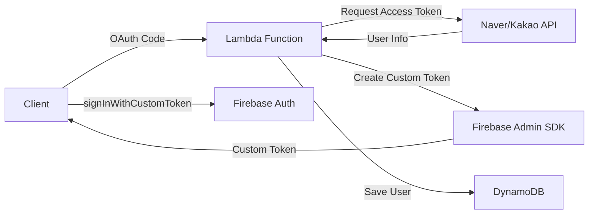

# Creating Naver/Kakao OIDC for Firebase? Reality Hits Different


*2 AM, wrestling with the Firebase console...*

## 🤦‍♂️ Here's What Happened

Last week on a project, I needed to add Naver/Kakao login to Firebase Authentication. "Oh, this should be simple. Just add an OIDC (OpenID Connect) provider in Firebase, right?" I thought...

How naive I was.

**The Problem**: Firebase supports adding OIDC providers, but Naver and Kakao don't fully comply with the standard OIDC specification!

```javascript
// I thought this would work...
const provider = new firebase.auth.OAuthProvider('naver.com');
// ❌ Error: Invalid provider ID
```

## 🔧 The Troubleshooting Journey

### First Attempt: Finding the OIDC Discovery Document

Standard OIDC providers offer a `/.well-known/openid-configuration` endpoint. So I went looking:

```bash
# Trying Naver
curl https://nid.naver.com/.well-known/openid-configuration
# 404 Not Found 😭

# Trying Kakao  
curl https://kauth.kakao.com/.well-known/openid-configuration
# 404 Not Found 😭
```

Neither had it...

The funny thing is, [Kakao says you can activate "OpenID Connect Activation" in Kakao Login settings](https://velog.io/@dginovker/How-to-use-Kakao-for-SSO-on-Android-and-iOS-Flutter-apps-with-Firebase), so I had my hopes up. But even then, they don't provide a standard Discovery document.

### Second Attempt: Manual OIDC Configuration

I tried to set it up manually in the Firebase console:

| Configuration Item | Required Value | Naver/Kakao Reality |
|-------------------|----------------|---------------------|
| Issuer URL | OIDC issuer URL | ❌ None |
| Client ID | OAuth client ID | ✅ Available |
| Client Secret | OAuth client secret | ✅ Available |
| Token URL | Token endpoint | ⚠️ OAuth 2.0 only |
| UserInfo URL | User info endpoint | ⚠️ Non-standard format |

Conclusion: **Impossible**. Naver and Kakao support OAuth 2.0, but not the complete OIDC standard.

### Third Attempt: Creating an OIDC Proxy with Firebase Functions

"What if I create an intermediate layer with Firebase Functions to transform it into standard OIDC?"

I tried this structure:

```javascript
// Attempting to implement an OIDC proxy in Firebase Function
exports.oidcProxy = functions.https.onRequest(async (req, res) => {
    const { provider } = req.query; // 'naver' or 'kakao'
    
    if (req.path === '/.well-known/openid-configuration') {
        // Provide fake OIDC Discovery document
        return res.json({
            issuer: `https://us-central1-myproject.cloudfunctions.net/oidcProxy`,
            authorization_endpoint: `https://us-central1-myproject.cloudfunctions.net/oidcProxy/authorize`,
            token_endpoint: `https://us-central1-myproject.cloudfunctions.net/oidcProxy/token`,
            userinfo_endpoint: `https://us-central1-myproject.cloudfunctions.net/oidcProxy/userinfo`,
            // ... other required OIDC fields
        });
    }
    
    // Proxy logic for each endpoint...
});
```

But this approach hit several walls:

1. **Complexity Explosion**: Had to implement all OIDC endpoints
2. **State Management Hell**: Where to store Authorization Codes, Access Tokens, etc.
3. **Security Issues**: Additional security considerations from acting as a middleman
4. **Increased Costs**: All auth requests must go through Functions

Looking at similar attempts:
- [A Naver blog also mentions "Kakao Login/Naver Login, which are actively used in Korea, are not yet supported"](https://m.blog.naver.com/chltmddus23/221784299552) and suggests the Custom Token approach
- [The firebase-custom-login project on GitHub](https://github.com/zaiyou12/firebase-custom-login) also adopts "returning Custom Token using firebase function"
- [Combining AWS Lambda with Firebase Auth](https://goodgoodjm.github.io/kakao-and-naver-login-with-firebase-1/) also ultimately leads to Custom Token

### Fourth Attempt: Custom Token Strategy

Eventually, I concluded that issuing Custom Tokens from a server (Lambda) was much cleaner than mimicking OIDC with Firebase Functions.

This was the right answer. But then another problem arose...

## 💡 The Solution: Hybrid Strategy

Finally solved it with this structure:



The key is **creating all users as Firebase anonymous users first, then linking accounts later**.

## 💻 Actual Implementation Code

### 1. Handling Naver Login in Lambda

```javascript
// Naver user → Firebase UID mapping
async function handleNaverLogin(naverUser) {
    // Check existing mapping
    const mappedUid = await getNaverUidMapping(naverUser.id);
    
    if (mappedUid) {
        // Existing user - use mapped UID
        return await loginExistingUser(mappedUid);
    } else {
        // New user - create anonymous account on server and link
        const anonymousUser = await admin.auth().createUser({
            disabled: false // anonymous user
        });
        
        // Update account with Naver info (Account Linking)
        await admin.auth().updateUser(anonymousUser.uid, {
            email: naverUser.email,
            displayName: naverUser.nickname,
            customClaims: {
                provider: 'naver',
                naver_id: naverUser.id
            }
        });
        
        // Save mapping
        await createNaverUidMapping(naverUser.id, anonymousUser.uid);
        
        return anonymousUser.uid;
    }
}
```

### 2. Storing Mapping Information in DynamoDB

```javascript
// Naver/Kakao ID → Firebase UID mapping
const mappingStructure = {
    PK: 'NLOGIN#naver_user_12345',  // Naver user ID
    SK: 'AbCdEfGhIjKlMnOpQrStUvWxYz', // Firebase UID
    createdAt: '2025-01-28T02:30:00Z'
};
```

This way, logging in with the same Naver/Kakao account always uses the same Firebase UID!

### 3. Using Custom Token on Client

```javascript
// Client (Unity/Web)
async function loginWithNaver(authCode) {
    // 1. Send Authorization Code to Lambda
    const response = await fetch('/auth/naver', {
        method: 'POST',
        body: JSON.stringify({ code: authCode })
    });
    
    const { customToken, jwt } = await response.json();
    
    // 2. Firebase login
    await firebase.auth().signInWithCustomToken(customToken);
    
    // 3. Store JWT token (for API calls)
    localStorage.setItem('authToken', jwt.accessToken);
}
```

## 📈 Results and Lessons Learned

### Pros
- ✅ Full access to all Firebase features (Rules, Analytics, etc.)
- ✅ Unified user management (all users have Firebase UID)
- ✅ Support for anonymous → social account conversion
- ✅ Multi-provider linking possible

### Cons
- ❌ Server infrastructure required (Lambda + DynamoDB)
- ❌ Additional costs
- ❌ Increased implementation complexity

### Key Insights

1. **Firebase Only Supports Global Standards**
   - Most Korean local services only support OAuth 2.0
   - Don't expect OIDC standard compliance
   - [Firebase official docs](https://firebase.google.com/docs/auth/web/openid-connect) clearly specify "OIDC compliant provider"

2. **Creating an OIDC Proxy with Firebase Functions is Unrealistic**
   - Theoretically possible but implementation complexity is too high
   - Increased possibility of security vulnerabilities
   - High cost and maintenance burden
   - Many developers tried but most reverted to Custom Token approach

3. **Hybrid Strategy is the Answer**
   - Unified management with Firebase UID
   - Handle social logins with mapping tables
   - Leveraging anonymous users is key
   - Can link accounts later with Account Linking

4. **Serverless is Optimal**
   - Lambda + DynamoDB combination is cost-effective
   - Use Node.js 18.x considering Cold Start
   - Manage secrets with Parameter Store

## 🎯 Wrapping Up

Initially, I thought "Just add an OIDC provider in Firebase and done!" But reality was different. However, this led to building a more flexible authentication system.

Looking around the internet, I found many people like me:
- [Questions about Firebase integration have been posted on Kakao DevTalk since 2017](https://devtalk.kakao.com/t/firebase/30575)
- [OAuth 2.0 configuration issues continue to be reported on Stack Overflow](https://stackoverflow.com/questions/79183709/oauth-2-0-not-working-properly-with-kakao-login-in-react-app)
- Most solutions converge on the Custom Token approach

If you're in a similar situation, go with the Custom Token approach from the start. Don't waste time trying to add an OIDC provider... 😅

The complete code is available in the [GitHub repository](https://github.com/realcoding2003/firebase-auth-apigateway)!

---

**P.S.** Implementing it this way made it easy to extend with the same pattern when adding Apple login later. Maybe it worked out for the better...? 🤔

**P.P.S.** I had hopes when I heard Kakao partially supports OIDC, but it was still far from the standards Firebase requires. Naver seems to have no OIDC plans at all... 🥲