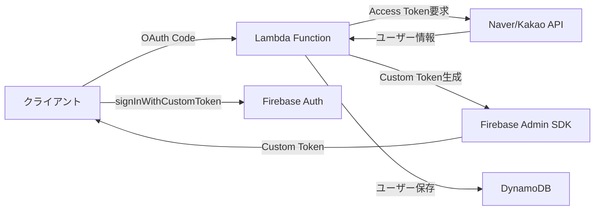

# FirebaseにNaver/Kakao OIDCを作る？現実は違った


*午前2時、Firebaseコンソールと格闘していたあの日...*

## 🤦‍♂️ こんなことが起きた

先週のプロジェクトで、Firebase AuthenticationにNaver/Kakaoログインを追加する必要があった。「ああ、簡単だな。FirebaseでOIDC（OpenID Connect）プロバイダーを追加すればいいんでしょ？」と思っていた私...

本当に甘かった。

**問題**: FirebaseはOIDCプロバイダーの追加をサポートしているが、NaverとKakaoは標準OIDC仕様を完全に準拠していない！

```javascript
// こうすればできると思ったのに...
const provider = new firebase.auth.OAuthProvider('naver.com');
// ❌ Error: Invalid provider ID
```

## 🔧 苦労の過程

### 最初の試み：OIDC Discoveryドキュメントを探す

標準的なOIDCプロバイダーは`/.well-known/openid-configuration`エンドポイントを提供する。それで探してみた：

```bash
# Naverを試す
curl https://nid.naver.com/.well-known/openid-configuration
# 404 Not Found 😭

# Kakaoを試す  
curl https://kauth.kakao.com/.well-known/openid-configuration
# 404 Not Found 😭
```

どちらもなかった...

面白いことに、[KakaoはKakao Login設定で「OpenID Connect Activation」を有効化できる](https://velog.io/@dginovker/How-to-use-Kakao-for-SSO-on-Android-and-iOS-Flutter-apps-with-Firebase)というので期待して確認してみたが、それでも標準Discoveryドキュメントは提供していなかった。

### 2回目の試み：手動でOIDC設定

Firebaseコンソールで手動で設定してみようとした：

| 設定項目 | 必要な値 | Naver/Kakaoの現実 |
|----------|----------|-------------------|
| Issuer URL | OIDC発行者URL | ❌ なし |
| Client ID | OAuthクライアントID | ✅ あり |
| Client Secret | OAuthクライアントシークレット | ✅ あり |
| Token URL | トークンエンドポイント | ⚠️ OAuth 2.0のみサポート |
| UserInfo URL | ユーザー情報エンドポイント | ⚠️ 非標準形式 |

結論：**不可能**。NaverとKakaoはOAuth 2.0はサポートしているが、完全なOIDC標準はサポートしていない。

### 3回目の試み：Firebase FunctionsでOIDCプロキシを作る

「じゃあ、Firebase Functionsで中間レイヤーを作って標準OIDCに変換すればいいんじゃない？」

こんな構造を試した：

```javascript
// Firebase FunctionでOIDCプロキシ実装を試みる
exports.oidcProxy = functions.https.onRequest(async (req, res) => {
    const { provider } = req.query; // 'naver'または'kakao'
    
    if (req.path === '/.well-known/openid-configuration') {
        // 偽のOIDC Discoveryドキュメントを提供
        return res.json({
            issuer: `https://us-central1-myproject.cloudfunctions.net/oidcProxy`,
            authorization_endpoint: `https://us-central1-myproject.cloudfunctions.net/oidcProxy/authorize`,
            token_endpoint: `https://us-central1-myproject.cloudfunctions.net/oidcProxy/token`,
            userinfo_endpoint: `https://us-central1-myproject.cloudfunctions.net/oidcProxy/userinfo`,
            // ... その他のOIDC必須フィールド
        });
    }
    
    // 各エンドポイントごとのプロキシロジック...
});
```

しかし、この方式はいくつかの問題に直面した：

1. **複雑度の爆発**：OIDCのすべてのエンドポイントを実装しなければならない
2. **状態管理地獄**：Authorization Code、Access Tokenなどをどこに保存するか
3. **セキュリティの問題**：中間者役割をしながら発生する追加のセキュリティ考慮事項
4. **コスト増加**：すべての認証リクエストがFunctionsを経由しなければならない

似たような試みをした事例を探してみると：
- [Naverブログでも「韓国で活発に使われているKakaoログイン/Naverログインはまだサポートされていない」と言及](https://m.blog.naver.com/chltmddus23/221784299552)しCustom Token方式を提案
- [GitHubのfirebase-custom-loginプロジェクト](https://github.com/zaiyou12/firebase-custom-login)でも「firebase functionを使用してCustom Tokenを返す方式」を採用
- [AWS LambdaとFirebase Authを組み合わせた方式](https://goodgoodjm.github.io/kakao-and-naver-login-with-firebase-1/)も結局Custom Tokenに帰結

### 4回目の試み：Custom Token戦略

結局、Firebase FunctionsでOIDCを真似るよりも、サーバー（Lambda）でCustom Tokenを発行する方がずっとすっきりしているという結論に到達した。

これが正解だった。でもここでまた問題が...

## 💡 解決策：ハイブリッド戦略

結局こんな構造で解決した：



核心は**すべてのユーザーをFirebaseの匿名ユーザーとして最初に作り、後でアカウントを連携する方式**である。

## 💻 実際の実装コード

### 1. LambdaでNaverログイン処理

```javascript
// Naverユーザー → Firebase UIDマッピング
async function handleNaverLogin(naverUser) {
    // 既存のマッピング確認
    const mappedUid = await getNaverUidMapping(naverUser.id);
    
    if (mappedUid) {
        // 既存ユーザー - マッピングされたUIDを使用
        return await loginExistingUser(mappedUid);
    } else {
        // 新規ユーザー - サーバーで匿名アカウント作成後連携
        const anonymousUser = await admin.auth().createUser({
            disabled: false // 匿名ユーザー
        });
        
        // Naver情報でアカウント更新（Account Linking）
        await admin.auth().updateUser(anonymousUser.uid, {
            email: naverUser.email,
            displayName: naverUser.nickname,
            customClaims: {
                provider: 'naver',
                naver_id: naverUser.id
            }
        });
        
        // マッピング保存
        await createNaverUidMapping(naverUser.id, anonymousUser.uid);
        
        return anonymousUser.uid;
    }
}
```

### 2. DynamoDBにマッピング情報を保存

```javascript
// Naver/Kakao ID → Firebase UIDマッピング
const mappingStructure = {
    PK: 'NLOGIN#naver_user_12345',  // NaverユーザーID
    SK: 'AbCdEfGhIjKlMnOpQrStUvWxYz', // Firebase UID
    createdAt: '2025-01-28T02:30:00Z'
};
```

これで同じNaver/Kakaoアカウントでログインしても常に同じFirebase UIDを使用できる！

### 3. クライアントでCustom Token使用

```javascript
// クライアント（Unity/Web）
async function loginWithNaver(authCode) {
    // 1. LambdaにAuthorization Code送信
    const response = await fetch('/auth/naver', {
        method: 'POST',
        body: JSON.stringify({ code: authCode })
    });
    
    const { customToken, jwt } = await response.json();
    
    // 2. Firebaseログイン
    await firebase.auth().signInWithCustomToken(customToken);
    
    // 3. JWTトークン保存（API呼び出し用）
    localStorage.setItem('authToken', jwt.accessToken);
}
```

## 📈 結果と学んだこと

### 長所
- ✅ Firebaseのすべての機能活用可能（Rules、Analyticsなど）
- ✅ 統合されたユーザー管理（すべてのユーザーがFirebase UIDを保有）
- ✅ 匿名 → ソーシャルアカウント転換サポート
- ✅ マルチプロバイダー連携可能

### 短所
- ❌ サーバーインフラ必要（Lambda + DynamoDB）
- ❌ 追加コスト発生
- ❌ 実装の複雑度増加

### 核心的な洞察

1. **Firebaseはグローバル標準のみサポートする**
   - 韓国のローカルサービスはほとんどOAuth 2.0のみサポート
   - OIDC標準を期待してはいけない
   - [Firebase公式ドキュメント](https://firebase.google.com/docs/auth/web/openid-connect)でも「OIDC compliant provider」を明示

2. **Firebase FunctionsでOIDCプロキシを作るのは非現実的である**
   - 理論的には可能だが実装の複雑度が高すぎる
   - セキュリティ脆弱性発生の可能性増加
   - コストとメンテナンス負担が大きい
   - 多くの開発者が試したがほとんどCustom Token方式に回帰

3. **ハイブリッド戦略が正解である**
   - Firebase UIDで統合管理
   - ソーシャルログインはマッピングテーブルで処理
   - 匿名ユーザー活用が核心
   - Account Linkingで後でアカウント連携可能

4. **サーバーレスが最適である**
   - Lambda + DynamoDBの組み合わせがコスト効率的
   - Cold Startを考慮してNode.js 18.x使用
   - Parameter Storeでシークレット管理

## 🎯 まとめ

最初は「FirebaseでOIDCプロバイダー追加すれば終わり！」と思ったが、現実は違った。しかしおかげでもっと柔軟な認証システムを作ることができた。

インターネットを調べてみると私のような人が多かった：
- [Kakao DevTalkでも2017年からFirebase連携の質問](https://devtalk.kakao.com/t/firebase/30575)が上がっている
- [Stack OverflowでもOAuth 2.0設定関連の問題](https://stackoverflow.com/questions/79183709/oauth-2-0-not-working-properly-with-kakao-login-in-react-app)が継続的に報告されている
- ほとんどの解決策がCustom Token方式に収束

似たような状況にいる方々、最初からCustom Token方式で行ってください。OIDCプロバイダー追加しようと時間を無駄にしないで... 😅

完全なコードは[GitHubリポジトリ](https://github.com/realcoding2003/firebase-auth-apigateway)で確認できます！

---

**P.S.** この方式で実装したら、後でAppleログインを追加する時も同じパターンで簡単に拡張できました。むしろ良かったのかも...？ 🤔

**P.P.S.** KakaoがOIDCを部分的にサポートすると聞いて期待したけど、結局Firebaseが要求する標準とは距離がありました。Naverはそもそも OIDC計画がないみたい... 🥲