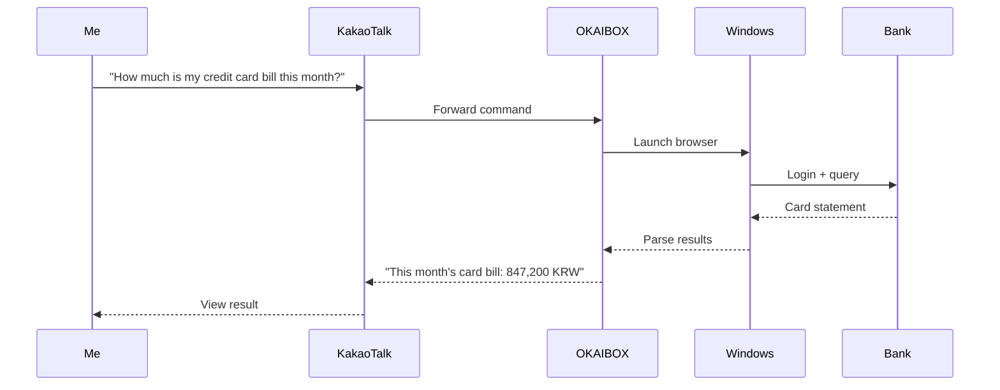
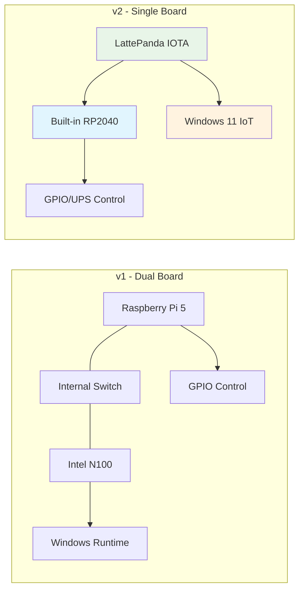

# Everyone's Talking About OpenClaw, But I Was Already Building the Korean Version

*OKAIBOX - Building an AI agent that actually works in Korea*

A few days ago, OpenClaw started blowing up on social media.

"Just send a message from your phone and your PC does everything for you" - and it had already crossed 160K GitHub stars.

Naturally, I had to check it out.

It's an open-source AI agent built by Peter Steinberger, an Austrian developer, and the concept is brilliant. You send messages through WhatsApp or Telegram like "organize my emails" or "find that file," and it executes directly on your PC.

No need to open any app. Just text it like you'd text a friend.

Wait, this is actually great?

I was about to try it right away, but...

## It Has Some Gaps for the Korean Market

Don't get me wrong. OpenClaw itself is a really well-built project. It runs cleanly on macOS and Linux, and the features are solid.

But when I tried to use it in a Korean environment, a few things stood out.

### No Native Windows Support

This was the biggest one. To run OpenClaw on Windows, you need WSL2. It runs on top of a Linux virtual environment...

Sure, any developer can set up WSL2. But that's not the real issue. An agent running on WSL2 has a hard time controlling native Windows programs directly. For things like Korean internet banking or government websites that require Windows-only security software, there are real limitations.

### The Korean Service Ecosystem Gap

The supported messengers are WhatsApp, Telegram, and Discord... but in Korea, KakaoTalk holds about 90% market share, and it's not supported yet. Same goes for HWP document handling.

Of course, this isn't really OpenClaw's fault - it's just the nature of global open-source projects. You can't expect them to handle Korean localization.

### Security Concerns

Major Korean tech companies like Naver and Kakao have reportedly restricted OpenClaw usage internally. Since the architecture involves granting an AI agent broad access to your PC... enterprises naturally have to be cautious.

Here's a summary:

| Category | OpenClaw | Korean Environment |
| ------ | ---------- | ----------- |
| Messenger | WhatsApp, Telegram, etc. | KakaoTalk at 90% |
| OS | Optimized for macOS/Linux | High Windows usage |
| Documents | PDF, DOCX | HWP widely used |
| Banking | Standard websites | Requires dedicated security software |
| Security | Suitable for personal use | Enterprise adoption requires review |

## Wait... I Was Already Building Something Similar

As I dug into OpenClaw, I had a strange realization.

"Hold on... this is going in the same direction as what I've been working on?"

I'd been planning a project called **OKAIBOX** since last year. OK + AI + BOX. Literally a box with AI inside.

But there's a fundamental difference from OpenClaw.

**OKAIBOX isn't software. It's hardware.**

More precisely, it's an integrated hardware + software product. It's a small box that looks like a NAS (Network Attached Storage) with an AI agent running inside - and this box was designed from the ground up for the **Korean environment**.

## How OKAIBOX Is Different

### 1. It Runs Real Windows

While OpenClaw runs Linux on top of WSL2, OKAIBOX has **Windows 11 IoT Enterprise** installed natively. Not a VM. Actual Windows.

Why does this matter? Korean banking sites require Windows-based security programs to log in. This is impossible on WSL2, but on OKAIBOX, it just works.

### 2. NAS + AI Agent in One Box

OpenClaw is software you install on an existing PC. OKAIBOX takes a different approach.

- 4-bay NAS for secure personal data storage
- Runs 24/7, so the AI agent is always available
- Built-in UPS protects your data during power outages
- Power consumption? 11W at idle. Less than a desk fan.

Put a NAS at home, and that NAS doubles as your AI assistant. Your data stays in your house, so no cloud worries either.

### 3. Native Korean Service Integration

Send a command via KakaoTalk and OKAIBOX executes it. Here's what that looks like:

Same goes for HWP files. Text "Open this HWP file and summarize page 3" via KakaoTalk, and OKAIBOX opens Hangul (the Korean word processor) and handles it. Possible because it's native Windows.

## Where Things Stand

I've actually been working on this for quite a while. Not just brainstorming - the hardware design is already done.

### 2025: Quote Automation and Document Automation Experience

Last year, I developed AI-based quote automation and document automation systems. The system analyzed PDFs, extracted data, had AI classify documents, and organized everything automatically. That experience is forming the software foundation of OKAIBOX.

What I realized back then was that Windows-based automation systems are genuinely needed in Korea. HWP file processing, government document formats, quote templates... these are uniquely Korean things that existing global tools just can't cover.

OKAIBOX is essentially that experience extended to the hardware level.

### Hardware Evolution: v1 to v2

The initial design used a dual-board setup combining a Raspberry Pi 5 and an Intel N100. But as I built it, the complexity became unmanageable. Inter-board communication, an internal network switch, OS synchronization...

So I scrapped it all for v2. Consolidated everything into a single board: the **LattePanda IOTA**!

*The actual LattePanda IOTA I purchased. This tiny board packs both an Intel N150 and RP2040*

What makes this board great is that it has an Intel N150 CPU with a built-in RP2040 coprocessor, so GPIO control works without a separate Arduino.

| Category | v1 (Dual Board) | v2 (Single Board) |
| ------ | -------------- | --------------- |
| Board count | 2 | **1** |
| Internal network | 5-port switch required | **Not needed** |
| Power (idle) | ~17W | **~11W** |
| Cost | ~$4,500 | **~$4,350** |
| Complexity | High | **Low** |

### Core Specs

- **CPU**: Intel N150 (4 cores, 3.6GHz) - plenty for lightweight AI tasks
- **RAM**: 16GB LPDDR5
- **Storage**: NVMe SSD (OS) + 4-bay HDD (data, up to 80TB)
- **Coprocessor**: RP2040 (dedicated GPIO/UPS control)
- **UPS**: 4-cell 18650 battery, 5-10 min backup
- **OS**: Windows 11 IoT Enterprise

### The BOM So Far

The standard prototype comes in at roughly **$2,250 per unit**. But the HDDs (10TB x 4) account for about $1,200 of that - more than half. The unit itself is around $1,050.

I'm also planning a model with a **Jetson AGX Thor** for those who want to run local LLMs, but that one jumps to about $10,000. The tradeoff is being able to run large AI models entirely on-device.

## The Roadmap

Today is Day 1. I plan to write a dev diary entry every day going forward.

**Short-term (1-2 months)**
- Set up and optimize Windows 11 IoT Enterprise
- Develop RP2040 UPS control firmware
- Stabilize core NAS functionality (Storage Spaces, SMB shares)

**Mid-term (3-6 months)**
- KakaoTalk API integration
- HWP document read/write library integration
- Korean website automation engine (banking, government)

**Long-term**
- Local LLM integration (Jetson AGX Thor)
- Open-source release (MIT License)
- Community building

### Series Preview

Here's what I'll be covering in upcoming entries:

- **Day 2**: LattePanda IOTA unboxing and first setup
- **Day 3**: The Windows 11 IoT Enterprise installation saga
- **Day 4**: Developing the RP2040 UPS control firmware
- **Day 5**: 3D printing the 4-bay NAS case
- **Day 6**: Attempting KakaoTalk integration
- **Day 7**: Implementing HWP document processing
- (to be continued...)

## Wrapping Up

OpenClaw reminded me of something important: the power of open source is real. One person starts a project, and in a matter of weeks it hits 160K stars. I plan to open-source OKAIBOX once it's ready too.

But if you ask whether OKAIBOX is just a Korean version of OpenClaw - it's not. The direction is similar, but the approach is completely different. OpenClaw is software. OKAIBOX starts with the hardware. OpenClaw installs on an existing PC. OKAIBOX is a dedicated device that runs 24/7.

I want to build an AI agent that actually works in Korea. One that takes commands through KakaoTalk, handles banking, processes HWP files... the whole nine yards.

It's a solo project, but I want to share the journey and grow together with others. If you're thinking about similar problems, drop a comment!

---

**P.S.** I want to give credit to Peter Steinberger, OpenClaw's creator, for the inspiration. He proved that one person's project can change the world. I'd like to walk that same path.

**P.P.S.** I'd love to connect with anyone who:
- Has experience with LattePanda boards
- Is working on automating Korean services
- Is interested in home AI servers
- Builds DIY NAS setups

**P.P.P.S.** In the next entry (Day 2), I'll be cracking open the LattePanda IOTA, showing exactly what I bought, and sharing a detailed BOM breakdown. Stay tuned!

---

**Series**: OKAIBOX Dev Diary
- **Current**: Day 1 - Everyone's Talking About OpenClaw, But I Was Already Building the Korean Version
- **Next**: Day 2 - LattePanda IOTA Unboxing and BOM Reveal (coming soon)
