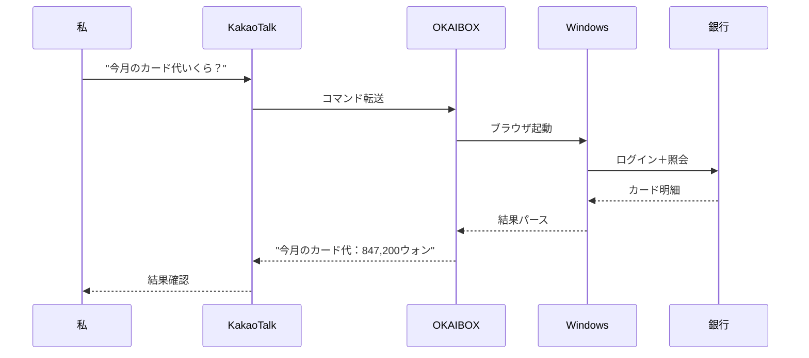
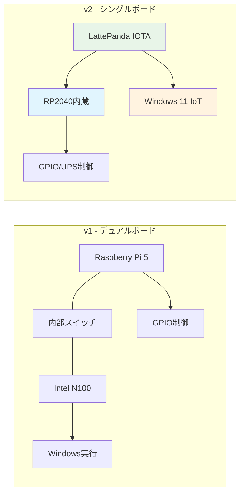

# OpenClawが話題だけど、実は韓国版をもう作り始めていた

*OKAIBOX - 韓国で本当に使えるAIエージェントを作ってみよう*

数日前、SNSでOpenClawの話がやたらと流れてきました。

「スマホからメッセージを送るだけで、PCが全部やってくれる」って... GitHubのスターがもう16万を超えたらしいです（笑）

気になってすぐ調べてみました。

Peter Steinbergerというオーストリアの開発者が作ったオープンソースAIエージェントで、コンセプトがめちゃくちゃいいんですよ。WhatsAppやTelegramで「メール整理して」「ファイル探して」みたいに送ると、自分のPCで直接実行してくれるんです。

アプリを開く必要もなく、友達にLINEするみたいに頼むだけ。

お、これいいじゃん。

すぐ使ってみようとしたんですが...

## でも韓国で使おうとすると惜しい点があった

誤解しないでください。OpenClaw自体は本当によくできたプロジェクトです。macOSやLinuxではきれいに動作するし、機能も素晴らしいです。

ただ、韓国の環境で使おうとするといくつか気になるポイントが出てきました。

### Windowsネイティブではない

一番大きかったのはこれです。OpenClawをWindowsで使うにはWSL2をインストールする必要があります。Linux仮想環境の上で動かすことになるわけで...

開発者ならWSL2くらい入れますけど、問題はそこじゃないんです。WSL2上で動くエージェントは、Windowsネイティブのプログラムを直接制御するのが難しい。韓国のインターネットバンキングや官公庁サイトのように、Windows専用セキュリティプログラムが必要な場合には限界がありました。

### 韓国サービスエコシステムとのギャップ

それからメッセンジャーがWhatsApp、Telegram、Discord中心なので... 韓国ではKakaoTalkが90%なのに、まだ対応していません。HWP（韓国独自のワープロ形式）の文書処理も同様です。

もちろんこれはOpenClawの問題というよりは、グローバルオープンソースプロジェクトの性質によるものです。韓国のローカライズまで気を配るのは難しいですからね。

### セキュリティの懸念

NAVER、Kakaoといった韓国のIT企業では、社内でのOpenClaw使用を制限しているという話も聞きます。AIエージェントにPCの広範な権限を渡す構造なので... 企業としては慎重にならざるを得ないですよね。

まとめるとこんな感じです：

| 項目 | OpenClawの現状 | 韓国の環境 |
| ------ | ---------- | ----------- |
| メッセンジャー | WhatsApp、Telegramなど | KakaoTalkが90% |
| OS | macOS/Linux最適化 | Windows使用比率が高い |
| 文書 | PDF、DOCX | HWPも多く使用 |
| 金融 | 一般Webサイト | 専用セキュリティプログラムが必要 |
| セキュリティ | 個人利用に適合 | 企業導入時は検討が必要 |

## でも考えてみたら... 自分も似たようなものを作っていた

OpenClawを分析していて、不思議な気持ちになりました。

「これ... 自分が構想していたのと方向が同じじゃないか？」

僕は去年から**OKAIBOX**というプロジェクトを企画していました。OK + AI + BOX。文字通りAIが入っている箱です（笑）

でもOpenClawとは決定的に違うところがあります。

**OKAIBOXはソフトウェアじゃない。ハードウェアです。**

正確にはハードウェア＋ソフトウェアの統合製品です。NAS（ネットワークストレージ）のような小さな箱の中でAIエージェントが動くんですが... この箱は最初から**韓国の環境**に合わせて設計しました。

## OKAIBOXはこう違う

### 1. 本物のWindowsを使う

OpenClawがWSL2上でLinuxを動かすのに対して、OKAIBOXは**Windows 11 IoT Enterprise**がネイティブでインストールされています。VMではありません。本物のWindowsです。

なぜこれが重要かというと... 韓国の銀行サイトにアクセスするには、Windows上で動作するセキュリティプログラムが必要なんです。WSL2ではこれが不可能ですが、OKAIBOXなら普通にできます。

### 2. NAS + AIエージェントを一つに

OpenClawは既存のPCにインストールするソフトウェアですが、OKAIBOXはちょっと違います。

- 4ベイNASで個人データを安全に保存
- 24時間稼働しているので、いつでもAIエージェントが使える
- 停電してもUPS内蔵でデータを保護
- 電気代？アイドル時11W。扇風機より少ないです（笑）

自宅にNASを1台置いて、そのNASがAIアシスタントの役割まで果たしてくれるんです。データも自宅にあるからクラウドの心配もなし。

### 3. 韓国サービスをネイティブに

KakaoTalkでコマンドを送ると、OKAIBOXが実行します。イメージとしてはこんな感じです：

HWPファイルも同じです。「このハングルファイルを開いて3ページの内容を要約して」とKakaoTalkで送ると、OKAIBOXがハングル（韓国のワープロソフト）を開いて処理してくれるんです。Windowsネイティブだからこそできることですね。

## どこまで進んだか

実はこのプロジェクトはかなり前から準備していました。構想だけでなく、ハードウェア設計まで終わった状態です。

### 2025年：見積もり自動化と文書自動化の経験

去年、AIベースで見積書の自動化と文書自動化システムを開発したことがありました。PDFを分析してデータを抽出し、AIが文書を分類して自動で整理してくれるシステムだったんですが... この経験がOKAIBOXのソフトウェア側の基盤になっています。

その時に感じたのは、Windows環境で動く自動化システムが韓国では本当に必要だということでした。ハングルファイル処理、官公庁の文書フォーマット、見積書の書式... こういうものは韓国でしか使わないのに、既存のグローバルツールではカバーできなかったんです。

OKAIBOXはその経験をハードウェアレベルまで拡張したプロジェクトなんです。

### ハードウェアの進化：v1からv2へ

最初はボード2枚（Raspberry Pi 5 + Intel N100）を組み合わせるデュアルボード構成で設計していました。でも作っていくうちにあまりにも複雑になってしまって... ボード間の通信もしなきゃいけないし、内部ネットワークスイッチも必要だし、OSの同期もしなきゃいけないし...

そこでv2でガラッと作り直しました。**LattePanda IOTA**というボード1枚に統合です！

*実際に購入したLattePanda IOTA。この小さなボード1枚にIntel N150 + RP2040が全部入っています*

このボードの何がいいかというと、Intel N150 CPUにRP2040コプロセッサが内蔵されていて、別途ArduinoがなくてもGPIO制御ができるんです（笑）

| 項目 | v1（デュアルボード） | v2（シングルボード） |
| ------ | -------------- | --------------- |
| ボード数 | 2枚 | **1枚** |
| 内部ネットワーク | 5ポートスイッチが必要 | **不要** |
| 消費電力（アイドル） | 約17W | **約11W** |
| 価格 | 約60万ウォン（約7万円） | **約58万ウォン（約6.7万円）** |
| 複雑さ | 高い | **低い** |

### コアスペック

- **CPU**: Intel N150（4コア、3.6GHz） - 軽めのAIタスクなら十分
- **RAM**: 16GB LPDDR5
- **ストレージ**: NVMe SSD（OS）+ HDD 4ベイ（データ、最大80TB）
- **コプロセッサ**: RP2040（GPIO/UPS制御専用）
- **UPS**: 18650バッテリー4セル、5〜10分バックアップ
- **OS**: Windows 11 IoT Enterprise

### BOMはこのくらい

量産試作品基準で**1台あたり約300万ウォン（約34万円）** です。ただしHDD（10TB x 4）が160万ウォン（約18万円）で半分以上を占めるので... 本体自体は140万ウォン（約16万円）くらいです。

あとローカルLLMを動かしたい人向けに**Jetson AGX Thor**搭載モデルも企画中ですが、こちらは約1,350万ウォン（約155万円）と値段が一気に跳ね上がります（笑）。その代わり、ローカルで大型AIモデルを動かせます。

## 今後の計画

今日がDay 1です。これから毎日開発日記を書いていこうと思います。

**短期（1〜2ヶ月）**
- Windows 11 IoT Enterprise環境構築と最適化
- RP2040 UPS制御ファームウェア開発
- 基本NAS機能の安定化（Storage Spaces、SMB共有）

**中期（3〜6ヶ月）**
- KakaoTalk API連携
- HWP文書の読み書きライブラリ統合
- 韓国Webサイト自動化エンジン（銀行、官公庁）

**長期**
- ローカルLLM統合（Jetson AGX Thor）
- オープンソース公開（MITライセンス）
- コミュニティ構築

### シリーズ予告

今後こんな内容を一つずつ取り上げていく予定です：

- **Day 2**: LattePanda IOTAの開封と初期セットアップ
- **Day 3**: Windows 11 IoT Enterpriseインストール奮闘記
- **Day 4**: RP2040 UPS制御ファームウェア開発
- **Day 5**: 4ベイNASケースの3Dプリント
- **Day 6**: KakaoTalk連携を試みる
- **Day 7**: HWP文書処理の実装
- （続く...）

## まとめ

OpenClawを見ていて感じたことがあります。オープンソースの力は本当にすごい。一人が始めたプロジェクトが数週間で16万スターを獲得するなんて... 僕もOKAIBOXが完成したらオープンソースとして公開するつもりです。

でもOKAIBOXはOpenClawの韓国版かと聞かれたら、それは違います。方向性は似ていますが、アプローチがまったく異なります。OpenClawはソフトウェアで、OKAIBOXはハードウェアから始めています。OpenClawは既存のPCにインストールするもので、OKAIBOXは24時間稼働する専用デバイスです。

韓国で本当に使えるAIエージェント。KakaoTalkでコマンドを送り、銀行の業務もこなし、ハングルファイルも処理する... そういうものを作ってみようとしています。

一人で作るプロジェクトですが、こうやって共有しながら一緒に成長していきたいです。似たようなことを考えている方がいらっしゃったら、ぜひコメントください！

---

**P.S.** OpenClawの開発者Peter Steinbergerにインスピレーションをもらったと伝えたいです。一人で始めたプロジェクトが世界を変えられることを見せてくれたから。僕もその道を歩んでみようと思います。

**P.P.S.** もしこんな方がいらっしゃったら、ぜひお話ししたいです：
- LattePandaを使ったことがある方
- 韓国サービスの自動化で悩んでいる方
- 家庭用AIサーバーに興味がある方
- NASを自作している方

**P.P.P.S.** 次回（Day 2）では、LattePanda IOTAの実物を開封して、実際に何を買ったか、いくらかかったかのBOM詳細を公開する予定です。お楽しみに！

---

**シリーズ**: OKAIBOX 開発日記
- **現在**: Day 1 - OpenClawが話題だけど、実は韓国版をもう作り始めていた
- **次回**: Day 2 - LattePanda IOTAの開封とBOM公開（予定）
