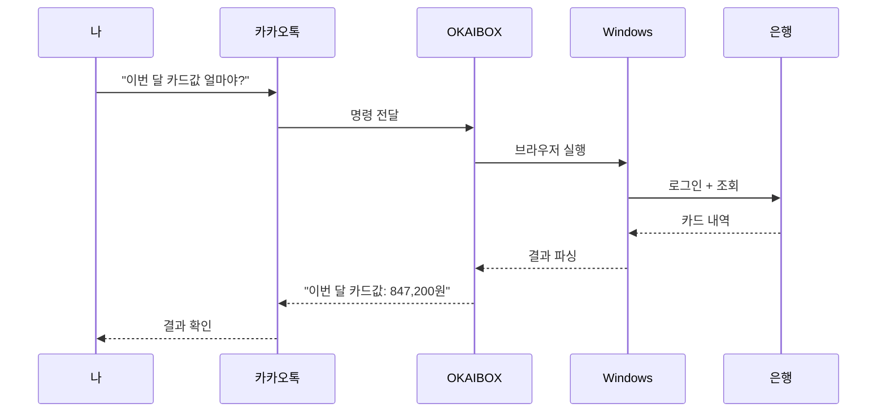
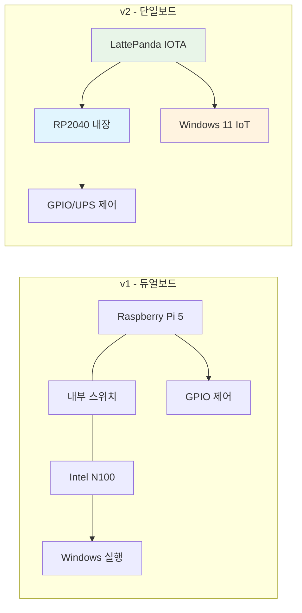

# OpenClaw 유행하던데, 사실 나는 이미 한국형 만들고 있었다

*OKAIBOX - 한국에서 진짜로 쓸 수 있는 AI 에이전트를 만들어보자*

며칠 전 SNS에서 OpenClaw 얘기가 돌더라.

"핸드폰으로 메시지만 보내면 PC가 알아서 다 해준다"는데... GitHub 스타가 벌써 16만을 넘겼다고 ㅎㅎ

궁금해서 바로 찾아봤다.

Peter Steinberger라는 오스트리아 개발자가 만든 오픈소스 AI 에이전트인데, 컨셉이 진짜 끝내준다. WhatsApp이나 Telegram으로 "이메일 정리해줘", "파일 찾아줘" 이런 식으로 보내면 내 PC에서 직접 실행해주는 거다.

앱을 열 필요도 없고, 그냥 친구한테 카톡하듯이 시키면 됨.

오 이거 좋은데?

바로 써보려고 했는데...

## 근데 한국에서 쓰려니까 아쉬운 점이 있더라

오해하지 말자. OpenClaw 자체는 정말 잘 만든 프로젝트다. macOS나 Linux에서는 깔끔하게 동작하고, 기능도 훌륭하다.

근데 한국 환경에서 쓰려고 하니까 몇 가지 아쉬운 점이 보이더라.

### Windows 네이티브가 아님

가장 큰 건 이거였다. OpenClaw를 Windows에서 쓰려면 WSL2를 깔아야 한다. Linux 가상환경 위에서 돌리는 건데...

개발자야 WSL2쯤은 깔겠지만, 문제는 그게 아니다. WSL2 위에서 돌아가는 에이전트는 Windows 네이티브 프로그램을 직접 제어하기가 어렵다. 인터넷뱅킹이나 관공서 사이트처럼 Windows 전용 보안 프로그램이 필요한 경우에는 한계가 있었다.

### 한국 서비스 생태계와의 갭

그리고 메신저가 WhatsApp, Telegram, Discord 중심이라... 한국에서는 카카오톡이 90%인데 아직 지원이 안 되고 있다. HWP 문서 처리도 마찬가지고.

물론 이건 OpenClaw의 문제라기보다는 글로벌 오픈소스 프로젝트의 특성인 거다. 한국 로컬라이징까지 신경 쓸 수는 없으니까.

### 보안 우려

네이버, 카카오 같은 한국 IT 기업들은 사내에서 OpenClaw 사용을 제한하고 있다고 하더라. AI 에이전트한테 PC의 광범위한 권한을 넘겨주는 구조다 보니... 기업 입장에선 신중할 수밖에 없는 거지.

정리하면 이런 느낌이다:

| 항목 | OpenClaw 현황 | 한국 환경 |
| ------ | ---------- | ----------- |
| 메신저 | WhatsApp, Telegram 등 | 카카오톡이 90% |
| OS | macOS/Linux 최적화 | Windows 사용 비중 높음 |
| 문서 | PDF, DOCX | HWP도 많이 사용 |
| 금융 | 일반 웹사이트 | 전용 보안 프로그램 필요 |
| 보안 | 개인 사용 적합 | 기업 도입 시 검토 필요 |

## 근데 생각해보니... 나도 비슷한 거 만들고 있었음

OpenClaw를 분석하면서 묘한 기분이 들었다.

"이거... 내가 구상하던 거랑 방향이 같잖아?"

나는 작년부터 **OKAIBOX**라는 프로젝트를 기획하고 있었다. OK + AI + BOX. 말 그대로 AI가 들어있는 상자다 ㅎㅎ

근데 OpenClaw랑 결정적으로 다른 점이 있다.

**OKAIBOX는 소프트웨어가 아니다. 하드웨어다.**

정확히 말하면 하드웨어 + 소프트웨어 통합 제품이다. NAS(네트워크 저장 장치)처럼 생긴 작은 박스 안에 AI 에이전트가 돌아가는 건데... 이 박스는 처음부터 **한국 환경**에 맞춰서 설계했다.

## OKAIBOX는 이렇게 다르다

### 1. 진짜 Windows를 쓴다

OpenClaw가 WSL2 위에서 Linux를 돌리는 반면, OKAIBOX는 **Windows 11 IoT Enterprise**가 네이티브로 설치되어 있다. VM이 아니다. 진짜 Windows.

왜 이게 중요하냐면... 한국 은행 사이트에 접속하려면 Windows에서 돌아가는 보안 프로그램들이 필요하다. WSL2에서는 이게 불가능한데, OKAIBOX에서는 그냥 된다.

### 2. NAS + AI 에이전트를 하나로

OpenClaw는 이미 있는 PC 위에 설치하는 소프트웨어인데, OKAIBOX는 좀 다르다.

- 4베이 NAS로 개인 데이터 안전하게 저장
- 24시간 켜져있으니까 언제든 AI 에이전트 사용 가능
- 정전 나도 내장 UPS가 데이터 보호
- 전기료? 유휴 시 11W. 선풍기보다 적다 ㅎㅎ

집에 NAS 하나 놓고, 그 NAS가 AI 비서 역할까지 하는 거다. 데이터도 내 집에 있으니까 클라우드 걱정도 없고.

### 3. 한국 서비스를 네이티브로

카카오톡으로 명령하면 OKAIBOX가 실행한다. 상상해보면 이런 느낌:

HWP 파일도 마찬가지다. "이 한글 파일 열어서 3페이지 내용 요약해줘"라고 카톡 보내면, OKAIBOX가 한글 프로그램 열어서 처리해주는 거다. Windows 네이티브니까 가능한 거지.

## 어디까지 왔나

사실 이 프로젝트는 꽤 오래전부터 준비했었다. 구상만 한 게 아니라 하드웨어 설계까지 끝낸 상태다.

### 2025년: 견적자동화와 문서자동화 경험

작년에 AI 기반으로 견적서 자동화와 문서 자동화 시스템을 개발한 적이 있었다. PDF 분석해서 데이터 추출하고, AI가 문서를 분류하고, 자동으로 정리해주는 시스템이었는데... 이 경험이 OKAIBOX의 소프트웨어 쪽 기반이 되고 있다.

그때 느낀 게, Windows 환경에서 돌아가는 자동화 시스템이 한국에서는 진짜 필요하다는 거였다. 한글 파일 처리, 관공서 문서 양식, 견적서 포맷... 이런 것들은 한국에서만 쓰는 건데, 기존 글로벌 도구로는 커버가 안 되더라.

OKAIBOX는 그 경험을 하드웨어 레벨까지 확장한 프로젝트인 셈이다.

### 하드웨어 진화: v1에서 v2로

처음엔 보드 두 개(Raspberry Pi 5 + Intel N100)를 조합하는 듀얼보드 구조로 설계했었다. 근데 만들다 보니 너무 복잡했다 ㅠㅠ 보드 간 통신도 해야 하고, 내부 네트워크 스위치도 필요하고, OS 동기화도 시켜야 하고...

그래서 v2에서 확 갈아엎었다. **LattePanda IOTA**라는 보드 하나로 통합!

*실제로 구매한 LattePanda IOTA. 이 작은 보드 하나에 Intel N150 + RP2040이 다 들어있다*

요놈이 진짜 좋은 게, Intel N150 CPU에 RP2040 코프로세서가 내장되어 있어서 별도 아두이노 없이도 GPIO 제어가 된다 ㅎㅎ

| 항목 | v1 (듀얼보드) | v2 (단일보드) |
| ------ | -------------- | --------------- |
| 보드 수 | 2개 | **1개** |
| 내부 네트워크 | 5포트 스위치 필요 | **불필요** |
| 전력 (유휴) | ~17W | **~11W** |
| 가격 | ~60만원 | **~58만원** |
| 복잡도 | 높음 | **낮음** |

### 핵심 스펙

- **CPU**: Intel N150 (4코어, 3.6GHz) - 가벼운 AI 작업은 충분
- **RAM**: 16GB LPDDR5
- **스토리지**: NVMe SSD (OS) + HDD 4베이 (데이터, 최대 80TB)
- **코프로세서**: RP2040 (GPIO/UPS 제어 전담)
- **UPS**: 18650 배터리 4셀, 5~10분 백업
- **OS**: Windows 11 IoT Enterprise

### BOM은 이 정도

보급형 시제품 기준 **대당 약 300만원**이다. 근데 HDD(10TB x 4)가 160만원으로 절반 이상을 차지해서... 본체 자체는 140만원 정도.

그리고 로컬 LLM 돌리고 싶은 사람을 위해 **Jetson AGX Thor** 탑재 모델도 기획 중인데, 이건 약 1,350만원으로 가격이 확 뛴다 ㅋㅋ 대신 로컬에서 대형 AI 모델을 돌릴 수 있다.

## 앞으로의 계획

오늘이 Day 1이다. 앞으로 매일 개발 일기를 쓸 생각이다.

**단기 (1~2개월)**
- Windows 11 IoT Enterprise 환경 구축 및 최적화
- RP2040 UPS 제어 펌웨어 개발
- 기본 NAS 기능 안정화 (Storage Spaces, SMB 공유)

**중기 (3~6개월)**
- 카카오톡 API 연동
- HWP 문서 읽기/쓰기 라이브러리 통합
- 한국 웹사이트 자동화 엔진 (은행, 관공서)

**장기**
- 로컬 LLM 통합 (Jetson AGX Thor)
- 오픈소스 공개 (MIT 라이선스)
- 커뮤니티 구축

### 시리즈 예고

앞으로 이런 내용들을 하나씩 다룰 예정이다:

- **Day 2**: LattePanda IOTA 언박싱과 첫 설정
- **Day 3**: Windows 11 IoT Enterprise 설치 삽질기
- **Day 4**: RP2040 UPS 제어 펌웨어 개발
- **Day 5**: 4베이 NAS 케이스 3D 프린팅
- **Day 6**: 카카오톡 연동 시도
- **Day 7**: HWP 문서 처리 구현
- (계속...)

## 마무리

OpenClaw를 보면서 느낀 점이 있다. 오픈소스의 힘은 정말 대단하더라. 한 사람이 시작한 프로젝트가 몇 주 만에 16만 스타를 받다니... 나도 OKAIBOX 완성하면 오픈소스로 공개할 생각이다.

근데 OKAIBOX가 OpenClaw의 한국 버전이냐고 물으면, 그건 아니다. 방향은 비슷하지만 접근이 완전 다르다. OpenClaw는 소프트웨어고, OKAIBOX는 하드웨어부터 시작한다. OpenClaw는 기존 PC에 설치하는 거고, OKAIBOX는 24시간 돌아가는 전용 디바이스다.

한국에서 진짜로 쓸 수 있는 AI 에이전트. 카카오톡으로 명령하고, 은행 업무도 보고, 한글 파일도 처리하는... 그런 걸 만들어보려고 한다.

혼자 만드는 프로젝트지만, 이렇게 공유하면서 같이 성장하고 싶다. 비슷한 고민 하는 분 계시면 댓글 남겨주세요!

---

**P.S.** OpenClaw 개발자 Peter Steinberger한테 영감을 받았다고 말하고 싶다. 혼자서 시작한 프로젝트가 세상을 바꿀 수 있다는 걸 보여줬으니까. 나도 그 길을 가보련다 ㅎㅎ

**P.P.S.** 혹시 이런 분들 계시면 같이 얘기하고 싶다:
- LattePanda 써보신 분
- 한국 서비스 자동화 고민하시는 분
- 가정용 AI 서버에 관심 있으신 분
- NAS 자작하시는 분

**P.P.P.S.** 다음 편(Day 2)에서는 LattePanda IOTA 실물을 까보고, 실제로 뭘 샀고 얼마나 들었는지 BOM 상세 공개할 예정이다. 기대해주세요!

---

**시리즈**: OKAIBOX 개발 일기
- **현재**: Day 1 - OpenClaw 유행하던데, 사실 나는 이미 한국형 만들고 있었다
- **다음**: Day 2 - LattePanda IOTA 언박싱과 BOM 공개 (예정)
