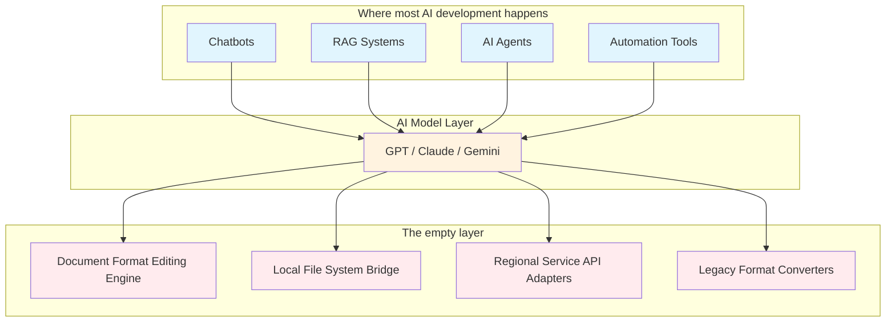
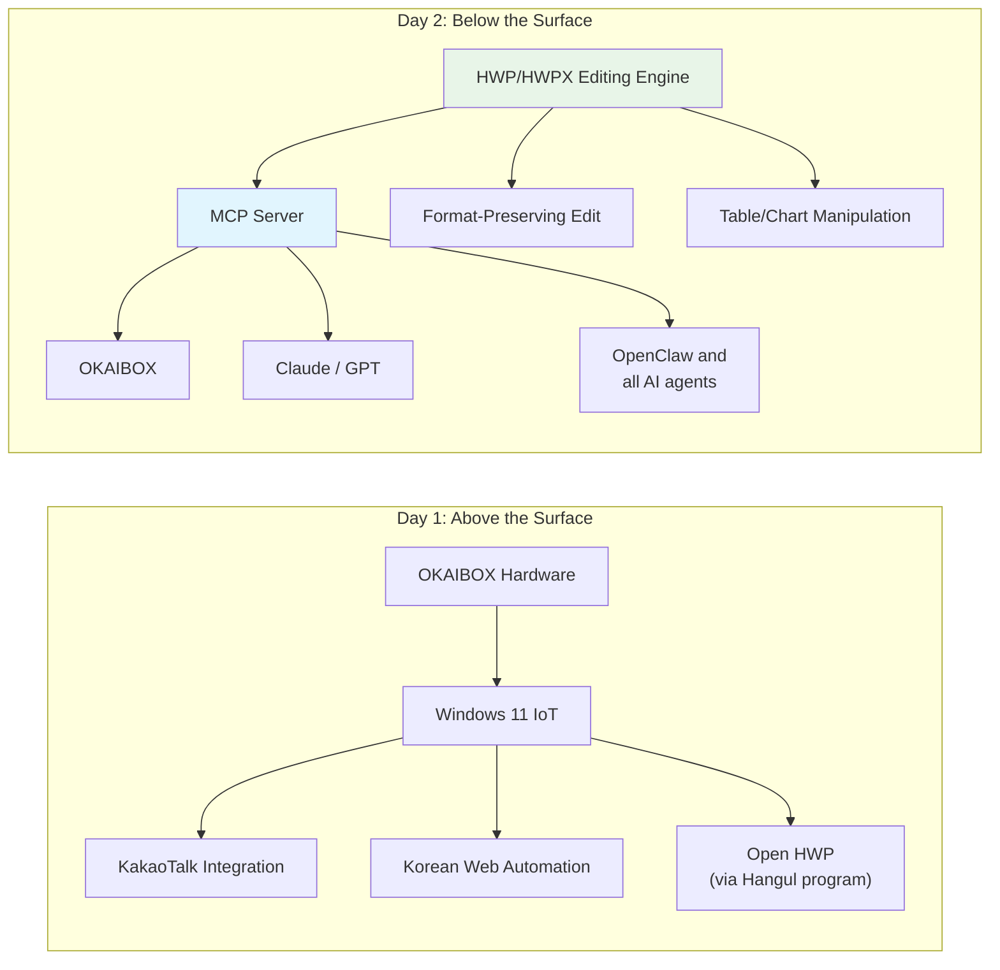

*OKAIBOX Dev Diary Day 2 - What Should Developers Build in the Age of AI?*

I was supposed to unbox the LattePanda IOTA today.

In [Day 1](/en/2026/02/14/okaibox-dev-diary-day1-en/), I even promised I'd crack open the hardware and share a detailed BOM breakdown. But before touching hardware, I need to sort out some thoughts first.

## When AI Can Do Everything, What Should We Build?

I've been having a bit of an existential crisis lately.

It's 2026. Fire up Cursor, say "build me this app," and it just... appears. AI agents like OpenClaw have crossed 160K GitHub stars, controlling PCs directly. MCP is becoming a standard protocol. AI reads files, fixes code, searches the web... anyone can do this now.

So the question that keeps nagging at me:

**"What should I actually be building?"**

When AI writes code for you, does writing code still matter? Even if I build an AI agent like OKAIBOX, OpenClaw is already doing it well. What kind of development actually means something in this era?

I sat with this question for a few days, trying different things. And I found my answer in an unexpected place.

## AI Can't Even Edit a Single Document

I have this quotation template we use at work - a .docx file. I asked AI to "update the amount in item 3."

The text changed. But all the formatting was gone.

Table borders disappeared, fonts changed, merged cells came apart. The clean, professional quotation became a blob of plain text. I connected an MCP server directly and tried manipulating the XML structure, but style information kept getting stripped away.

HWP files (Korea's standard word processor format)? Can't even open them. "Unsupported format." That's it.

This got me thinking deeply.

## Understanding "Content" vs. Handling "Form"

AI has reached near-perfect capability with **content**. Understanding text, grasping context, generating new content - it genuinely excels at this.

But **form** is an entirely different problem.

A document isn't just a sequence of text. Fonts, margins, tables, merged cells, page breaks, headers/footers, style references... these intertwine in complex ways to create what we call a "document."

Crack open a single DOCX file and you see the reality. It looks like one file, but it's actually a ZIP archive containing dozens of XML files. `document.xml`, `styles.xml`, `numbering.xml`, `relationships.xml`... modifying a single piece of text means updating style references, numbering, and relationship data across multiple files.

Left side: 4 steps. Right side: 7 steps. But it's not just about the number of steps.

The critical points are **"Map Styles"** and **"Reapply Styles."** If even one piece of information gets lost here, the output breaks. And this isn't a problem of "intelligence" - it's a problem of **tooling**.

The AI model itself is smart enough. Explain a document structure and it understands. But there's no intermediate tool that connects that understanding to actual file manipulation. Like having the world's best hammer but no nails.

## The Empty Layer in AI Development

Let's zoom out.

The AI development ecosystem right now is buzzing with activity - chatbots, RAG systems, AI agents, automation tools. Everyone's building valuable things on top of AI.

But something stands out. There's a lot of action above AI, and it's pretty quiet below.

Think about it this way:

Plenty of apps are being built on top. Big tech companies are competing to improve the AI models in the middle. But **the bottom layer** - the infrastructure that connects AI to the real world - is largely empty.

Even if AI perfectly understands "change the amount in quotation item 3," without **a docx editing engine that preserves formatting**, it simply can't execute.

This is the gap in today's AI development ecosystem. Vibrant on top, hollow underneath.

## In Korea, This Gap Is Even Wider

This infrastructure layer is thin globally, but in Korea the situation is more severe.

| Area | Global Status | Korea Status |
| ------ | --------- | -------- |
| Document Formats | DOCX editing libraries exist (incomplete) | No HWP/HWPX editing libraries |
| Messaging | WhatsApp/Telegram APIs well-established | KakaoTalk bot API limited |
| Government Automation | Mostly web-standard based | ActiveX/security programs required |
| Financial Services | Open banking APIs common | Complex certificate/security modules |

HWP is the prime example. It's Korea's proprietary document format by Hancom, with a binary structure that's inherently difficult to parse. The official specification is only partially public, and building a proper editing library sometimes requires reverse engineering.

HWPX is better - it's the next-gen format based on XML with an open structure. But a proper read-write-edit library? Doesn't exist. Not in Python. Not in JavaScript.

Will any global AI company build HWP support? No. Korea is the only country that uses it. OpenAI, Google, Anthropic - none of them will ever touch HWP.

**This isn't a problem that solves itself by waiting.**

## OKAIBOX Changes Direction

In [Day 1](/en/2026/02/14/okaibox-dev-diary-day1-en/), I introduced OKAIBOX as "Korea's OpenClaw." A hardware-based AI agent. KakaoTalk integration, native Windows, Korean service optimization.

But that alone would just make it a Korean version of OpenClaw. Playing on the surface.

What's really needed is building the layer underneath.

In Day 1, I planned to "run the Hangul program to handle HWP files." But that's just depending on the Hangul application. It's not AI handling documents directly - it's mimicking what humans already do.

The new direction: **build an engine that directly parses and edits HWP/HWPX files**, wrap it as an MCP server, and make it callable from any AI. Not just OKAIBOX - Claude, GPT, OpenClaw, anything can use this engine to handle Korean documents.

Not an app. **Infrastructure.**

From "Korea's OpenClaw" to "Korean document infrastructure for AI." That's the pivot.

## My Answer: Build the Infrastructure

Making it possible for AI to do what it currently **can't**. Not touching the AI model itself, but expanding the **contact surface** where AI meets the real world. That's the development I want to do.

Build an HWP parsing library, and every AI in the world can handle Korean documents. Build a format-preserving document editing engine, and AI can work with real business documents.

It's not easy. You have to read file format specs, implement binary parsing, handle edge cases one by one. It's not glamorous either. But one piece of infrastructure like this opens up countless possibilities for everything built on top.

This is the direction I found in the age of one-click everything.

## Updated Roadmap

I've revised the plan from Day 1.

**Priority 1: HWP/HWPX Editing Engine**
- Analyze the HWPX file format (starting with XML-based format)
- Implement read/write/edit library
- Format preservation as the key goal

**Priority 2: MCP Server**
- Wrap the engine with MCP protocol
- Make it immediately usable from Claude, GPT, etc.
- Include DOCX format-preserving editing

**Priority 3: OKAIBOX Hardware (in parallel)**
- LattePanda IOTA setup continues
- Hardware and software development in parallel

The LattePanda unboxing has been pushed to Day 3 or Day 4. I'll be tearing apart the HWPX file format in Day 3.

## Wrapping Up

What's the most valuable thing a developer can do in the age of AI?

Building tools that let AI reach places it currently can't. That's the answer I found.

OKAIBOX started with a shallow direction - "Korea's OpenClaw." But hitting real walls showed me what's actually needed. The reality that AI can't edit a single Hangul file. Filling that gap feels like the work I should be doing.

Next up, I'll be dissecting actual HWPX files. It's XML-based, so it should be more approachable than DOCX... right?

---

**Series**: OKAIBOX Dev Diary
- **Previous**: [Day 1 - Everyone's Talking About OpenClaw, But I Was Already Building the Korean Version](/en/2026/02/14/okaibox-dev-diary-day1-en/)
- **Current**: Day 2 - AI Can Do Everything Now - So What Should We Build?
- **Next**: Day 3 - Tearing Apart the HWPX File Format (Coming Soon)
