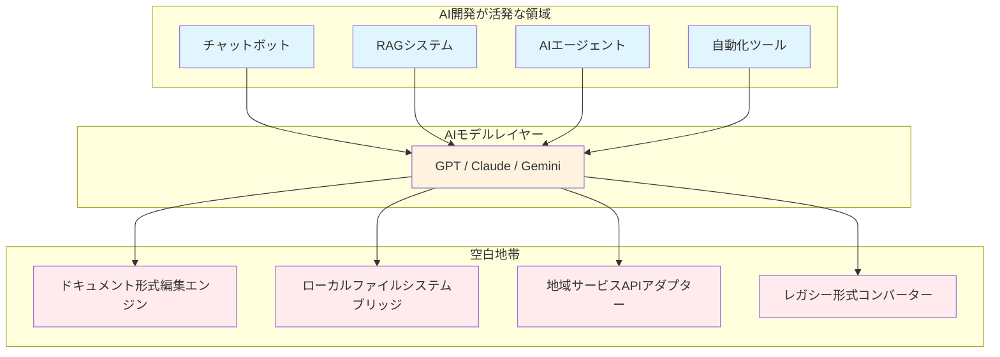
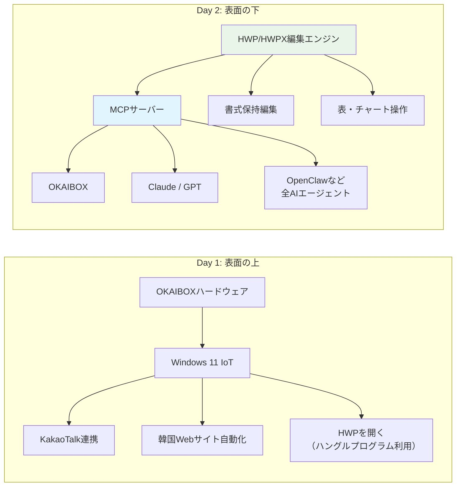

*OKAIBOX 開発日記 Day 2 - AI時代、開発者は何を作るべきか*

本当は今日、LattePanda IOTAの開封をするはずでした。

[Day 1](/ja/2026/02/14/okaibox-dev-diary-day1-ja/)で「次回は実物を開けてBOMを公開する」と予告までしたのに...でも、ハードウェアに触る前に、まず整理しなければならない考えがありました。

## AIで何でもできる時代に、何を開発すべきか

最近、ちょっとした存在危機を感じています。

2026年です。Cursorを開いて「こんなアプリ作って」と言えば、すぐにできてしまう。OpenClawのようなAIエージェントは16万スターを超え、PCを直接制御している。MCPが標準のように定着して、AIがファイルを読み、コードを修正し、Web検索もする...こんなことは今や誰でもできます。

それで最近ずっと考えていることがあります。

**「自分は何を開発すべきなのか？」**

AIがコードを書いてくれる時代に、コードを書くことに意味はあるのか？OKAIBOXのようなAIエージェントを作っても、OpenClawがすでにうまくやっているのに？この時代に本当に意味のある開発とは何なのか？

この悩みを抱えて数日間いろいろ試してみました。そして、意外なところで答えを見つけたんです。

## ドキュメント1つ編集できないAI

会社で使っている見積書テンプレートがあります。docx形式のもの。これをAIに「3番目の項目の金額を修正して」と頼みました。

テキストは変わりました。でも書式が全部飛んでしまいました...

表の罫線が消えて、フォントが変わって、セルの結合が解除されて...元々きれいだった見積書がただのテキストの塊に。MCPサーバーを直接接続してXML構造をパースして修正してみましたが、スタイル情報がどんどん抜け落ちていきます。

HWPファイルは？そもそも開けません。「サポートされていない形式です。」以上。

これを見て深く考えさせられました。

## 「内容」の理解と「形式」の操作

AIは**「内容」**についてはほぼ完璧なレベルに達しています。テキストを理解し、文脈を把握し、新しい内容を生成する。これは本当にすごい。

でも**「形式」**はまったく別の問題です。

ドキュメントというのは単純なテキストの並びではありません。フォント、余白、表、セル結合、ページ区切り、ヘッダー/フッター、スタイル参照...これらが複雑に絡み合って1つの「ドキュメント」になります。

DOCXファイルを1つ解体してみると実態が見えます。見た目は1つのファイルですが、実際にはZIPアーカイブの中に数十個のXMLファイルが詰まっています。`document.xml`、`styles.xml`、`numbering.xml`、`relationships.xml`...テキスト1つ修正するだけでも、スタイル参照、ナンバリング、リレーション情報を全て合わせなければなりません。

左側は4ステップ。右側は7ステップ。でも単にステップ数が多いからではありません。

核心は**「スタイルマッピング」と「スタイル再適用」**の2つのステップです。ここで情報が1つでも抜け落ちると、出力結果が壊れます。これは「知能」の問題ではなく、**「ツール」の問題**なんです。

AIモデル自体は十分賢い。ドキュメント構造を説明すれば理解します。でも、その理解を実際のファイル操作に繋げる中間ツールがないんです。どんなに良いハンマーがあっても、釘がなければ木を結合できないように。

## AI開発エコシステムの空白地帯

もう少し広い視野で考えてみましょう。

今のAI開発エコシステムを見ると、チャットボット、RAGシステム、AIエージェント、自動化ツール...みんなAIを**「活用」**する方向で、それぞれの領域で価値あるものを作っています。

でも1つ気になることがあります。AIの上では活発なのに、AIの下はちょっと静かです。

こんな構造を考えてみてください：

上では数多くのアプリが作られています。AIモデルはビッグテックが競争しながら進化させている。でも**下のレイヤー**、つまりAIが現実世界と接するインフラ層は...ほぼ空っぽです。

AIが「見積書3番目の項目の金額を変えて」という命令を完璧に理解しても、その下に**docxファイルを書式を保ったまま編集するエンジン**がなければ、実行できないんです。

これが今のAI開発エコシステムの穴です。上は華やかなのに、下が抜けている。

## 韓国ではこのギャップがさらに深刻

グローバル基準でもこのインフラレイヤーは薄いのですが、韓国ではさらに深刻です。

| 領域 | グローバル現状 | 韓国現状 |
| ------ | --------- | -------- |
| ドキュメント形式 | DOCX編集ライブラリ有り（不完全） | HWP/HWPX編集ライブラリなし |
| メッセンジャー連携 | WhatsApp/Telegram API充実 | KakaoTalkボットAPI制限的 |
| 官公庁自動化 | ほぼWeb標準ベース | ActiveX/セキュリティプログラム必要 |
| 金融サービス | オープンバンキングAPI普及 | 公認認証、セキュリティモジュール複雑 |

HWPが典型的な例です。韓国のHancom社が作った独自フォーマットで、旧式HWPはバイナリ構造のためパース自体が困難。公式仕様が部分的にしか公開されておらず、まともな編集ライブラリを作るにはリバースエンジニアリングが必要な部分もあります。

HWPXはまだ良い方です。次世代フォーマットでXMLベース、構造がオープン。でもこれを適切に読み書き・編集するライブラリが...存在しません。Pythonで？ありません。JavaScriptで？ありません。

グローバルAI企業がHWPをサポートする理由はありますか？ありません。世界で韓国だけが使うフォーマットですから。OpenAIも、Googleも、AnthropicもHWPには永遠に触れないでしょう。

**これは待っていれば解決する問題ではありません。**

## OKAIBOXの方向を変えた

[Day 1](/ja/2026/02/14/okaibox-dev-diary-day1-ja/)ではOKAIBOXを「韓国版OpenClaw」として紹介しました。ハードウェアベースのAIエージェント。KakaoTalk連携、Windowsネイティブ、韓国サービス最適化。

でもこれだけでは、OpenClawの韓国版に過ぎません。表面の上で遊んでいるだけです。

本当に必要なのは、表面の下を支える作業です。

Day 1では「ハングルプログラムを起動してHWPを処理する」計画でした。でもこれは結局、ハングルアプリケーションに依存しているだけ。AIが直接ドキュメントを扱っているのではなく、人間がやっていたことをそのまま真似しているだけです。

新しい方向は、**HWP/HWPXファイルを直接パースして編集するエンジン**を作り、MCPサーバーとしてラップして、どのAIからでも呼び出せるようにすること。OKAIBOXだけでなく、Claude、GPT、OpenClaw、何を使ってもこのエンジンで韓国のドキュメントを扱えるように。

アプリではなく、**インフラ**を作る。

「韓国版OpenClaw」から「AI向け韓国ドキュメントインフラ」へ。これがピボットの核心です。

## 自分が見つけた答え：インフラを作ろう

AIが「できないこと」を「できるように」する。AIモデル自体に手を加えるのではなく、AIが世界と接する**接点**を広げること。これが自分がやりたい開発です。

HWPパースライブラリを作れば、世界中のすべてのAIが韓国語ドキュメントを扱えるようになる。書式保持ドキュメント編集エンジンを作れば、AIが本当のビジネス文書に触れることができるようになる。

簡単ではありません。ファイルフォーマットの仕様を読み、バイナリパースを実装し、エッジケースを一つ一つ潰していく必要があります。華やかでもない。でも、こうしたインフラ1つが、その上に乗る数え切れない可能性を開いてくれます。

ワンクリックで何でもできる時代に、自分が見つけた方向がこれです。

## 修正されたロードマップ

Day 1で公開した計画を変更しました。

**優先度1：HWP/HWPX編集エンジン開発**
- HWPXファイルフォーマット分析（XMLベースなのでここから着手）
- 読み取り/書き込み/編集ライブラリの実装
- 書式保持が最重要目標

**優先度2：MCPサーバー構築**
- 上記エンジンをMCPプロトコルでラップ
- Claude、GPTなどからすぐに使えるように
- DOCX書式保持編集も含む

**優先度3：OKAIBOXハードウェア（並行）**
- LattePanda IOTAのセットアップは継続
- ハードウェアとソフトウェア開発を並行

LattePanda開封はDay 3かDay 4に延期。Day 3ではHWPXファイルフォーマットを実際に分解してみる予定です。

## おわりに

AI時代に開発者ができる最も価値ある仕事は何か。

AIがまだ届かない場所にまで手を伸ばせるようにするツールを作ること。それが自分の見つけた答えです。

OKAIBOXも最初は「韓国版OpenClaw」という浅い方向から始まりました。でも実際にぶつかってみたら、本当に必要なものは別のところにありました。AIがハングルファイル1つ修正できない現実。このギャップを埋めるのが、自分にできることだと思います。

次回はHWPXファイルを実際に解剖してみます。XMLベースなのでDOCXよりはアプローチしやすいはず...果たしてそうでしょうか？（笑）

---

**シリーズ**: OKAIBOX 開発日記
- **前回**: [Day 1 - OpenClawが話題だけど、実は韓国版をもう作り始めていた](/ja/2026/02/14/okaibox-dev-diary-day1-ja/)
- **今回**: Day 2 - AIで何でもできる時代に、開発者は何を作るべきか
- **次回**: Day 3 - HWPXファイルフォーマットを解剖する（予定）
