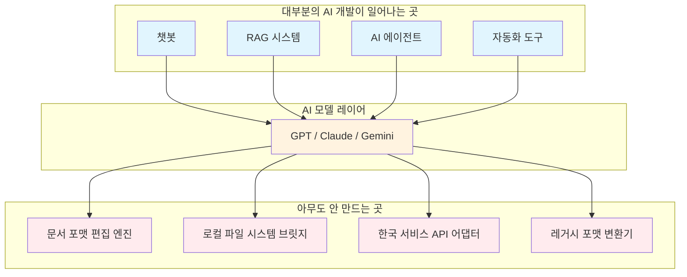
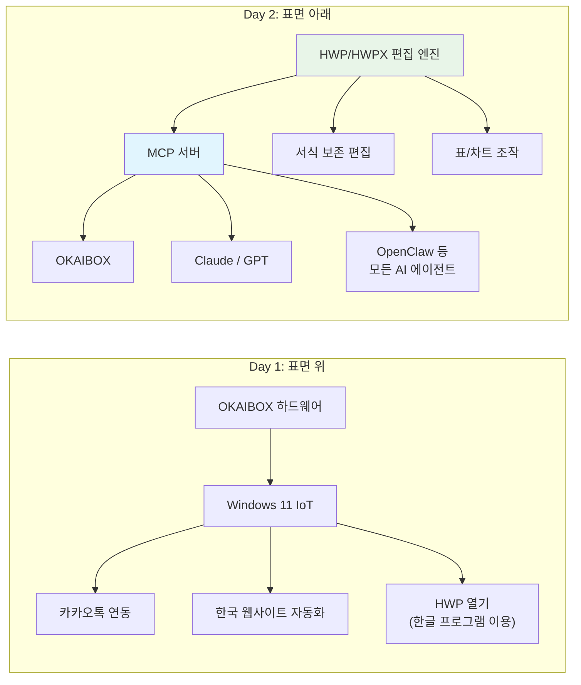

*OKAIBOX 개발 일기 Day 2 - AI 시대, 개발자는 뭘 만들어야 하는가*

원래 오늘은 LattePanda IOTA 언박싱 하려고 했다.

[Day 1](/2026/02/14/okaibox-dev-diary-day1/)에서 "다음엔 실물 까보고 BOM 공개한다"고 예고까지 해놓고... 근데 하드웨어를 만지기 전에 먼저 정리해야 할 생각이 있더라.

## AI로 딸깍이면 다 되는 시대에, 뭘 개발해야 하나

요즘 현타가 온다.

2026년이다. Cursor 켜고 "이런 앱 만들어줘" 하면 뚝딱 나온다. OpenClaw 같은 AI 에이전트는 16만 스타를 넘기면서 PC를 직접 제어하고, MCP가 표준처럼 자리잡으면서 AI가 파일도 읽고, 코드도 고치고, 웹도 뒤지고... 이런 건 이제 누구나 할 수 있다.

그래서 요즘 드는 생각.

**"나는 뭘 개발해야 하지?"**

AI가 코드를 짜주는 시대에 코드를 짜는 게 의미가 있나? OKAIBOX 같은 AI 에이전트를 만든다 해도 OpenClaw가 이미 잘 하고 있는데? 내가 뭘 해야 이 시대에 진짜 의미 있는 개발을 할 수 있는 걸까?

이 고민을 안고 며칠간 이것저것 시도해봤다. 근데 하다 보니 의외의 곳에서 답을 찾았다.

## 문서 하나 수정 못 하는 AI

회사에서 쓰는 견적서 docx 파일. 이걸 AI한테 "3번 항목 금액을 수정해줘"라고 시켰다.

텍스트는 바뀌었다. 근데 서식이 다 날아갔다 ㅠㅠ

표 테두리 사라지고, 폰트 바뀌고, 셀 병합 풀리고... 원래 깔끔했던 견적서가 그냥 텍스트 덩어리가 됐다. MCP 서버를 직접 연결해서 XML 구조를 파싱하고 수정해봤는데, 스타일 정보가 자꾸 빠져나가더라.

HWP 파일은? 아예 열지를 못 한다. "지원하지 않는 형식입니다." 끝.

이거 보면서 깊게 생각하게 됐다.

## "내용"을 이해하는 것과 "형식"을 다루는 것

AI는 **"내용"**에 대해서는 거의 완벽한 수준에 도달했다. 텍스트를 이해하고, 맥락을 파악하고, 새로운 내용을 생성하는 것. 이건 진짜 잘 한다.

근데 **"형식"**은 전혀 다른 문제다.

문서라는 게 단순히 텍스트의 나열이 아니거든. 폰트, 여백, 표, 셀 병합, 페이지 나누기, 머리글/바닥글, 스타일 참조... 이런 것들이 복잡하게 얽혀서 하나의 "문서"가 된다.

DOCX 파일 하나를 뜯어보면 실체가 보인다. 겉보기엔 파일 하나인데, 실제로는 ZIP 안에 XML 수십 개가 들어있다. `document.xml`, `styles.xml`, `numbering.xml`, `relationships.xml`... 텍스트 하나 고치려고 해도 스타일 참조, 넘버링, 관계 정보를 전부 맞춰야 한다.

왼쪽은 4단계. 오른쪽은 7단계. 근데 단순히 단계가 많아서가 아니다.

핵심은 **"스타일 매핑"과 "스타일 재적용"** 이 두 단계다. 여기서 정보가 하나라도 빠지면 결과물이 깨진다. AI가 "이 셀은 Bold에 12pt에 맑은 고딕이고, 테두리는 0.5pt 실선이고, 배경색은 #F2F2F2"라는 걸 이해하고 유지해야 하는데... 지금의 AI 도구들은 이걸 못 한다.

왜? 이건 "지능"의 문제가 아니라 **"도구"의 문제**이기 때문이다.

AI 모델 자체는 충분히 똑똑하다. 문서 구조를 설명해주면 이해한다. 근데 그 이해를 실제 파일 조작으로 연결해주는 중간 도구가 없는 거다. 망치가 아무리 좋아도 못이 없으면 나무를 결합할 수 없는 것처럼.

## AI 개발 생태계의 빈 곳

여기서 좀 더 넓게 생각해보자.

요즘 AI 개발 생태계를 보면 챗봇, RAG 시스템, AI 에이전트, 프롬프트 엔지니어링... 다들 AI를 **"활용"**하는 방향으로 달리고 있다. 각자의 영역에서 가치 있는 것들을 만들고 있다.

근데 한 가지 눈에 띄는 게 있다. AI 위에서는 활발한데, AI 아래쪽은 좀 조용하다.

이런 구조를 생각해보면:

위쪽에서는 수많은 앱들이 만들어지고 있다. AI 모델은 빅테크가 경쟁하며 키워주고 있다. 근데 **아래쪽**, 그러니까 AI가 실제 세계와 만나는 접점을 담당하는 인프라 레이어는... 텅 비어있다.

AI가 "견적서 3번 항목 금액을 바꿔줘"라는 명령을 완벽히 이해해도, 그 아래에 **docx 파일을 서식 유지하면서 편집하는 엔진**이 없으면 실행을 못 한다.

이게 지금 AI 개발 생태계의 구멍이다. 위에서는 화려한데 아래가 뚫려있는.

## 한국에서는 이게 더 심하다

글로벌 기준으로도 이 인프라 레이어가 부족한데, 한국에서는 상황이 더 심각하다.

| 영역 | 글로벌 현황 | 한국 현황 |
| ------ | --------- | -------- |
| 문서 포맷 | DOCX 편집 라이브러리 있긴 함 (불완전) | HWP/HWPX 편집 라이브러리 없음 |
| 메신저 연동 | WhatsApp/Telegram API 잘 갖춰짐 | 카카오톡 봇 API 제한적 |
| 관공서 자동화 | 대부분 웹 표준 기반 | ActiveX/보안 프로그램 필요 |
| 금융 서비스 | 오픈뱅킹 API 보편화 | 공인인증, 보안 모듈 복잡 |

HWP가 대표적이다. 한글과컴퓨터에서 만든 한국 독자 포맷인데, 구형 HWP는 바이너리 구조라 파싱 자체가 어렵다. 공식 스펙이 부분적으로만 공개되어 있고, 제대로 된 편집 라이브러리를 만들려면 리버스 엔지니어링이 필요한 부분도 있다.

HWPX는 그나마 낫다. 차세대 포맷이라 XML 기반이고 구조가 열려있다. 근데 이걸 제대로 읽고 쓰고 편집하는 라이브러리가... 없다. 파이썬으로? 없다. 자바스크립트로? 없다.

글로벌 AI 회사 입장에서 HWP를 지원할 이유가 있나? 없다. 전 세계에서 한국만 쓰는 포맷이니까. OpenAI도, Google도, Anthropic도 HWP는 안 건드린다. 영원히.

**이건 기다린다고 해결되는 문제가 아니다.**

## 그래서 OKAIBOX의 방향을 바꿨다

[Day 1](/2026/02/14/okaibox-dev-diary-day1/)에서 OKAIBOX를 "한국형 OpenClaw"로 소개했다. 하드웨어 기반의 AI 에이전트. 카카오톡 연동, Windows 네이티브, 한국 서비스 최적화.

근데 이것만으로는 OpenClaw의 한국 버전에 불과하다. 표면 위에서 노는 거다.

진짜 필요한 건 표면 아래를 깔아주는 작업이다.

Day 1에서는 "한글 프로그램을 실행해서 HWP를 처리"하겠다고 했다. 근데 이건 결국 한글 프로그램에 의존하는 거다. AI가 직접 문서를 다루는 게 아니라, 사람이 하던 걸 그대로 흉내내는 것 뿐이다.

바뀐 방향은 **HWP/HWPX 파일을 직접 파싱하고 편집하는 엔진**을 만들고, MCP 서버로 감싸서 어떤 AI에서든 호출할 수 있게 하는 거다. OKAIBOX뿐만 아니라 Claude, GPT, OpenClaw, 뭘 쓰든 이 엔진을 통해 한국 문서를 다룰 수 있게.

앱이 아니라 **인프라**를 만드는 거다.

"한국형 OpenClaw"에서 "AI를 위한 한국 문서 인프라"로. 이게 이번 피봇의 핵심이다.

## 내가 찾은 답: 인프라를 만들자

AI가 "할 수 없는 것"을 "할 수 있게" 만들어주는 것. AI 모델 자체를 건드리는 게 아니라, AI가 세상과 접촉하는 그 **접점**을 넓혀주는 것. 이게 내가 하고 싶은 개발이다.

HWP 파싱 라이브러리를 만들면, 전 세계 모든 AI가 한글 파일을 다룰 수 있게 된다. 서식 보존 문서 편집 엔진을 만들면, AI가 진짜 업무용 문서를 건드릴 수 있게 된다.

쉽진 않다. 파일 포맷 스펙을 읽어야 하고, 바이너리 파싱을 해야 하고, 엣지 케이스를 하나하나 잡아야 한다. 화려하지도 않다. 근데 이런 인프라 하나가 그 위에 올라타는 수많은 가능성을 열어준다.

이게 딸깍의 시대에 내가 찾은 방향이다.

## 수정된 로드맵

Day 1에서 올렸던 계획을 바꿨다.

**1순위: HWP/HWPX 편집 엔진 개발**
- HWPX 파일 포맷 분석 (XML 기반이라 여기서부터)
- 읽기/쓰기/편집 라이브러리 구현
- 서식 보존이 핵심 목표

**2순위: MCP 서버 구현**
- 위 엔진을 MCP 프로토콜로 감싸기
- Claude, GPT 등에서 바로 사용 가능하게
- DOCX 서식 보존 편집도 포함

**3순위: OKAIBOX 하드웨어 (병행)**
- LattePanda IOTA 세팅은 계속 진행
- 하드웨어와 소프트웨어 개발 병행

LattePanda 언박싱은 Day 3이나 Day 4로 밀렸다. Day 3에서는 HWPX 파일 포맷을 실제로 뜯어보려고 한다.

## 마무리

AI 시대에 개발자가 할 수 있는 가장 가치 있는 일이 뭘까.

AI가 닿지 못하는 곳까지 손을 뻗을 수 있게 해주는 도구를 만드는 것. 그게 내가 찾은 답이다.

OKAIBOX도 처음엔 "한국형 OpenClaw"라는 얕은 방향에서 시작했다. 근데 직접 부딪혀보니 진짜 필요한 건 다른 곳에 있었다. AI가 한글 파일 하나를 수정하지 못하는 현실. 이 간극을 메우는 게 내가 할 수 있는 일인 것 같다.

다음 편에서는 HWPX 파일을 실제로 뜯어본다. XML 기반이라 DOCX보다는 접근하기 쉬울 것 같은데... 과연 그럴까? ㅎㅎ

---

**시리즈**: OKAIBOX 개발 일기
- **이전**: [Day 1 - OpenClaw 유행하던데, 사실 나는 이미 한국형 만들고 있었다](/2026/02/14/okaibox-dev-diary-day1/)
- **현재**: Day 2 - AI는 똑똑한데 왜 한글 파일 하나를 못 고칠까
- **다음**: Day 3 - HWPX 파일 포맷 뜯어보기 (예정)
