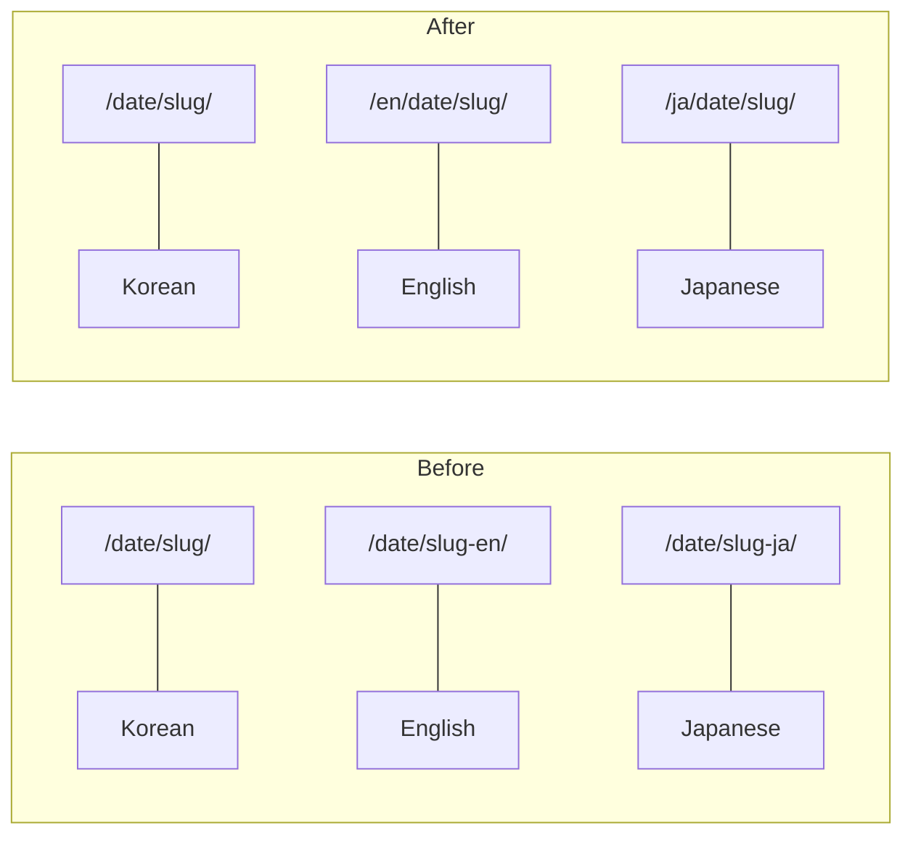

## The URLs Were Bothering Me

This blog supports three languages: Korean, English, and Japanese. But the URL structure was a bit off.

```text
Korean:   /2026/02/21/claude-code-1m-cost-reality/
English:  /2026/02/21/claude-code-1m-cost-reality-en/
Japanese: /2026/02/21/claude-code-1m-cost-reality-ja/
```

The `-en` suffix tacked on to every English post URL — not great. Google also recommends using subdirectory structures like `/en/` for language-specific content. And the longer I waited, the more posts would pile up, making it even harder to fix later.

Here's what I wanted:



## Fixed It with permalink + redirect_from

Jekyll lets you set a `permalink` for each post. I added this to every English and Japanese post's front matter:

```yaml
# English post front matter
permalink: /en/:year/:month/:day/:title/
redirect_from:
  - /2026/02/21/claude-code-1m-cost-reality-en/
```

`permalink` sets the new URL, and `redirect_from` ensures the old URL redirects automatically. This requires the `jekyll-redirect-from` plugin, which GitHub Pages officially supports — just one line in `_config.yml`.

```yaml
# _config.yml
plugins:
  - jekyll-redirect-from
```

Next, I updated the hreflang tags in `_layouts/default.html`:

```html
<!-- Before -->
<link rel="alternate" hreflang="en" href="{{ site.url }}{{ date_path }}{{ base_slug }}-en/" />

<!-- After -->
<link rel="alternate" hreflang="en" href="{{ site.url }}/en{{ date_path }}{{ base_slug }}-en/" />
```

The real grunt work, though, was updating 152 hardcoded links in the post bodies. Every English post referencing another English post was using the old URL format.

```markdown
<!-- Before -->
[Escaping Compacting Hell](/2026/02/20/claude-code-1m-context-review-en/)

<!-- After -->
[Escaping Compacting Hell](/en/2026/02/20/claude-code-1m-context-review-en/)
```

Final tally: **140 files changed, 569 insertions, 154 deletions**. Quite the operation.

## Then Pagination Broke

After restructuring the URLs, pagination became an issue. Jekyll's `jekyll-paginate` plugin **only works in the root directory (`/`)**. This is a well-known limitation.

It worked fine on the Korean homepage (`/`), but on `/en/` and `/ja/`, the `paginator` object simply doesn't exist. No server-side Liquid solution was possible.

## Rewrote It in JS

So I switched to client-side JavaScript pagination entirely. The concept is straightforward:

1. Render all posts in the HTML via Liquid
2. JS shows/hides them in groups of 10 using `display: none/block`
3. Page state managed through `?page=2` URL parameters

Here's the core logic:

```javascript
(function() {
  var POSTS_PER_PAGE = 10;
  var posts = document.querySelectorAll('.posts-list .post-item');
  if (posts.length <= POSTS_PER_PAGE) return;

  var totalPages = Math.ceil(posts.length / POSTS_PER_PAGE);
  var params = new URLSearchParams(window.location.search);
  var currentPage = parseInt(params.get('page')) || 1;

  function showPage(page) {
    var start = (page - 1) * POSTS_PER_PAGE;
    var end = start + POSTS_PER_PAGE;
    for (var i = 0; i < posts.length; i++) {
      posts[i].style.display = (i >= start && i < end) ? '' : 'none';
    }
  }
  showPage(currentPage);
})();
```

This same script goes into `index.html`, `en/index.html`, and `ja/index.html`. Multilingual labels were added to `_data/*.yml`:

```yaml
# _data/en.yml
posts:
  prev_page: "Previous"
  next_page: "Next"
```

Previously, only Korean had pagination via `/page2/`, `/page3/`. Now all three languages use the unified `?page=2` approach.

## Wrap-up

Set your URL structure early, before posts accumulate. Changing it later means touching 140+ files. And if you're running a multilingual Jekyll blog, skip `jekyll-paginate` for non-root pages — client-side JS is the pragmatic choice.
