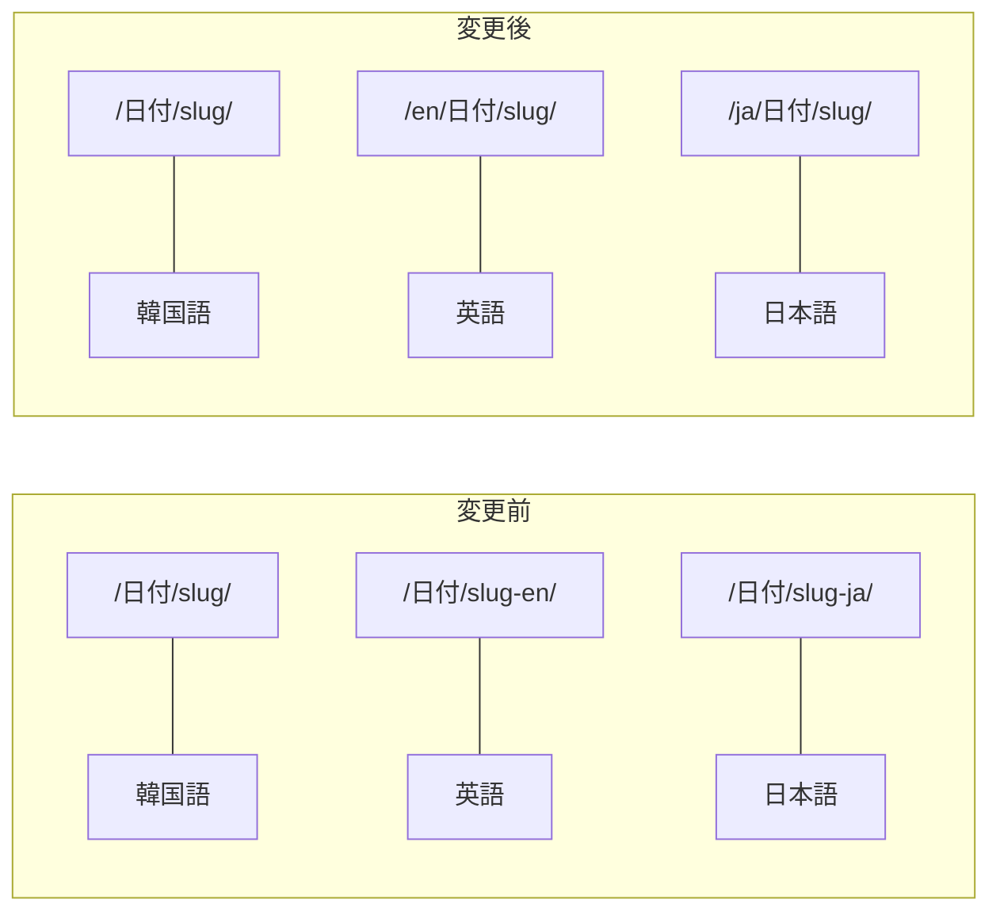

## URLが気になっていました

このブログは韓国語、英語、日本語の3言語に対応しています。ですが、URL構造に少し問題がありました。

```text
韓国語: /2026/02/21/claude-code-1m-cost-reality/
英語:   /2026/02/21/claude-code-1m-cost-reality-en/
日本語: /2026/02/21/claude-code-1m-cost-reality-ja/
```

英語記事のURLの末尾に`-en`が付いているのが、どうにも気になっていました。見た目もよくないですし、Googleも言語別コンテンツは`/en/`のようなサブディレクトリ構造を推奨しています。記事が増えれば増えるほど、後から変更するのは大変になります。

目指したのはこの構造です。



## permalink + redirect_from の組み合わせで解決

Jekyllでは記事ごとに`permalink`を指定できます。英語・日本語の記事のfront matterに以下を追加しました。

```yaml
# 英語記事のfront matter
permalink: /en/:year/:month/:day/:title/
redirect_from:
  - /2026/02/21/claude-code-1m-cost-reality-en/
```

`permalink`で新しいURLを指定し、`redirect_from`で旧URLから自動リダイレクトされるようにしました。`jekyll-redirect-from`プラグインが必要ですが、GitHub Pagesで公式サポートされているため、`_config.yml`に1行追加するだけです。

```yaml
# _config.yml
plugins:
  - jekyll-redirect-from
```

次に、`_layouts/default.html`のhreflangタグも修正しました。

```html
<!-- 変更前 -->
<link rel="alternate" hreflang="en" href="{{ site.url }}{{ date_path }}{{ base_slug }}-en/" />

<!-- 変更後 -->
<link rel="alternate" hreflang="en" href="{{ site.url }}/en{{ date_path }}{{ base_slug }}-en/" />
```

ただ、本当に大変だったのはその先でした。本文中にハードコードされたリンクが152箇所あり、すべて修正する必要がありました。

```markdown
<!-- 変更前 -->
[Escaping Compacting Hell](/2026/02/20/claude-code-1m-context-review-en/)

<!-- 変更後 -->
[Escaping Compacting Hell](/en/2026/02/20/claude-code-1m-context-review-en/)
```

結果：**140ファイル変更、569行追加、154行削除**。かなり大がかりな作業でした。

## ところがページネーションが壊れました

URL構造を変更したら、ページネーションに問題が発生しました。Jekyllの`jekyll-paginate`プラグインは**ルートディレクトリ(`/`)でしか動作しない**という既知の制約があります。

韓国語のトップページ(`/`)では問題なく動いていましたが、`/en/`や`/ja/`では`paginator`オブジェクト自体が存在しません。サーバーサイドのLiquidテンプレートでは対処できませんでした。

## JavaScriptで全面刷新

そこで、クライアントサイドのJavaScriptページネーションに切り替えました。仕組みはシンプルです。

1. Liquidですべての記事をHTMLにレンダリング
2. JSが10件ずつ`display: none/block`で表示を切り替え
3. `?page=2`のURLパラメータでページを管理

コアとなるコードはこちらです。

```javascript
(function() {
  var POSTS_PER_PAGE = 10;
  var posts = document.querySelectorAll('.posts-list .post-item');
  if (posts.length <= POSTS_PER_PAGE) return;

  var totalPages = Math.ceil(posts.length / POSTS_PER_PAGE);
  var params = new URLSearchParams(window.location.search);
  var currentPage = parseInt(params.get('page')) || 1;

  function showPage(page) {
    var start = (page - 1) * POSTS_PER_PAGE;
    var end = start + POSTS_PER_PAGE;
    for (var i = 0; i < posts.length; i++) {
      posts[i].style.display = (i >= start && i < end) ? '' : 'none';
    }
  }
  showPage(currentPage);
})();
```

このスクリプトを`index.html`、`en/index.html`、`ja/index.html`の3箇所に配置しました。多言語ラベルは`_data/*.yml`に追加しています。

```yaml
# _data/ja.yml
posts:
  prev_page: "前へ"
  next_page: "次へ"
```

以前は韓国語のみ`/page2/`、`/page3/`形式でページネーションが機能していましたが、今は3言語すべてが`?page=2`方式に統一されました。

## まとめ

URL構造は記事が蓄積される前に、早めに設計しておくべきです。後から変更すると、140以上のファイルを修正する作業が待っています。多言語Jekyllブログであれば、ルート以外のページには最初からJavaScript方式のページネーションを検討するのが現実的です。
