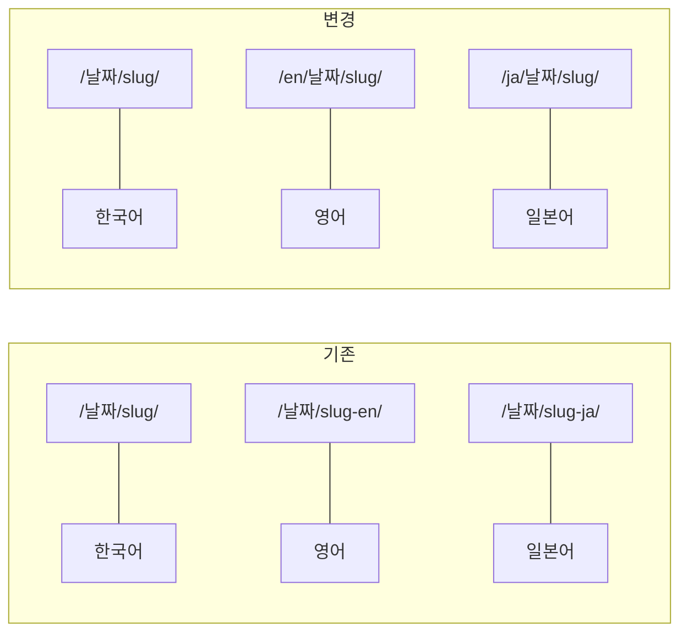

## URL이 거슬렸다

이 블로그는 한국어, 영어, 일본어 3개 언어를 지원한다. 근데 URL 구조가 좀 이상했다.

```text
한국어: /2026/02/21/claude-code-1m-cost-reality/
영어:   /2026/02/21/claude-code-1m-cost-reality-en/
일본어: /2026/02/21/claude-code-1m-cost-reality-ja/
```

영어 포스트 URL 끝에 `-en`이 덕지덕지 붙어있는 거다. 보기도 싫고, Google에서도 언어별 콘텐츠를 `/en/` 하위 경로로 구분하는 걸 권장한다. 이대로 놔뒀다가 포스트가 더 쌓이면 나중에 바꾸기 훨씬 힘들어질 거 같았다.

바꾸고 싶은 구조는 이거였다.



## permalink + redirect_from 조합으로 해결

Jekyll에서는 포스트마다 `permalink`를 지정할 수 있다. 영어/일본어 포스트 front matter에 이걸 추가했다.

```yaml
# 영어 포스트 front matter
permalink: /en/:year/:month/:day/:title/
redirect_from:
  - /2026/02/21/claude-code-1m-cost-reality-en/
```

`permalink`로 새 URL을 지정하고, `redirect_from`으로 기존 URL에서 자동 리다이렉트되게 했다. `jekyll-redirect-from` 플러그인이 필요한데, GitHub Pages에서 공식 지원하는 플러그인이라 `_config.yml`에 한 줄 추가하면 끝이다.

```yaml
# _config.yml
plugins:
  - jekyll-redirect-from
```

그 다음은 `_layouts/default.html`에서 hreflang 태그 수정.

```html
<!-- 기존 -->
<link rel="alternate" hreflang="en" href="{{ site.url }}{{ date_path }}{{ base_slug }}-en/" />

<!-- 변경 -->
<link rel="alternate" hreflang="en" href="{{ site.url }}/en{{ date_path }}{{ base_slug }}-en/" />
```

...근데 진짜 노가다는 따로 있었다. 본문에 하드코딩된 링크 152개를 전부 수정해야 했다. 영어 포스트에서 다른 영어 포스트를 참조하는 링크가 죄다 기존 URL이었거든.

```markdown
<!-- 기존 -->
[Escaping Compacting Hell](/2026/02/20/claude-code-1m-context-review-en/)

<!-- 변경 -->
[Escaping Compacting Hell](/en/2026/02/20/claude-code-1m-context-review-en/)
```

결과: **140개 파일 변경, 569줄 추가, 154줄 삭제**. 꽤 큰 작업이었다.

## 근데 페이지네이션이 깨졌다

URL 구조를 바꾸고 나니까 페이지네이션이 문제였다. Jekyll의 `jekyll-paginate` 플러그인은 **루트 디렉토리(`/`)에서만 동작**한다. 이건 Jekyll의 알려진 제약이다.

한국어 홈페이지(`/`)에서는 기존에 잘 됐는데, `/en/`이나 `/ja/`에서는 `paginator` 객체 자체가 없다. 서버사이드 Liquid 템플릿에서는 방법이 없었다.

## JS로 갈아엎었다

그래서 아예 JavaScript 클라이언트사이드 페이지네이션으로 갈아탔다. 원리는 간단하다.

1. Liquid로 모든 포스트를 HTML에 렌더링
2. JS가 10개씩 잘라서 `display: none/block` 처리
3. `?page=2` URL 파라미터로 페이지 관리

핵심 코드는 이거다.

```javascript
(function() {
  var POSTS_PER_PAGE = 10;
  var posts = document.querySelectorAll('.posts-list .post-item');
  if (posts.length <= POSTS_PER_PAGE) return;

  var totalPages = Math.ceil(posts.length / POSTS_PER_PAGE);
  var params = new URLSearchParams(window.location.search);
  var currentPage = parseInt(params.get('page')) || 1;

  function showPage(page) {
    var start = (page - 1) * POSTS_PER_PAGE;
    var end = start + POSTS_PER_PAGE;
    for (var i = 0; i < posts.length; i++) {
      posts[i].style.display = (i >= start && i < end) ? '' : 'none';
    }
  }
  showPage(currentPage);
})();
```

이 코드를 `index.html`, `en/index.html`, `ja/index.html` 세 곳에 동일하게 넣었다. 다국어 레이블은 `_data/*.yml`에 추가.

```yaml
# _data/ko.yml
posts:
  prev_page: "이전"
  next_page: "다음"
```

이전에는 한국어만 `/page2/`, `/page3/` 식으로 페이지네이션이 됐는데, 이제는 3개 언어 모두 `?page=2` 방식으로 통일됐다.

## 정리

URL 구조는 포스트가 쌓이기 전에 초기에 잡는 게 답이다. 나중에 바꾸면 140개 파일을 고치는 노가다가 기다리고 있다. Jekyll Paginate의 루트 전용 제약은 명확하니까, 다국어 블로그라면 처음부터 JS 방식을 고려하는 게 현실적이다.
