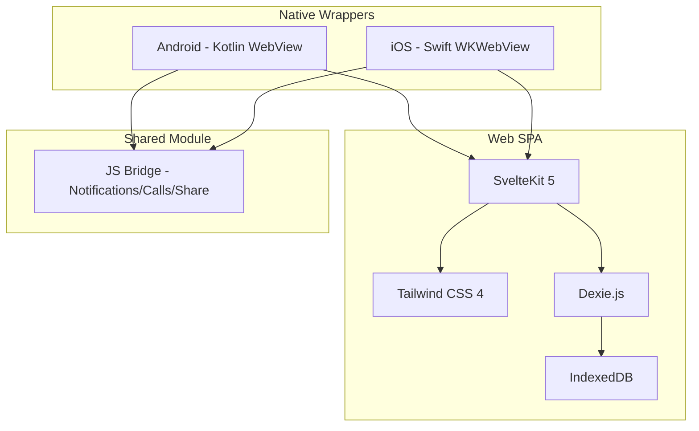
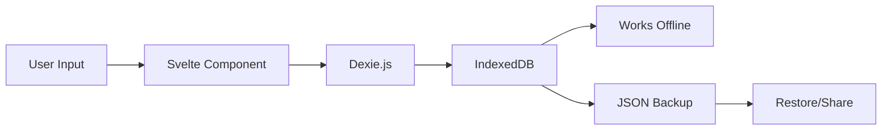
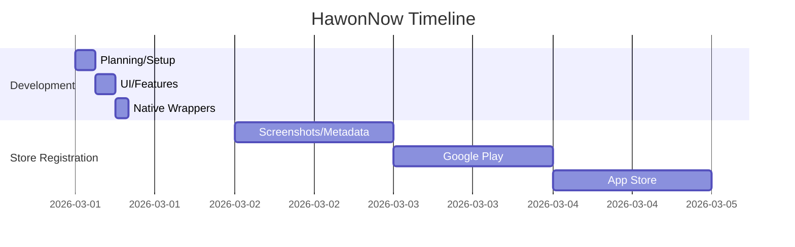

My kid goes to three after-school academies. Math, English, Taekwondo. My wife asks me every day "what time is which class again?" and I'm sitting there trying to remember. The paper schedule on the fridge is outdated. Calendar apps are overkill for tracking academy schedules.

So I decided to build one myself.

## Picking the Tech Stack Took 10 Minutes

Ever spent a week just choosing a tech stack for a side project? Been there. But this time was different. I asked myself three questions.

**Do I need a server?** No. There's zero reason for academy schedule data to live on a server. Keep it on the phone. No server means zero cost and zero privacy concerns.

**Does it need to be native?** Not really. An academy scheduler doesn't need gaming-level performance. Build it as a web app, wrap it in a WebView. One codebase covers both Android and iOS.

**Framework?** SvelteKit. Less boilerplate than React, which makes it easier for AI to work with too.

```
Frontend: SvelteKit 5 + Tailwind CSS 4
Local DB: Dexie.js (IndexedDB wrapper)
Android: Kotlin WebView wrapper
iOS: Swift WKWebView wrapper
Infra: AWS CDK (for later)
```

Done. Under 10 minutes.



LOCAL-FIRST essentially means no server. No API design, no DB migration, no auth logic, no deployment pipeline. Cut what needs to be built in half.

## Half a Day with Claude Code

I used one tool: Claude Code. It's a CLI tool where you chat and code directly from the terminal. Turns out that's faster than clicking around in an IDE.

The key was the monorepo structure. Frontend, android, ios, infra, landing, store-listing — all in one project. This way, Claude Code can consume the entire context at once. Say "understand this whole project" and it reads everything in the monorepo.

Then there's the CLAUDE.md file. This is the real game-changer. Drop this file in the project root and Claude Code reads it automatically. I put all the architecture decisions, coding conventions, and tech stack info in there.

```
hawonnow/
├── frontend/        # SvelteKit SPA (main)
├── android/         # Kotlin WebView wrapper
├── ios/             # Swift WKWebView wrapper
├── infra/           # AWS CDK
├── landing/         # Landing page
├── store-listing/   # Store listing assets
├── CLAUDE.md        # Project guide for AI
└── pnpm-workspace.yaml
```

Here's how the day actually went:

**Morning (3 hours)** — Project setup, DB schema, basic CRUD. I told Claude Code "build an academy schedule management app where you register academies per child and show a weekly timetable" and it scaffolded the Dexie schema, store patterns, and routing in one go. Fine-tuning was needed, but the skeleton was up in 30 minutes.

**Afternoon (3 hours)** — UI implementation. NOW page, weekly schedule, academy management, statistics. Tailwind CSS made it easy to delegate design to AI. "Mobile-first layout with bottom navigation" and it just builds it.

**Evening (2 hours)** — Native wrappers. Android WebView, iOS WKWebView, JS Bridge connections. Notifications, phone calls, share functionality through native bridges.

What AI excelled at: repetitive CRUD code and Tailwind UI work. What I had to do myself: data model design decisions and feature scoping — deciding what to build and what to skip. The person who knows *what* to build still has to be human.

## Why Half a Day Was Actually Possible

"AI is fast" doesn't fully explain it. Structural decisions created the speed.



**Eliminating the server was the biggest factor.** Typical app development splits roughly 30% frontend, 40% backend, 30% infra. Remove the backend entirely and you can focus exclusively on the frontend. API endpoint design? Don't need it. Auth logic? Don't need it. DB server setup? IndexedDB is built into the browser.

**The hybrid app approach.** The actual Android Kotlin code is about 200 lines. iOS Swift code is similar. It's literally just a shell. Load a URL in a WebView, wire up a few native features via JS Bridge, and you're done.

**Monorepo + CLAUDE.md.** Being able to give the AI "the entire project context" at once is the key. When you need to modify frontend code and the Android bridge simultaneously, a monorepo eliminates context switching. Just say "update both of these files together."

## What I Built


**NOW Page** — The first screen when you open the app. Answers "what's happening right now?" Today's schedule cards show the current class, remaining time, and next event in real-time. Tap a phone number to call the academy directly.

**Weekly Schedule** — A 7-day grid from Monday to Sunday with color-coded schedule blocks per child. Drag and drop to change times. Capture the schedule as an image and share it via messaging apps.


**Academy Management** — Academy name, teacher contact, driver contact, monthly tuition, payment date — all in one place. "How much are we paying for academies this month?" answered by a single screen.


**Statistics** — Total weekly class hours, monthly tuition totals, day-of-week and time-of-day distribution charts. Seeing that one kid spends 23 hours a week at academies... that's a sobering number.

The trickiest part was the NOW page's real-time logic. It wasn't just showing today's schedule — it needed to calculate "in progress," "coming up," and "completed" based on the current time. Add recurring weekly schedules, single-day cancellations (overrides), and it gets complex fast.

## But Store Registration Took 3 Days

Half a day to develop. Three days to register. The irony.



AI wrote the code, but store metadata? That's still a human job.

**Screenshot specs were painful.** Google Play wants pure screenshots without phone frames. App Store requires different resolutions per device — iPhone 6.7", 6.5", 5.5" each. Plus marketing images with text overlays.

**Multilingual app descriptions.** Korean and English versions. Short description 80 chars, long description 4000 chars. Keyword optimization. Researching what terms people actually search for.

**Privacy policy.** The app collects zero data, but you still need a privacy policy page with a URL. Ended up building a privacy-policy page on the landing site.

**Content rating.** Google Play has a detailed IARC questionnaire. App Store asks exactly what data you collect. Proving "we collect nothing" is surprisingly tedious.

All this metadata went into the `store-listing/` directory in the monorepo. Will need it again for updates.

## Lessons Learned

**The key to side projects in the AI era is deciding what NOT to build.** The single decision to skip the server cut development time in half. AI writes code fast, sure — but reducing what needs to be built in the first place is the real time saver.

**CLAUDE.md is the productivity multiplier.** Instead of explaining "this project uses this architecture with these conventions" every time, write it in one file and AI reads it automatically. Especially critical in a monorepo where you're jumping between modules.

**Store registration is still a human domain.** AI handled the coding, but creating screenshots, writing marketing copy, and navigating review processes — that's still on me. Automating this part is the next challenge.

---

If you're a parent juggling academy schedules, give it a try. It's free, and all data stays on your device — zero privacy concerns.

**HawonNow - Academy Schedule Manager**
- [Google Play Store](https://play.google.com/store/apps/details?id=com.hawonnow)
- [App Store](https://apps.apple.com/app/id6759882369)
