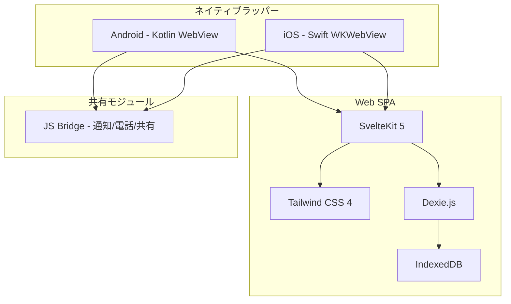
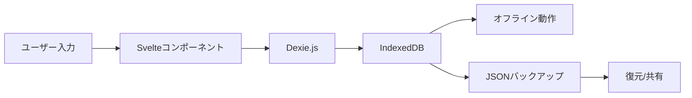
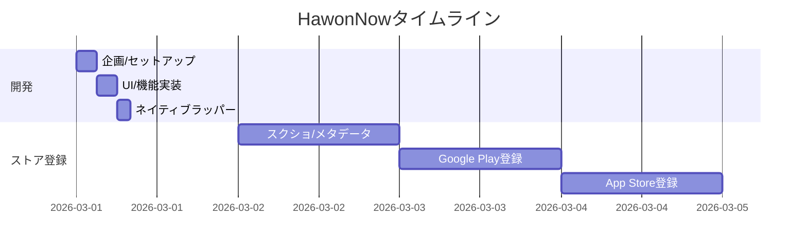

子供が塾を3つ通っています。算数、英語、テコンドー。妻が毎回「今日は何時にどこだっけ？」と聞いてきて、私は頭の中で「算数が3時で...英語が5時で...」と記憶を辿ります。冷蔵庫に貼った紙の時間割は更新されていなくて役に立たない。カレンダーアプリは塾の管理には大げさすぎます。

だから自分で作ることにしました。

## 技術スタック選びに10分しかかからなかった

サイドプロジェクトで技術スタック選びに1週間費やした経験はありませんか？私もそうでした。でも今回は違いました。核心的な質問を3つだけ投げかけました。

**サーバーは必要か？** いいえ。塾のスケジュールデータがサーバーにある必要はありません。端末の中にあればいい。サーバーがなければコストもゼロ、プライバシーの心配もゼロです。

**ネイティブで作る必要があるか？** 別に。塾のスケジュールアプリにゲーム級のパフォーマンスは要りません。Webで作ってWebViewで包めばいい。コード1セットでAndroidもiOSもカバーできます。

**フレームワークは？** SvelteKit。Reactよりボイラープレートが少なくて、AIに作業させるのも楽です。

```
フロントエンド: SvelteKit 5 + Tailwind CSS 4
ローカルDB: Dexie.js (IndexedDBラッパー)
Android: Kotlin WebViewラッパー
iOS: Swift WKWebViewラッパー
インフラ: AWS CDK (後で使う予定)
```

決定完了。10分もかかりませんでした。



LOCAL-FIRSTとは要するにサーバーを作らないということです。API設計、DBマイグレーション、認証ロジック、デプロイパイプライン...これらを全部省くと、作るべきものが半分に減りました。

## Claude Codeに任せた半日の記録

使ったツールはClaude Codeだけです。ターミナルから直接対話しながらコーディングできるCLIツールで、IDEであれこれクリックするより速いんです。

ポイントはモノレポ構造でした。frontend、android、ios、infra、landing、store-listingを一つのプロジェクトにまとめました。こうするとClaude Codeにプロジェクト全体のコンテキストを一度に渡せます。「このプロジェクト全体を理解して」と言えば、モノレポの中を全部読んでくれます。

そしてCLAUDE.mdファイル。これが本当のキーポイントです。プロジェクトルートにこのファイルを置くと、Claude Codeが自動的に読み込みます。アーキテクチャ、コーディング規約、技術スタック情報を全部書いておきました。

```
hawonnow/
├── frontend/        # SvelteKit SPA (メイン)
├── android/         # Kotlin WebViewラッパー
├── ios/             # Swift WKWebViewラッパー
├── infra/           # AWS CDK
├── landing/         # ランディングページ
├── store-listing/   # ストア登録資料
├── CLAUDE.md        # AIに渡すプロジェクトガイド
└── pnpm-workspace.yaml
```

実際の作業フローはこうでした。

**午前（3時間）** — プロジェクトセットアップ、DBスキーマ、基本CRUD。Claude Codeに「子供別に塾を登録して週間時間割を表示する塾スケジュール管理アプリを作って」と伝えたら、Dexieスキーマからstoreパターン、ルーティングまで一気に組み上げてくれました。細かい調整はしましたが、骨組みは30分で完成しました。

**午後（3時間）** — UI実装。NOWページ、週間スケジュール、塾管理、統計画面。Tailwind CSSのおかげでデザインもAIに任せやすかったです。「モバイルファーストで、ボトムナビゲーション付きの構成で」と言えば、サクッと作ってくれます。

**夕方（2時間）** — ネイティブラッパーの作成。Android WebView、iOS WKWebViewそれぞれ作って、JS Bridgeを接続。通知、電話発信、共有機能をネイティブブリッジで実装しました。

AIが特に優れていたのは、繰り返しのCRUDコード作成とTailwind UIの作業でした。私が自分でやるべきだったのは、データモデルの設計判断と「この機能は入れる、この機能は省く」という決定。何を作るべきか分かっている人間は、やはり自分でなければなりませんでした。

## 半日で可能だった本当の理由

正直「AIが速いから」だけでは説明がつきません。構造的な決定がスピードを生みました。



**サーバーをなくしたことが一番大きかったです。** 通常のアプリ開発はフロントエンド30%、バックエンド40%、インフラ30%くらいの時間配分ですが、バックエンドを丸ごとなくすとフロントエンドだけに集中できました。APIエンドポイント設計？不要です。認証ロジック？不要です。DBサーバーのセットアップ？IndexedDBがブラウザに内蔵されているので、それも不要です。

**ハイブリッドアプリという選択。** AndroidのKotlinコードは実質200行程度です。iOSのSwiftコードも同じくらい。本当に殻だけ作ればよかったんです。WebViewにURLを一つロードして、JS Bridgeでネイティブ機能をいくつか接続すれば完成。

**モノレポ + CLAUDE.md。** AIに「プロジェクト全体のコンテキスト」を一度に渡せるのが核心です。フロントエンドのコードを修正しながら同時にAndroidブリッジも直す必要がある時、モノレポでなければコンテキストスイッチが発生します。モノレポなら「この2つのファイルを一緒に修正して」で済みます。

## 作った機能たち


**NOWページ** — アプリを開くとすぐ表示される画面。「今何の時間？」に答えてくれます。今日のスケジュールカードに、現在進行中の授業、残り時間、次の予定がリアルタイムで表示されます。塾の電話番号をタップすればすぐ電話できます。

**週間スケジュール** — 月曜から日曜の7日グリッドにスケジュールブロックが色別に表示されます。子供が複数いれば色で区別。ドラッグ＆ドロップで時間変更もでき、画像としてキャプチャしてメッセージアプリで共有もできます。


**塾管理** — 塾名、先生の連絡先、送迎ドライバーの連絡先、月謝、支払日まで一箇所で管理。「今月の塾代いくら？」にアプリ一つで答えられます。


**統計** — 週間総授業時間、月別塾代合計、曜日別・時間帯別分布チャート。一人の子供が週に23時間塾で過ごしているという数字を見ると...ちょっと考えさせられます。

一番悩んだのはNOWページの「現在」ロジックでした。単に今日のスケジュールを表示するだけでなく、現在時刻を基準に「進行中」「次の予定」「完了」をリアルタイムで計算する必要がありました。さらに曜日別の繰り返しスケジュール、特定日のキャンセル（オーバーライド）などの例外処理まで。この部分はAIにロジックを説明しながら一緒に作るのに時間がかかりました。

## でもストア登録に3日かかった

開発半日。ストア登録3日。この逆転が本当に面白いです。



コードはAIが書いてくれたのに、ストアのメタデータは人間がやるしかありませんでした。

**スクリーンショットの規格が厄介でした。** Google Playはフレームなしの純粋なスクリーンショットを求め、App Storeはデバイスごとに異なる解像度を要求します。iPhone 6.7インチ、6.5インチ、5.5インチそれぞれ。さらにテキストを載せたマーケティング画像も別途作成する必要があります。

**アプリ説明の多言語対応。** 韓国語と英語の2セット。短い説明80文字、長い説明4000文字。キーワード最適化。ユーザーがどんな言葉で検索するかのリサーチも必要でした。

**プライバシーポリシー。** アプリはデータを一切収集しないのに、プライバシーポリシーページを作ってURLを提出する必要があります。結局ランディングページにprivacy-policyページを別途作りました。

**コンテンツレーティング。** Google PlayにはIARCのアンケートに細かく回答する必要があり、App Storeはどんなデータを収集するか詳細に聞いてきます。「何も収集していません」を証明するのが意外と面倒です。

これらのメタデータはすべて`store-listing/`ディレクトリにまとめてモノレポに入れました。次のアップデート時にもまた使いますから。

## 学んだこと

**AI時代のサイドプロジェクトの核心は「何を作らないか」を決めることです。** サーバーを作らないというたった一つの決定が開発時間を半分に減らしました。AIがコードを速く書いてくれるのは確かですが、作るべきもの自体を減らすことが本当の時間節約です。

**CLAUDE.mdが生産性の鍵です。** AIに毎回「このプロジェクトはこういう構造で、こういう規約があって」と説明する代わりに、ファイル一つに全部書いておけば自動的に読んでくれます。特にモノレポで複数モジュールを行き来しながら作業する時、これがないとコンテキストが毎回失われます。

**ストア登録はまだ人間の領域です。** コーディングはAIが代わりにやってくれましたが、スクリーンショットを作ってマーケティング文言を書いて審査に対応するのは...まだ自分でやるしかありません。この部分の自動化が次の課題です。

---

お子さんの塾スケジュール管理に困っている方は、ぜひ試してみてください。無料で、データはすべて端末内に保存されるのでプライバシーの心配もありません。

**HawonNow - 塾スケジュール管理**
- [Google Play Store](https://play.google.com/store/apps/details?id=com.hawonnow)
- [App Store](https://apps.apple.com/app/id6759882369)
