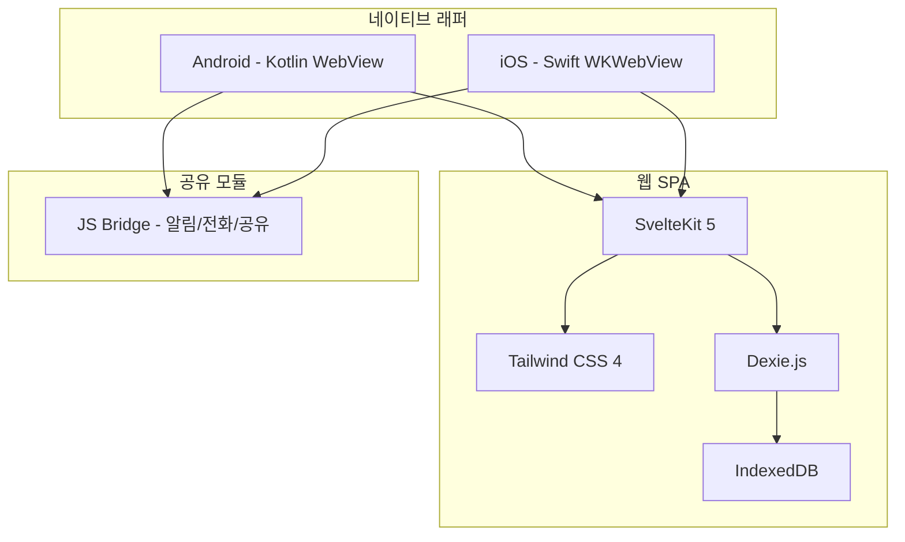
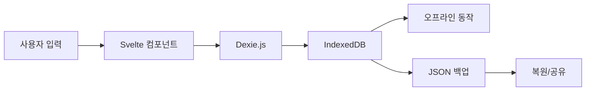
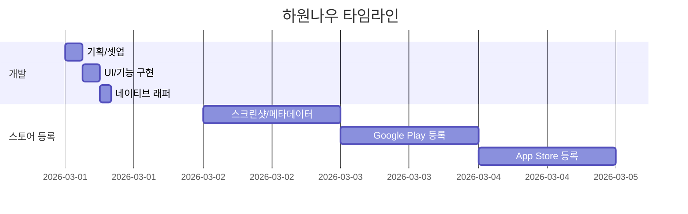

아이가 학원을 세 개 다닌다. 수학, 영어, 태권도. 아내가 매번 카톡으로 "오늘 몇시에 어디야?" 물어보고, 나는 머릿속으로 "수학이 3시고... 영어가 5시고..." 이러면서 기억을 더듬는다. 종이 시간표는 냉장고에 붙여놨는데 업데이트가 안 돼서 쓸모가 없고. 캘린더 앱을 써봤는데 학원 일정 관리용으로는 너무 과하다.

그래서 만들기로 했다. 직접.

## 기술 스택 고르는 데 10분 걸렸다

사이드 프로젝트에서 기술 스택 고르느라 일주일 써본 적 있는 사람? 나도 그랬다. 근데 이번엔 달랐다. 핵심 질문 세 개만 던졌다.

**서버가 필요한가?** 아니. 학원 일정 데이터가 서버에 있어야 할 이유가 없다. 내 폰 안에만 있으면 된다. 서버 없으면 비용도 0원이고, 개인정보 걱정도 없다.

**네이티브로 만들어야 하나?** 굳이? 학원 일정 앱에 게임급 성능이 필요한 게 아니니까. 웹으로 만들고 WebView로 감싸면 된다. 코드 한 벌로 Android, iOS 둘 다 커버.

**프레임워크는?** SvelteKit. 이건 그냥 내가 좋아하는 거다 ㅎㅎ React보다 보일러플레이트가 적어서 AI한테 시키기도 편하다.

```
프론트엔드: SvelteKit 5 + Tailwind CSS 4
로컬 DB: Dexie.js (IndexedDB 래퍼)
Android: Kotlin WebView 래퍼
iOS: Swift WKWebView 래퍼
인프라: AWS CDK (나중에 쓸 것)
```

결정 끝. 10분도 안 걸렸다.



LOCAL-FIRST라는 건 결국 서버를 안 만든다는 거다. API 설계, DB 스키마 마이그레이션, 인증 로직, 배포 파이프라인... 이런 거 다 빼니까 만들어야 할 게 절반으로 줄었다.

## Claude Code한테 시킨 반나절의 기록

도구는 Claude Code 하나만 썼다. 터미널에서 바로 대화하면서 코드를 짜는 CLI 도구인데, 이게 IDE 안에서 이것저것 누르면서 하는 것보다 빠르더라.

핵심은 모노레포 구조였다. frontend, android, ios, infra, landing, store-listing을 하나의 프로젝트에 다 넣었다. 왜냐면 Claude Code한테 전체 컨텍스트를 한 번에 줄 수 있으니까. "이 프로젝트 전체를 이해해" 라고 하면 모노레포 안에서 다 읽는다.

그리고 CLAUDE.md 파일. 이게 진짜 핵심이다. 프로젝트 루트에 이 파일을 만들어놓으면 Claude Code가 자동으로 읽는다. 여기에 아키텍처, 코딩 규칙, 기술 스택 정보를 다 적어놨다.

```
hawonnow/
├── frontend/        # SvelteKit SPA (메인)
├── android/         # Kotlin WebView 래퍼
├── ios/             # Swift WKWebView 래퍼
├── infra/           # AWS CDK
├── landing/         # 랜딩 페이지
├── store-listing/   # 스토어 등록 자료
├── CLAUDE.md        # AI한테 주는 프로젝트 가이드
└── pnpm-workspace.yaml
```

실제 작업 흐름은 이랬다.

**오전 (3시간)** - 프로젝트 셋업, DB 스키마, 기본 CRUD. Claude Code한테 "학원 일정 관리 앱인데, 아이별로 학원을 등록하고 주간 시간표를 보여주는 구조로 만들어줘"라고 했더니 Dexie 스키마부터 store 패턴, 라우팅까지 한 번에 잡아줬다. 물론 세부 조정은 했지만 뼈대가 30분 만에 나왔다.

**오후 (3시간)** - UI 구현. NOW 페이지, 주간 시간표, 학원 관리, 통계 화면. Tailwind CSS 덕분에 디자인도 AI한테 시키기 편했다. "모바일 퍼스트로, 하단 네비게이션 있는 구조로" 하면 척척 만들어준다.

**저녁 (2시간)** - 네이티브 래퍼 작성. Android WebView, iOS WKWebView 각각 만들고 JS Bridge 연결. 알림, 전화 걸기, 공유 기능을 네이티브 브릿지로 구현했다.

AI가 특히 잘한 건 반복적인 CRUD 코드 작성이랑 Tailwind UI 작업이었다. 내가 직접 해야 했던 건? 데이터 모델 설계 결정이랑 "이 기능은 넣고 저 기능은 빼자"는 판단. 결국 뭘 만들지 아는 사람은 나여야 했다.

## 반나절 만에 가능했던 진짜 이유

솔직히 "AI가 빨라서"만으로는 설명이 안 된다. 구조적인 결정이 속도를 만들었다.



**서버를 없앤 것이 가장 컸다.** 보통 앱 만들면 프론트엔드 30%, 백엔드 40%, 인프라 30% 정도의 시간 분배인데. 백엔드를 통째로 없애버리니까 프론트엔드에만 집중할 수 있었다. API 엔드포인트 설계? 필요 없다. 인증 로직? 필요 없다. DB 서버 셋업? IndexedDB가 브라우저에 내장돼 있으니까 그것도 필요 없다.

**하이브리드 앱이라는 선택.** Android Kotlin 코드는 실질적으로 200줄 정도다. iOS Swift 코드도 비슷하다. 진짜 껍데기만 만들면 되는 거다. WebView에 URL 하나 로드하고, JS Bridge로 네이티브 기능 몇 개 연결하면 끝.

**모노레포 + CLAUDE.md.** AI한테 "전체 프로젝트 컨텍스트"를 한 번에 줄 수 있다는 게 핵심이다. 프론트엔드 코드를 고치면서 동시에 Android 브릿지도 수정해야 할 때, 모노레포가 아니면 컨텍스트 스위칭이 생긴다. 모노레포면 그냥 "이 두 파일 같이 수정해줘" 하면 된다.

## 만든 기능들


**NOW 페이지** - 앱 열면 바로 보이는 화면. "지금 뭐 하는 시간이지?"에 대한 답을 준다. 오늘 일정 카드에 현재 진행 중인 수업, 남은 시간, 다음 일정이 실시간으로 뜬다. 학원 전화번호 탭하면 바로 전화 걸리고.

**주간 시간표** - 월~일 7일 그리드에 일정 블록이 색상별로 표시된다. 아이가 여러 명이면 색상으로 구분. 드래그 앤 드롭으로 시간 변경도 되고, 이미지로 캡처해서 카톡으로 공유할 수도 있다.


**학원 관리** - 학원 이름, 선생님 연락처, 차량 기사 연락처, 월 수강료, 결제일까지 한 곳에서 관리. "이번 달 학원비 얼마야?"를 앱 하나로 답할 수 있게.


**통계** - 주당 총 수업 시간, 월별 학원비 합계, 요일별/시간대별 분포 차트. 아이 한 명이 일주일에 23시간을 학원에서 보내고 있다는 걸 숫자로 보면... 좀 현타 온다 ㅎㅎ

이 중에서 가장 고민했던 건 NOW 페이지의 "지금" 로직이었다. 단순히 오늘 일정을 보여주는 게 아니라, 현재 시각 기준으로 "진행 중", "다음 예정", "완료"를 실시간으로 계산해야 했다. 여기에 요일별 반복 일정, 특정 날짜 취소(오버라이드) 같은 예외 처리까지. 이 부분은 AI한테 로직을 설명하고 같이 짜는 데 시간이 좀 걸렸다.

## 근데 스토어 등록에 3일이 걸렸다

개발 반나절. 스토어 등록 3일. 이 역전이 진짜 웃기다.



코드는 AI가 짜줬는데, 스토어 메타데이터는 사람이 해야 하더라...

**스크린샷 규격이 짜증났다.** Google Play는 폰 프레임 없는 순수 스크린샷을 원하고, App Store는 기기별로 다른 해상도를 요구한다. iPhone 6.7인치, 6.5인치, 5.5인치 각각. 그리고 스크린샷 위에 텍스트 올린 마케팅 이미지를 따로 만들어야 한다.

**앱 설명 다국어.** 한국어, 영어 두 벌. 짧은 설명 80자, 긴 설명 4000자. 키워드 최적화. "학원 관리"를 일본어로 뭐라고 검색하는지도 조사해야 했다.

**개인정보처리방침.** 앱이 아무 데이터도 수집 안 하는데도 개인정보처리방침 페이지를 만들어서 URL을 제출해야 한다. 결국 landing 페이지에 privacy-policy 페이지를 따로 만들었다.

**콘텐츠 등급 심사.** Google Play는 IARC 설문을 꼼꼼하게 답해야 하고, App Store는 앱이 어떤 데이터를 수집하는지 세세하게 물어본다. "아무것도 수집 안 합니다"를 증명하는 게 은근 번거롭다.

이 모든 메타데이터를 `store-listing/` 디렉토리에 정리해서 모노레포에 넣었다. 다음에 앱 업데이트할 때 또 쓸 거니까.

## 배운 것들

**AI 시대 사이드 프로젝트의 핵심은 "뭘 안 만들지" 결정하는 것이다.** 서버를 안 만들기로 한 그 결정 하나가 개발 시간을 절반으로 줄였다. AI가 코드를 빨리 짜주는 건 맞지만, 만들어야 할 것 자체를 줄이는 게 진짜 시간 절약이다.

**CLAUDE.md가 생산성의 핵심이다.** AI한테 매번 "이 프로젝트는 이런 구조고, 이런 규칙이 있어"라고 설명하는 대신, 파일 하나에 다 적어놓으면 자동으로 읽는다. 특히 모노레포에서 여러 모듈을 오가면서 작업할 때 이게 없으면 컨텍스트가 계속 유실된다.

**스토어 등록은 아직 사람의 영역이다.** 코드 짜는 건 AI가 대신해줬는데, 스크린샷 만들고 마케팅 문구 쓰고 심사 대응하는 건... 아직은 내가 해야 한다. 이 부분의 자동화가 다음 과제다.

---

학원 보내는 부모님들, 한번 써보시면 좋겠다. 무료고, 데이터는 폰 안에만 저장되니까 개인정보 걱정도 없다.

**하원나우 - 학원 일정 관리**
- [Google Play Store](https://play.google.com/store/apps/details?id=com.hawonnow)
- [App Store](https://apps.apple.com/app/id6743440737)
